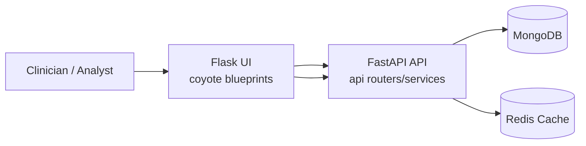

# Coyote3

Coyote3 is a clinical genomics platform for DNA/RNA interpretation, review, and reporting workflows.

## What It Includes

- Flask web application (`coyote/`) for interactive analyst and admin workflows
- FastAPI service (`api/`) for APIs, validation, and business logic
- MongoDB as system-of-record storage
- Redis for caching and performance-sensitive read paths
- MkDocs documentation in `docs/`

## Architecture



## Tech Stack

| Layer | Technologies |
| --- | --- |
| Web UI | Flask, Jinja2, WTForms, Tailwind |
| API | FastAPI, Pydantic |
| Data | MongoDB, PyMongo |
| Caching | Redis, Flask-Caching |
| Quality | Pytest, Ruff, Black, Mypy |
| Docs | MkDocs |

## Environment Requirements

- Python `3.12+`
- Docker + Docker Compose (for local infra)
- MongoDB and Redis reachable from app containers
- Required secret: `COYOTE3_FERNET_KEY`

## Quick Start (Development)

```bash
git clone git@github.com:SMD-Bioinformatics-Lund/coyote3.git
cd coyote3
python3 -m venv .venv
source .venv/bin/activate
python -m pip install -e ".[dev,test]"
cp deploy/env/example.dev.env .coyote3_dev_env
./scripts/compose-with-version.sh --env-file .coyote3_dev_env -f deploy/compose/docker-compose.dev.yml up -d --build
```

## Quality Checks

```bash
bash scripts/setup_git_hooks.sh
PYTHONPATH=. python -m ruff check api coyote tests scripts
PYTHONPATH=. python -m pytest -q
PYTHON_BIN="$(command -v python)" PYTHONPATH=. bash scripts/run_family_coverage_gates.sh
```

## Security Notes

- CORS allowlist is configured with `CORS_ORIGINS` (comma-separated).
- If `CORS_ORIGINS` is empty/unset, CORS is permissive (all origins).

## Documentation

Full project docs live in `docs/` and are published via MkDocs.

- [Quickstart](docs/start-here/quickstart.md)
- [Local Development](docs/start-here/local-development.md)
- [System Overview](docs/architecture/system-overview.md)
- [Deployment Runbook](docs/operations/deployment-runbook.md)
- [Testing And Quality](docs/testing/testing-and-quality.md)
