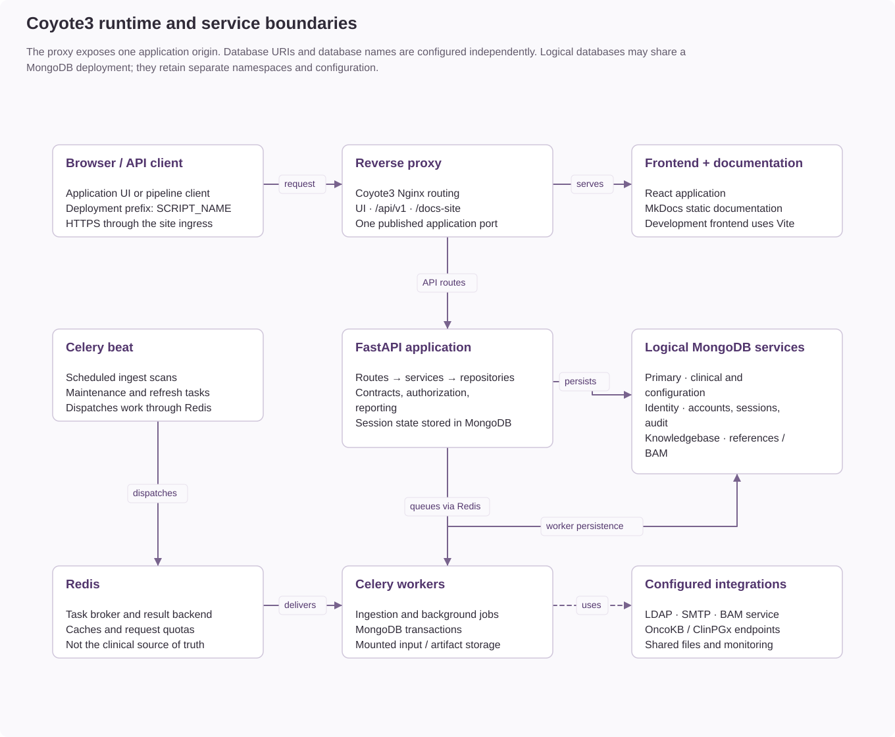

# Coyote3

Clinical genomics review, assay configuration, and reporting for DNA and RNA
workflows. Developed by the Section for Molecular Diagnostics (SMD), Lund.

[Get started](docs/getting-started/local-quickstart.md) ·
[User guide](docs/user-guide/README.md) ·
[Deployment](docs/deployment/README.md) ·
[Architecture](docs/architecture/README.md) ·
[API integration](docs/api/README.md) ·
[Contributing](CONTRIBUTING.md)

## Project Status and Technology

### Build and validation

[](https://github.com/SMD-Bioinformatics-Lund/coyote3/actions/workflows/quality.yml)
[](https://github.com/SMD-Bioinformatics-Lund/coyote3/actions/workflows/bootstrap-and-ingest-check.yml)


### Core Stack


### Domain & Capabilities


### Security & Governance


Workflow badges link to execution results. Technology and capability badges describe
the repository; they are not clinical validation or compliance certifications.

## Overview

Coyote3 is a clinical genomics application developed by the bioinformatics team at
the **Section for Molecular Diagnostics (SMD), Lund**, within Region Skåne's
clinical laboratory service.

Clinical geneticists, bioinformaticians and laboratory staff use it to ingest
samples, review genomic findings, record classifications and comments, and prepare
reports. Assay configuration determines the available analyses and filters. Saved
reports retain finding snapshots and the reporting context used to produce them.

The application connects four areas of laboratory work:

| Area | What users manage | Result |
| --- | --- | --- |
| Assay configuration | Assay groups, physical assays, shared subpanels, gene lists, analysis settings, and reporting rules. | A reviewed configuration that controls ingest, review, and reporting for an assay and environment. |
| Data ingestion | Sample manifests and declared analysis files from laboratory pipelines. | Validated sample records and linked findings, with job status and ingestion provenance. |
| Clinical interpretation | Sample filters, evidence, classifications, finding actions, and comments. | A review state shared by authorized users and used to prepare report content. |
| Reporting and operations | Published clinical rules, saved reports, accounts, audit events, notifications, and reference releases. | Preserved reporting evidence and the operational context needed to run the installation. |

### From assay setup to a saved report

1. Register an assay group and prepare an assay setup with its scopes and configurations.
2. Publish compatible clinical rules and obtain independent setup approval.
3. Activate the assay resources, then ingest a sample bundle through the supported workflow.
4. Review the available DNA or RNA analyses using the recorded configuration and sample filters.
5. Curate findings and inspect the report preview, including reporting warnings.
6. Confirm the report to save finding snapshots, configuration provenance, and rendered content.


ASP is the physical assay, ASPC is its analysis configuration, and ISGL is an optional
gene list. A sample records the configuration used for its review. See
[resource relationships](docs/architecture/resource-relationships.md) for subpanels,
cardinality, scope resolution, and dependencies.

## Key Capabilities

Coyote3 supports the following laboratory tasks:

* **Sample review and reporting** - ingest samples, review findings and save report snapshots
* **Assay-aware filtering** - configure filter defaults for each assay and analysis intent
* **Team review** - share findings, classifications and comments with authorized colleagues
* **Role- and scope-based access control** - powered by Casbin RBAC, with fine-grained permissions per user group and operational scope
* **Audit trail** - clinically and administratively significant actions are logged and retained
* **LDAP and local authentication** - integrates with existing directory infrastructure
* **Validated ingestion** - validate sample manifests and parsed records against Pydantic contracts
* **Center configuration** - configure assays, gene lists, report rules and storage for the installation

## Supported Workflows

Coyote3 provides these sample analysis and reporting workflows:

* **Sample types** - DNA and RNA workflows, somatic and germline
* **Variant review** - SNV, CNV, translocation, fusion, biomarker, and coverage findings, gated by assay configuration
* **Filtering** - intent-specific somatic and germline SNV filter rules, reproducibly applied per assay
* **Clinical configuration** - assay-specific panels (ASP), assay configurations (ASPC), and in-silico gene lists (ISGL)
* **Finding actions** - classifications, comments, cross-sample search, and finding-level decisions
* **Annotation** - clinical knowledgebase integrations (OncoKB, ClinPGx) with configurable timeouts and fallbacks
* **Reporting** - live report preview and immutable saved snapshots for governance and reproducibility
* **Access and identity** - scoped roles, Casbin-backed permissions, and a public assay catalog
* **Observability** - audit events, user notifications, and operational metrics
* **Background work** - contract-validated ingestion via Celery workers; scheduled maintenance via Celery Beat

## Design Principles

Coyote3 separates clinical review, configuration and deployment responsibilities:

* **Traceability** - audit events record clinical and administrative changes; retention is configured by the center
* **Reporting context** - saved reports preserve findings and the configuration used for reporting
* **Access control** - API operations check user permissions and sample access
* **Data validation** - Pydantic contracts validate API requests and collection documents
* **Separation of concerns** - deployment configuration, center-configurable clinical content, and fixed product behaviour are kept in distinct, independently owned layers
* **Deployment flexibility** - logical databases and storage mounts can be configured independently

## Architecture



| Component | Responsibility |
| --- | --- |
| `frontend/` | React interface, route workflows, shared tables, and API query state. |
| `api/` | FastAPI routes, application services, domain rules, contracts, authorization, and repositories. |
| Celery worker and Beat | Sample ingestion and scheduled maintenance. |
| MongoDB | Clinical findings, configuration, identity, audit, and operational records. |
| Redis | Task delivery, task results, rate limits and caches; API sessions are stored in MongoDB. |
| Reverse proxy | One public origin for the UI, API, public pages, and documentation. |

The backend separates HTTP transport, application workflows, domain rules, typed
contracts, and persistence. MongoDB access stays in repositories. The frontend
uses shared API/query abstractions, and Celery executes background work outside
the HTTP request lifecycle.

Four logical MongoDB services separate primary clinical data, identity and audit,
knowledgebase references, and BAM-service records. Each has an independent
URI/database pair. Redis carries tasks and caches; it does not hold the clinical
record or API sessions.

For the complete component and request flow, see
[Application Architecture](docs/architecture/application-architecture.md).

## Repository Layout

```text
api/                         FastAPI application and backend contracts
api/config/center/           Center-configurable TOML and YAML files
frontend/                    React application and frontend tests
deploy/                      Compose, proxy, and container configuration
scripts/                     Bootstrap, quality, validation, and operations tools
docs/                        User, clinical, API, architecture, and operations guides
tests/                       Backend unit, API, integration, and contract tests
tests/load/                  Optional synthetic HTTP workload and safety checks
demo_data/                   Synthetic demonstration and ingest data
```

## Quick Start

### Prerequisites

- Git
- Docker with Docker Compose
- Python 3.12 or later for repository scripts and local quality checks
- MongoDB 8.2 or later when using an external database; the self-hosted stack
  uses the pinned `mongo:8.2` image

Create the development environment file:

```bash
cp deploy/env/example.env .coyote3_dev_env
```

Review the copied file and replace every `CHANGE_ME` value. Set `COYOTE3_MONGO_URI` to
the MongoDB instance the containers should use, and configure the host data and
log roots for the local machine.

Provision the external application network selected by `COYOTE3_APP_NETWORK`
before starting Compose. The [local quickstart](docs/getting-started/local-quickstart.md)
includes the network setup and MongoDB prerequisites.

Start the development stack:

```bash
./scripts/compose-with-version.sh \
  --env-file .coyote3_dev_env \
  -f deploy/compose/docker-compose.yml -f deploy/compose/docker-compose.dev.yml \
  up -d --build
```

App, identity, knowledgebase, and BAM services have independent MongoDB URI/name
pairs. The base stack starts no MongoDB. Include the optional Mongo overlay and
enable `mongo` and/or `mongo-kb` only for repository-managed database containers.
See [service topology](docs/architecture/mongodb-topology.md) for local and split deployments.

See [MongoDB deployment and recovery](docs/deployment/mongodb-setup-and-recovery.md)
for replica-set initialization, backups, and recovery testing.

Capacity testing uses a separate, optional Locust service, not the API image.
The [load-testing guide](docs/testing/load-and-capacity-testing.md) covers isolated test data,
authenticated workflows, the `loadtest` Compose profile, and how to interpret
latency, error rates and background-job completion. Its CI smoke test runs only
against an in-process synthetic HTTP server; it does not certify deployment capacity.

The public application path is controlled by `SCRIPT_NAME`. With the example
development value `/coyote3_dev`, the standard endpoints are:

| Service | URL |
| --- | --- |
| Application | `http://localhost:6801/coyote3_dev/` |
| API documentation | `http://localhost:6801/coyote3_dev/api/v1/docs` |
| Documentation site | `http://localhost:6801/coyote3_dev/docs-site/` |
| Public catalog | `http://localhost:6801/coyote3_dev/public/catalog` |

For first deployment, baseline RBAC data, the initial superuser, demo
configuration, and synthetic sample ingestion, follow the
[Quickstart](docs/getting-started/local-quickstart.md). Production deployments must follow
the [Initial Deployment Checklist](docs/deployment/installation-checklist.md).

## Configuration Model

Coyote3 separates configuration by ownership:

- environment files hold deployment identity, secrets, public routing, service
  endpoints, and host mount paths;
- `api/config/center/` contains center-configurable clinical vocabulary,
  collection names, contact details, assay catalog text, filter metadata, and
  query policy;
- ASP, ASPC, and ISGL are versioned clinical configuration resources, while
  roles and users are managed as operational identity resources;
- published clinical report rules are governed in MongoDB and resolved for the
  assay, subpanel, analyte, and reporting language, with an explicit Base fallback;
- fixed product behavior remains in Python and frontend theme configuration.

Start with the [Configuration Guide](docs/deployment/configuration-reference.md) and
[Center Configuration Files](docs/deployment/center-configuration.md).

### Resource governance

| Resource | Lifecycle and responsibility |
| --- | --- |
| Assay setup | Draft, readiness validation, independent review, and transactional activation. |
| ASP / ASPC / ISGL | Stable business identities with versioned clinical configuration. |
| Named subpanel | Shared definition plus independently managed assay associations; Base is implicit. |
| Clinical rule set | Authoring, tests, clinical review, publication, and immutable release provenance. |
| Public assay catalog | Separate publication workflow referencing eligible assay and gene-list resources. |
| Sample and findings | Validated ingestion, recorded configuration, review state, and actor/source provenance. |
| Saved report | Confirmed finding snapshots and the configuration and rules used to render the report. |
| Identity and audit | Managed users and roles, application permission catalog, sessions, and recorded actions. |

See [assay administration](docs/administration/README.md) and the
[database resource map](docs/architecture/mongodb-topology.md) for ownership boundaries.

## Production Deployment and Operations

Use the [first-installation guide](docs/deployment/first-installation.md),
[production deployment guide](docs/deployment/production-deployment.md), and
[acceptance checklist](docs/deployment/acceptance-checklist.md) as the installation procedure.
The quickstart above is a local entry point.

| Responsibility | Operator reference |
| --- | --- |
| Service endpoints, secrets, mounts, and routing | [Deployment configuration](docs/deployment/configuration-reference.md) |
| MongoDB topology and transaction support | [MongoDB setup and recovery](docs/deployment/mongodb-setup-and-recovery.md) |
| Backups and recovery exercises | [Backup and recovery](docs/operations/backup-and-recovery.md) |
| Audit records and application logs | [Audit and logging](docs/operations/audit-and-logging.md) |
| Monitoring and background task health | [Monitoring and alerts](docs/operations/monitoring-and-alerts.md) |
| Reference dataset installation and updates | [Knowledgebase updates](docs/operations/knowledgebase-updates.md) |
| Existing installations and data changes | [Migration procedures](docs/operations/migrations/README.md) |

## Documentation

Browse the [documentation directory](docs/README.md) for a guide organized by
task. Each section has a README with its scope, reading order, and page descriptions.
Start with [deployment](docs/deployment/README.md),
[clinical use](docs/user-guide/README.md),
[administration](docs/administration/README.md), or
[development](docs/development/README.md).

| Reader or task | Documentation |
| --- | --- |
| First local run | [Quickstart](docs/getting-started/local-quickstart.md) |
| Clinical use and administration | [Application User Guide](docs/user-guide/application-guide.md) |
| Clinical review | [Clinical Workflow](docs/user-guide/clinical-review-workflow.md) |
| ASP, ASPC, ISGL, samples, and findings | [Core Concepts](docs/reference/clinical-concepts.md) |
| System relationships | [System Overview](docs/reference/application-overview.md) |
| Center deployment | [First installation](docs/deployment/first-installation.md) and [deployment checklist](docs/deployment/installation-checklist.md) |
| Environment and secrets | [Environment and Secrets](docs/deployment/environments-and-secrets.md) |
| Sample manifest and input contracts | [Sample YAML Manifest](docs/reference/sample-manifest.md) and [Sample Input Files](docs/reference/sample-file-formats.md) |
| API organization and authentication | [API Organization](docs/api/route-groups.md) and [Authentication](docs/api/authentication.md) |
| Architecture | [Application Architecture](docs/architecture/application-architecture.md) |
| Development | [Developer Guide](docs/development/developer-guide.md) |
| Testing and release checks | [Testing and Quality](docs/testing/test-strategy-and-quality-gates.md) |
| Operational troubleshooting | [Troubleshooting](docs/operations/troubleshooting.md) |

The documentation site is built with MkDocs. Its table of contents is defined
in `mkdocs.yml`.

## Development and Quality

Install the backend development dependencies and frontend packages using the
procedures in [Local Development](docs/getting-started/developer-environment.md). Run the
complete repository quality suite with:

```bash
scripts/run_quality_suite.sh
```

The suite runs backend tests and coverage gates, strict Python typing, contract
checks, frontend lint and coverage, Playwright tests, the frontend production
build, and a strict documentation build. GitHub Actions selects the affected
backend, frontend, and documentation scopes for pull requests; default-branch
and manually dispatched runs retain backend XML and frontend LCOV coverage
artifacts for seven days.

Contributions must follow the [Contributing Guide](docs/project/contributing.md)
and [Engineering and Refactoring Standards](docs/development/refactoring-standards.md).

## Security and Clinical Use

- Never commit environment files, credentials, tokens, patient information, or
  real sample identifiers.
- Clinical and administrative writes are validated through typed contracts and
  explicit permissions.
- Internal endpoints are not part of the supported public OpenAPI contract and
  remain protected independently of documentation visibility.
- Each deploying organization is responsible for local validation, clinical
  governance, access policy, infrastructure security, and regulatory approval.

See the [Security Model](docs/architecture/security-model.md),
[Governance](docs/project/governance.md), and [NOTICE](NOTICE.txt) before using
the software in a clinical environment.

## Project and License

For reproducible bugs and feature requests, use the
[repository issue tracker](https://github.com/SMD-Bioinformatics-Lund/coyote3/issues).
Include the application version, affected workflow, and synthetic reproduction steps.
Keep credentials, patient information, and private operational data out of issues and attachments.
Contribution and review expectations are in [CONTRIBUTING.md](CONTRIBUTING.md);
release responsibilities are in the [maintainer guide](docs/project/maintainer-guide.md).

Coyote3 is developed and maintained by the bioinformatics team at the
**Section for Molecular Diagnostics (SMD), Lund**, in collaboration with
clinical users and platform maintainers.

Licensed under the [Apache License 2.0](LICENSE.txt). Clinical-use and
deployment responsibilities are described in [NOTICE.txt](NOTICE.txt).
