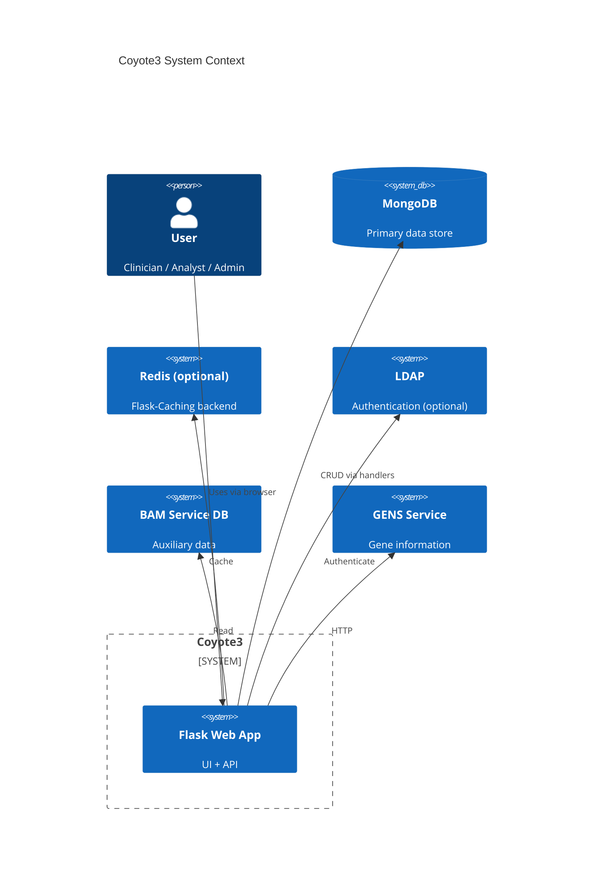

# Architecture – System Context (C4‑1)

```mermaid
C4Context
    title Coyote3 System Context
    Person(user, "User", "Clinician / Analyst / Admin")
    System_Boundary(coyote, "Coyote3") {
      System(web, "Flask Web App", "UI + API")
    }
    SystemDb(db, "MongoDB", "Primary data store")
    System(queue, "Redis (optional)", "Flask‑Caching backend")
    System(ext1, "LDAP", "Authentication (optional)")
    System(ext2, "BAM Service DB", "Auxiliary data")
    System(ext3, "GENS Service", "Gene information")
    Rel(user, web, "Uses via browser")
    Rel(web, db, "CRUD via handlers")
    Rel(web, queue, "Cache")
    Rel(web, ext1, "Authenticate")
    Rel(web, ext2, "Read")
    Rel(web, ext3, "HTTP")
```

