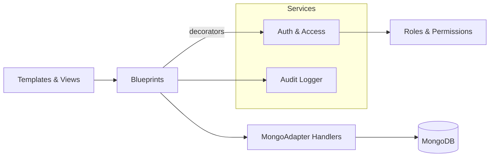

# Architecture – Components (C4‑3)

**Blueprints**
- **admin_bp**: users, roles, permissions, schemas, ASP, ASPC, ISGL, audit
- **dna_bp**: DNA variants, CNVs, translocations, biomarkers
- **rna_bp**: fusions
- **common_bp**: error pages, sample redirect, shared endpoints
- **coverage**, **dashboard**, **public**, **userprofile**: area‑specific UIs

**Handlers (`coyote/db/`)** (selected)
- `samples.py`, `variants.py`, `cnvs.py`, `translocations.py`, `fusions.py`
- `asp.py` (panels), `asp_configs.py` (assay configs), `schemas.py`
- `roles.py`, `permissions.py`, `users.py`
- `isgl.py` (in‑silico gene lists), `vep_meta.py`, `hgnc.py`
