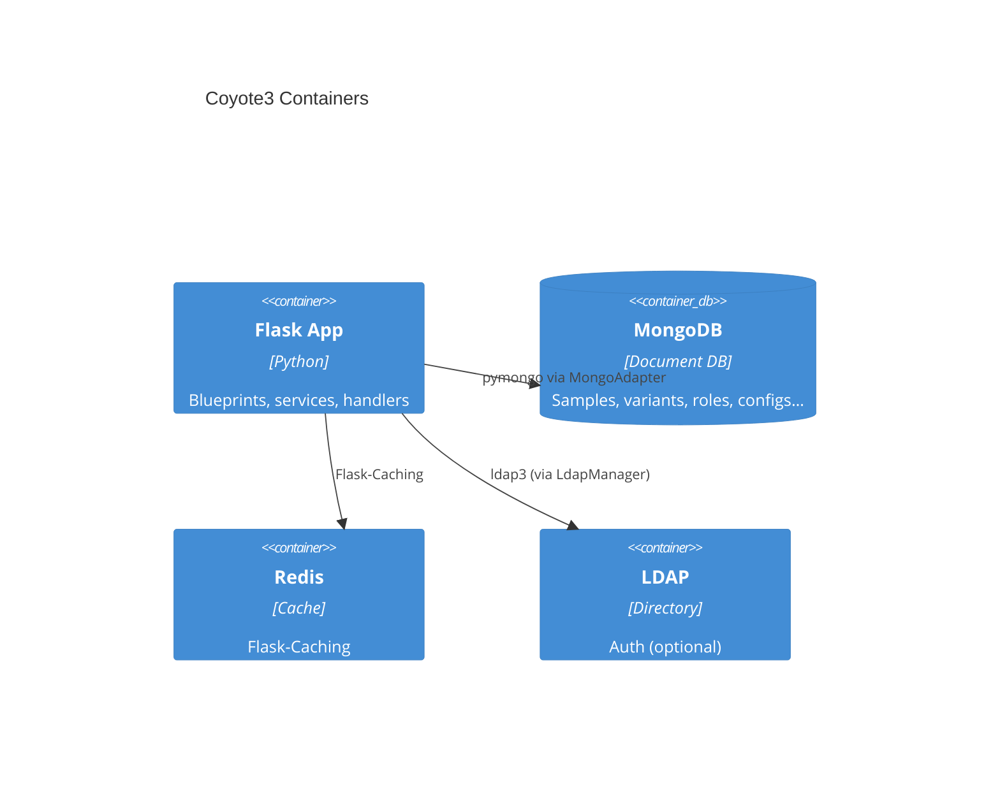

# Architecture – Containers (C4‑2)

**Key modules**
- `coyote/__init__.py`: app factory, blueprint registration, context processors
- `coyote/extensions/__init__.py`: shared objects (login_manager, mongo, **store**, ldap_manager, util)
- `coyote/db/mongo.py`: **MongoAdapter** + handler wiring
- `coyote/services/`: auth (decorators, LDAP, user session), audit logs
- `coyote/blueprints/`: `admin`, `dna`, `rna`, `common`, `coverage`, `dashboard`, etc.
