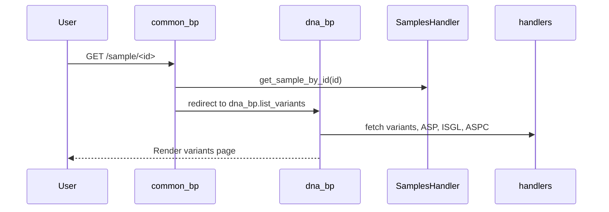
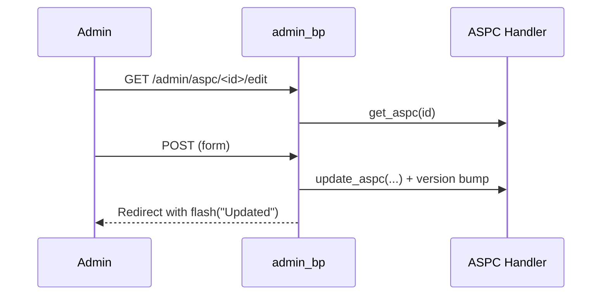

# Key Sequences

## Login (LDAP or local)
```mermaid
sequenceDiagram
  participant U as User
  participant W as Flask App
  participant L as LDAP
  U->>W: POST /login (credentials)
  W->>L: Bind & verify (if LDAP)
  L-->>W: OK / Fail
  W-->>U: Session cookie; redirect
```

## Open sample → DNA view


## Edit assay config (ASPC)


