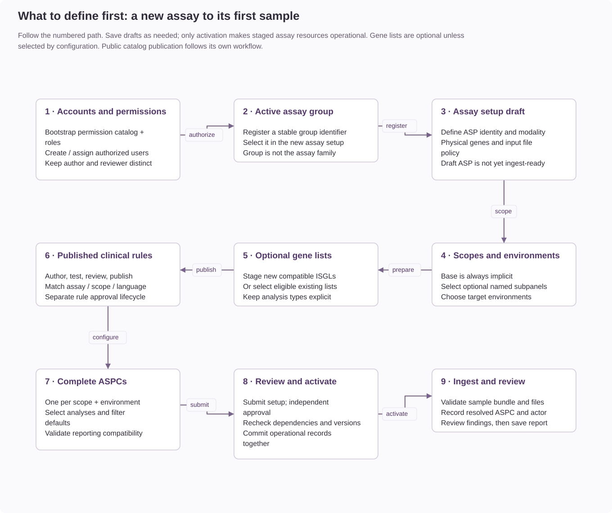

# Assay Setup


The diagram separates shared definitions, operational configuration, setup approval,
and catalog publication. Follow the steps below to create a new assay.

## Names And Identifiers

Administration uses **Assay group**, **Assay**, **Subpanel**, **Assay configuration**,
**Gene list**, **Reporting rule set**, and **Assay catalog**. ASP, ASPC and ISGL
remain technical names in API fields and storage; changing a display label does
not change an endpoint, permission or database reference.

Assay groups are center-defined. WGS, WTS and Fusion may be both group names and
registered assays at a center; they are not forced into a clinical-specialty
classification. Group membership and assay family are separate configuration fields.

Use lowercase ASCII letters and digits with **underscores between words for new
database identifiers**: `solid_gmsv3`, `breast_cancer`, `mpn_diagnostic_genes`.
Use **hyphens for URL path segments**, such as `/assay-groups`. JSON/Python field
names use underscores (`asp_id`, `subpanel_id`). These are conventions for different
kinds of names, not instructions to translate a stored identifier in a URL.

New assay groups, assays, shared subpanels and gene lists must use lowercase
letters and digits separated by single underscores. Creation rejects hyphens,
spaces, and leading, trailing or repeated underscores with HTTP 422. The rule
also applies to assay setup registration and gene lists created through setup,
and to imported new definitions submitted through the same creation services.

Existing identifiers and references retain their original separators. Editing
metadata does not register a new identity. `breast-cancer` and `breast_cancer`
remain different keys, not aliases; lookups do not try alternative spellings.
Generated configuration and reporting keys continue to derive from their scope
identifiers, using their established underscore separators without renaming an
existing assay or subpanel reference. Do not create duplicate definitions solely
to change punctuation. Renaming stored identities requires a reference migration.

Display names may contain spaces, punctuation and clinical capitalization, such
as **Breast Cancer** or **Hematology GMSv1**. Gene-list aliases provide alternative
readable names; references still use the stable gene-list identifier. Keep release
versions in version fields rather than changing the identifier on each publication.
An established assay name may contain a generation marker, such as `gmsv1`; that
is distinct from its configuration revision. `base` remains the implicit default
scope and must not be registered as a separate subpanel.

## Starting A Setup



The numbered path shows the dependencies for a new installation or assay. Existing
accounts, groups, shared subpanels, and eligible gene lists can be reused. Gene lists
are optional unless selected by a configuration. Publish compatible rules through
their separate review process before activating configurations that require them.

Register an [assay group](assay-groups.md) before starting a new assay setup.
The assay form uses the database registry, including center-owned groups.
An inactive group blocks new setup saves, submission and activation. Existing
clinical records remain accessible; disabling a group does not rewrite child statuses.

Open **Admin > Assay setup** (`/admin/assay-setups`) to prepare a new assay.
The **Create** action on the ASP list opens this workspace. Existing ASPs continue
to use their individual administration pages.

Setup drafts are separate from active assay data. Saving a step does not make
the assay available to ingest, sample analysis, or the public catalog. Reopen a
draft from **Saved setups** to continue its configuration.

## Steps

| Step | Configuration | Required before activation |
| --- | --- | --- |
| Assay | Identifier, display name, group, family, DNA/RNA category, input files, coverage and sequencing settings | Valid ASP definition |
| Scopes | Base, optional named subpanels and target environments | Base and at least one environment |
| Gene lists | New lists, their genes, list types, readable names and diagnosis scopes | Optional unless required by the selected filters |
| Reporting rules | Published rule sets available to the assay | Compatible published rules for every configured reporting scope |
| Configurations | ASPCs, including filters and reporting settings | Exactly one complete ASPC per selected scope/environment combination |
| Review | Readiness results, author, scope summary and revision history | Independent review and approval |

**Base is always selected.** It is an implicit scope, not a document in
`subpanels` or `subpanel_associations`. A base-only assay can be activated without
registering a named subpanel. Select additional shared definitions only when the
assay needs them. Each selected named scope requires its own ASPC in every
selected environment. Unselected scopes do not block activation.

To register a missing named scope, use **Manage subpanel definitions**, create
the shared definition without an active assay association, then return and select
**Refresh subpanel definitions**. Its association with the draft assay is created
only during activation.

For example, Base and Myeloid in development and production require four ASPCs.
Base alone in development requires one.

Save each form before moving to another step. Later steps can remain incomplete
while in draft. Review identifies the first blocking validation error; correct
it and review readiness again.

## Gene Lists And Rules

Gene lists created here are staged until activation. Their assay and group
bindings come from the draft ASP. Diagnosis identifiers must belong to the
selected scopes. Existing active lists available to the assay group are also
offered by ASPC filter selectors; the workflow does not rewrite those shared lists.

**Open rule builder** opens clinical-rule administration in a new tab. Saved
setup assays are available in its assay selector even though they are not
operational ASPs. Rule authoring, testing, clinical review and publication retain
their existing lifecycle and permissions. After publishing rules, return to setup
and use **Refresh reporting rules**.

Clinical rules are published through their own approval process before setup
activation. Setup approval does not publish or modify clinical-rule content.
An ASPC supplies the reporting language. Its exact subpanel release is selected
automatically, with assay Base used only when no exact published release exists.
The analyte and declared analyses must match the configuration. Publishing a new
exact release does not require rebinding the ASPC.

Public catalog publication remains separate. Add the assay to the catalog after
activation; only the catalog workflow controls public presentation and publication.

## Review And Activation

1. Complete and save the selected configurations.
2. Open **Review** and resolve readiness errors.
3. Choose **Submit for review**. Submitted content becomes read-only.
4. A qualified user who has not edited the content opens the saved setup.
5. The reviewer selects **Approve and activate**, or enters review notes and
   selects **Return for changes**.

Returning a setup restores draft editing and preserves the submitted revision.
Content editors, including the creator, cannot approve that setup. Published
setup snapshots cannot be edited. Subsequent changes use the individual resource
administration pages.

Activation revalidates configurations and checks the versions of published rules,
shared subpanels and available shared gene lists against the submitted review.
A dependency change requires returning the setup and submitting it again.
Stale saves and concurrent publication attempts return a conflict.

The ASP, named subpanel associations, newly staged gene lists, ASPCs, published
setup state and revision snapshot are written in one MongoDB transaction. A
failed write rolls back activation. A replica set is required, including a
single-member replica set for local development. Samples, annotations and
existing reports are not changed.

The transaction also writes an internal counter on the active parent group.
A concurrent deactivation therefore conflicts with publication and forces an
availability recheck before retrying. A group that becomes inactive before
publication commits cannot leave a partially activated setup.

## Permissions

| Operation | Required permissions |
| --- | --- |
| List summaries | `assay.panel:list` |
| Inspect a setup | `assay.panel:view` |
| Open a new form | `assay.panel:create` |
| Create a draft | `assay.panel:create`, `assay.config:create`, `gene_list.insilico:create` |
| Save, submit, approve and activate | All three creation permissions plus `assay.panel:edit` |
| Return for changes | `assay.panel:edit` and independence from content editors |

The UI requires assay list and view access. Editing requires the creation
permissions and assay edit permission. Clinical-rule actions retain their own
permissions.

An independent reviewer with `assay.panel:edit` can return a submitted setup
with a reason even without the creation permissions. Approval and activation
require all the creation permissions as well. Review notes are specific to the
selected setup and are cleared when switching workspaces.

## Storage And Operations

| Collection | Identity | Purpose |
| --- | --- | --- |
| `assay_setups` | Reserved `asp_id`; `_id` identifies the workspace | Current content and governance state |
| `assay_setup_revisions` | `setup_id`, `revision` | Immutable full snapshots of saved states and lifecycle actions |

Collection names are configured in `api/config/center/collections.toml`. Install
their indexes using the standard command, with the intended deployment
configuration and index-management account:

```bash
PYTHONPATH=. .venv/bin/python scripts/database/manage_mongo_indexes.py apply
```

Apply indexes before starting an API configured to verify index contracts. No
existing ASP backfill or clinical data migration is required.

Mutations attach traceability audit metadata with the setup identifier, assay
identifier and revision. The workspace displays revision history; full historical
content is retained in the revision collection.

API endpoints are under `/api/v1/admin/assay-setups`: list/create at the collection
path, new context at `/context`, saved context at `/{identifier}/context`, updates
at `/{identifier}`, and actions at `/{identifier}/submit`, `/publish` and `/return`.
Updates and lifecycle actions require the expected `revision`.

## Verification

```bash
.venv/bin/pytest -q tests/unit/test_assay_setup.py --no-cov
npm --prefix frontend run test:e2e -- assay-setup.spec.ts
```

Real transaction tests require an explicitly selected disposable test replica set
through `ASSAY_SETUP_TEST_MONGO_URI`. They create a uniquely named synthetic
database and remove only that database afterward. Do not use a production account.

```bash
.venv/bin/pytest -q tests/integration/test_assay_setup_transactions.py --no-cov
```
