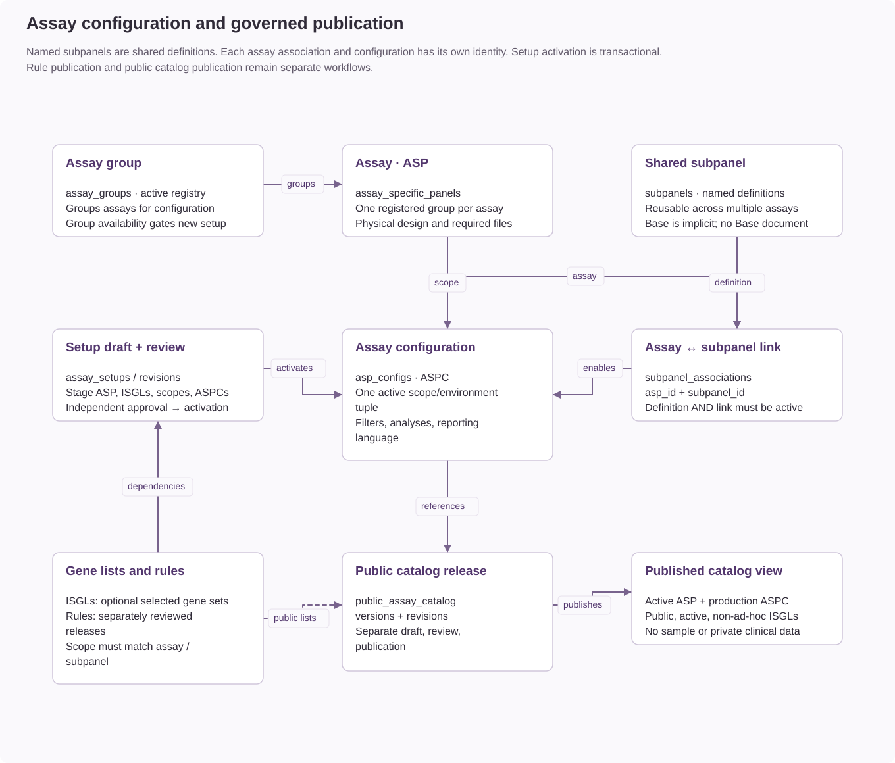

# Clinical configuration resources

Clinical configuration describes assay identity, clinical scope, review defaults,
reporting behavior and access. These are application resources, not separately
started Docker services. API and workers consume them; creating a database record
does not enable an unsupported parser or analysis workflow.

## Resource responsibilities

| Resource | Defines | Requires | Used by |
| --- | --- | --- | --- |
| Assay group | Center grouping and availability, with an access-scope identifier | Registered stable identifier and active status for new operations | ASP selection, configuration availability, eligible gene lists and user scope. |
| Assay / ASP | Assay design, group, DNA/RNA category, family, physical covered genes, sequencing settings and file policy | Active group; saved setup draft during preparation, operational ASP after activation | Ingest validation, analysis eligibility, configurations and sample identity. |
| Shared subpanel definition | Reusable named clinical scope | Stable identifier and active definition | Assay setup, associations, configuration and reporting scope selectors. |
| Assay–subpanel association | Availability of one named scope for one assay | Shared definition and assay; staged by setup until activation | Named-scope selection for that assay. Both definition and association must be active for new configuration. |
| Assay configuration / ASPC | Analysis/intents, filter defaults and report settings for an assay, scope and environment | ASP, valid scope, eligible selected lists and compatible reporting rules where required | Initial sample filters, enabled analyses, report configuration and revision traceability. |
| Gene list / ISGL | Analysis-specific in-silico gene selection | Valid list type, genes and eligible assay/group bindings; applicable diagnosis scopes | Optional filter defaults and sample review choices. |
| Clinical reporting rule set | Tested, reviewed report logic and wording for an assay/scope/analyte/language | Registered assay or eligible saved setup draft, valid scope and independent publication workflow | Report evaluation and compatibility of reporting configurations. |
| Assay setup | Draft workspace, readiness checks and independent approval | Active parent group and authorized author/reviewer | Stages related ASP, ISGL, association and ASPC records; commits them together at activation. |
| Public assay catalog | Public descriptions and presentation of operational offerings | Available operational resources and its own approval/publication workflow | Public catalog pages; not clinical filtering or sample access. |
| User, role, permission and scope | Who may perform an action and which clinical records they may access | Identity baseline, active accounts, suitable grants and scope assignments | All administrative and clinical workflows. |
| Sample | One ingested case's identity, evidence availability, saved filters and configuration lineage | Available assay/group, resolvable active ASPC, valid manifest and required inputs | Clinical review, findings, annotations and reports. |

## Assay identity and input policy

An ASP establishes what the pipeline is expected to deliver. `expected_files`
controls the available analysis choices; `required_files` selects inputs whose
absence rejects ingestion. An expected-but-not-required input may be absent,
in which case the sample records missing evidence. It is not an empty result set.

ASP physical coverage and ISGL selection serve different purposes. Physical
coverage describes the assay design and provides a default gene scope. ISGLs
select an analysis-specific subset for review. Neither a subpanel name nor a
report-rule name supplies the genes automatically.

## Base, named scopes and environments

Base is the implicit default scope. Never create a `base` subpanel document or
association. Named definitions are shared; their associations and ASPCs are
assay-specific. Reusing the same subpanel across two assays does not share their
thresholds, report language or configuration revision.

One active ASPC serves an `(asp_id, subpanel_id, environment)` combination.
For example, two scopes in two environments need four configurations in assay
setup. Unselected scopes/environments do not block setup activation.

Ingest and sample configuration resolution first look for the requested named
scope and then may fall back to Base in the **same environment**. Resolution records
the requested/resolved scope and a warning when that fallback is used. A development
ASPC does not substitute for a production ASPC. Assay setup is stricter than this
runtime fallback: it requires an explicit ASPC for every selected combination.

## Gene lists and analysis types

Standard ISGL types are `snv`, `cnv`, `fusion`, `expression` and `pgx` in the
bundled vocabulary. Corresponding `adhoc_*` types represent ad-hoc list choices;
they do not create additional finding types. Keep list type and eligible assay/
group bindings consistent with the intended filter. The typed form also validates
the list's diagnosis scopes against the associated assays/subpanels.

An active list is offered only when it is eligible for the selected assay or group
and analysis. Selecting it narrows that analysis; selecting an SNV list does not
implicitly filter CNVs or fusions. Creating a list alone does not select it for
an ASPC or overwrite an existing sample's filters.

Lists are optional unless referenced by configured filters. With no selected ISGL
or ad-hoc genes, applicable gene queries use ASP physical coverage; with no physical
genes, a query may have no gene restriction. Other evidence, policy and review
filters still apply. Review that behavior before choosing an unrestricted scope.

## Reporting rules and query policy

Clinical reporting rules are governed database releases. They select report content
and wording; separate [query rules](query-rules.md) govern finding retrieval and
exceptions. `filter_flag_metadata.yaml`
only controls flag presentation.

Reporting resolution uses assay, subpanel, analyte and language. It prefers an
exact published scope and can use the assay's published Base scope when no exact
published release exists. A rule must declare each configured report analysis.
Draft and unapproved content does not satisfy a published-release lookup.

In the setup workflow, every selected ASPC must resolve a published rule before
activation. In individual ASPC administration, the reporting compatibility check
applies to active configurations with report sections. These checks are distinct;
leaving sections empty does not bypass setup publication requirements.

## Access and historical records

Action permissions and clinical access scopes are separate. A user needs both the
relevant action grant and access to the assay/group/environment. Registering an
assay or group does not grant access to every user. Independent review requirements
also apply even when a user has broad administrative permissions.

New samples receive the resolved ASPC revision and initial filter state. Existing
samples continue to use their recorded revision rather than silently adopting new
ASPC defaults. Saved reports retain their historical evidence; changing a definition
does not regenerate them. Apply configuration changes to existing samples only
through the supported explicit workflow and review the resulting impact.

## Missing prerequisites and their effects

| Missing or unavailable resource | Effect | Resolution |
| --- | --- | --- |
| Authorized author or independent reviewer | Setup cannot complete its approval lifecycle. | Assign the required permissions and scope to distinct eligible people. |
| Registered active group | New assay/setup operations, activation and new ingest are blocked. Existing records remain accessible under their permissions. | Register or activate the intended group; do not change historical IDs to bypass it. |
| Saved assay draft | Rule authoring cannot select that new assay identity. | Save the Assay step first. A saved draft still does not enable ingest. |
| Operational ASP | A sample cannot use the draft as an ingest-ready assay. | Complete and approve setup activation. |
| Named subpanel definition or active association | Named scope is unavailable for new configuration. In setup, the selected definition is required and its link is created at activation. | Register/reuse the definition and select it; use association administration for an existing assay. Base needs neither. |
| Unselected ISGL | No missing-list error solely because no list exists. | Confirm the ASP fallback gene scope is intended, or create/select the needed list. |
| Selected ISGL missing, inactive or incompatible | ASPC validation rejects that selection; it cannot supply the intended default scope. | Select an eligible active list of the correct analysis type. |
| Compatible published rule | Setup activation is blocked; individual active reporting ASPCs also fail the reporting-scope check. Reporting cannot resolve the missing release. | Publish the appropriate assay/scope/analyte/language rule with all selected report analyses. |
| ASPC for a selected setup combination | Setup readiness/submission/activation fails. | Complete that configuration or deliberately remove the unneeded combination while drafting. |
| Runtime ASPC for a requested named scope | Base in the same environment may be used, with a recorded warning. Without either configuration, ingest fails. | Provide the named configuration or explicitly accept and validate Base fallback. |
| Stored ASPC revision referenced by an existing sample | Analysis/report views cannot resolve its recorded configuration. | Restore the revision or use the explicit supported configuration-update workflow. |
| ASP file declaration or compatible analysis choice | The analysis is unavailable in the ASPC editor; report sections cannot enable it independently. | Review the pipeline/file contract and supported assay-family capabilities. |
| Required ingest file | Ingest is rejected. | Supply the validated required input; do not weaken the requirement merely to admit an incomplete sample. |
| Expected but optional input | Ingest may proceed with a missing-evidence state; that resource is unavailable for review. | Supply the input when available or follow the approved incomplete-evidence workflow. |
| Public catalog release | No published catalog offering for the assay. Clinical use does not depend on catalog publication. | Publish catalog content if public presentation is required. |
| Optional external knowledgebase | Its enrichment is unavailable; it does not create the assay or its evidence. | Load/configure the relevant reference release when required. HGNC/VEP prerequisites still apply to workflows using their validation/metadata. |

## Related procedures

- [Add and activate an assay](assay-setup.md#step-by-step-add-a-new-assay)
- [Shared subpanels and assay associations](assay-subpanels.md)
- [Analysis and reporting availability](assay-analysis-availability.md)
- [Plan changes to existing configuration](planning-configuration-changes.md)
- [Clinical rule authoring and publication](../reference/clinical-reporting-rules.md)
