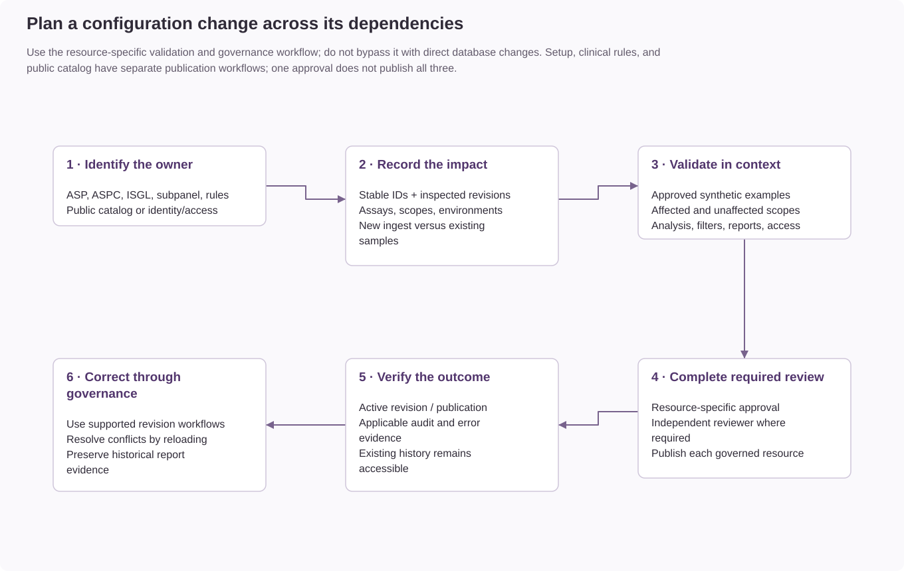

# Planning configuration changes

Changes to assays, subpanels, gene lists, and published resources can affect analysis
availability, filtering, or reporting. Change planning identifies the responsible
resource, affected workflows, and verification requirements. Resource-specific
validation and approval requirements still apply.

## Choose the resource that owns the behavior

| Intended change | Resource or workflow | Check before saving |
| --- | --- | --- |
| Physical assay design or required input files | ASP; use [assay setup](assay-setup.md) for a new assay. | Modality, assay family, coverage, and ingest file policy. |
| Enable analyses, change default filters, or configure reporting | ASPC for the assay/subpanel/environment. | Available input data, supported intents, selected lists, and compatible published rules. |
| Change reusable gene membership | ISGL. | Assay/group eligibility, list types, diagnosis scopes, and whether the list is public. |
| Register a named clinical scope | Shared subpanel definition and its assay associations. | Which assays need the scope, and which ASPCs must be configured separately. |
| Disable availability for one assay/subpanel pair | That assay's subpanel association. | Shared definition status and the effect on new selections. |
| Disable a group for new operations | Assay group availability. | Affected assays, queued ingest, publication, and new access assignments. |
| Change report wording or decision conditions | Clinical rule authoring, testing, independent review, and publication. | Scope, analyte, language, declared analyses, and representative test cases. |
| Change public presentation | Public catalog draft and publication. | Eligible active production resources and explicitly public gene lists. |
| Change who can act on a resource | User role and scope assignment. | Action permissions and assay/group/environment access are separate. |

## Record the impact before editing

Record the stable resource identity, inspected revision, intended environment,
requested change, and affected assays or scopes. Identify shared resources: one
subpanel definition or gene list can be referenced by more than one assay.
Use the [resource maps](../architecture/diagram-guide.md) to trace those dependencies.

Distinguish the intended effect on new ingest from the effect on existing review.
A sample records its resolved ASPC revision and maintains its own filter state.
Do not treat a new configuration revision as an automatic reset of all samples.
Likewise, saved reports retain their confirmed snapshots rather than recomputing
from a later configuration.

| Boundary | Established behavior |
| --- | --- |
| Group availability | Blocks specified new operations without cascading inactive flags into children or deleting historical records. |
| Shared subpanel | Global definition status and per-assay association status remain distinct. Sharing a scope does not share ASPCs or rules. |
| Sample filters | Existing filters remain authoritative until an explicit supported change or reset. |
| Published rules | Exact compatible scope is selected before permitted assay Base fallback; published content is immutable. |
| Setup activation | Revalidates dependencies and writes staged operational resources together after independent review. |
| Public catalog | Has its own approval/publication lifecycle; catalog editing does not change ingest or clinical filters. |
| Saved reports | Retain confirmed findings, configuration, filter, and rule provenance. |

## Validate, review, and verify

1. Reproduce the intended change with approved synthetic examples in the target
   validation environment. Include an affected scope and an unaffected scope.
2. Verify enabled analyses, filter selections, gene scope, report preview, and
   applicable access restrictions. Include the relevant failure condition, such as
   missing required data or an incompatible rule scope.
3. Complete the resource's required review and publication workflow. Setup approval
   does not publish clinical rules or the public catalog.
4. If a concurrent-edit conflict occurs, reload and compare revisions before
   reapplying the change. Do not overwrite another editor's changes using raw database writes.
5. Verify the resulting active revision or publication, applicable audit event,
   new-operation behavior, and access to existing sample/report history.

If a change produces an unexpected result, use the resource's governed correction
or revision workflow. Do not delete historical revisions, rewrite saved reports,
or assume that restoring application code reverses database changes.

## Resource-specific procedures

- [Assay groups](assay-groups.md) and [shared subpanels](assay-subpanels.md).
- [Assay setup and activation](assay-setup.md).
- [Analysis and reporting availability](assay-analysis-availability.md).
- [Clinical reporting rules](../reference/clinical-reporting-rules.md).
- [Public catalog publication](public-assay-catalog.md).
- [Permissions and access](permissions-and-access.md).
