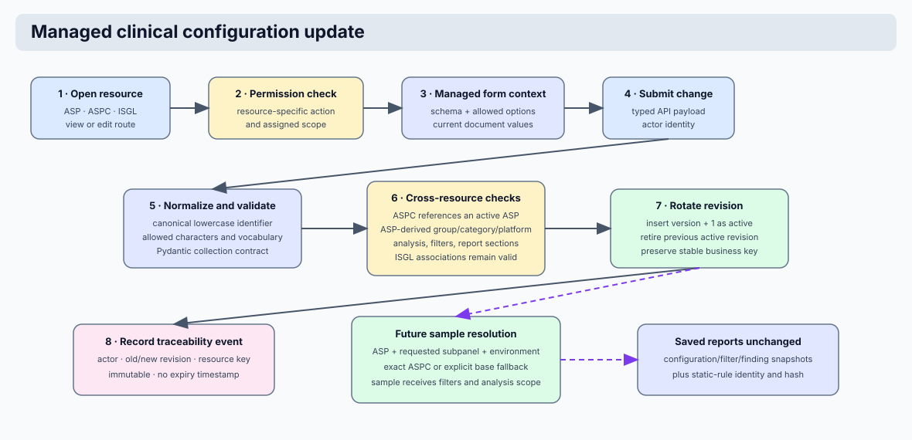

# Configuration Identity And Audit

Coyote3 uses stable clinical identifiers, one active configuration record per
clinical scope, and an operational audit trail. Together, these rules make
configuration easy to query while preserving the evidence needed to explain
how a sample was reviewed and reported.

This page describes the production architecture. It is intended for clinical
administrators, developers, and operators who maintain ASP, ASPC, and ISGL
configuration.

> **Info**
>
> Application timestamps are stored in UTC. The user interface renders them
> in the deployment's configured local time zone.
>

## Identity Model

Clinical identifiers are machine join keys, not display labels. They are used
by configuration records, samples, filters, static report-rule directories,
and access scopes. The same canonical value must therefore be used wherever a
clinical scope is referenced.

| Identifier | Represents | Primary use |
|---|---|---|
| `asp_id` | Physical assay definition | Connects an assay to its platforms, coverage, and assay family |
| `subpanel_id` | In-silico subpanel within an ASP | Selects scoped filters, gene lists, and report rules; `base` means no subpanel-specific configuration |
| `aspc_id` | Active assay configuration | Identifies the resolved ASP, subpanel, and environment configuration |
| `isgl_id` | In-silico gene list | Identifies a reusable curated gene scope |
| `sample.name` | Clinical sample identifier | Human-facing sample identity and URL segment |

### Identifier grammar

| Rule | Requirement | Example |
|---|---|---|
| Case | Input is converted to lowercase before storage | `Hem-Snabb` becomes `hem-snabb` |
| Allowed characters | Lowercase letters, digits, underscore, and hyphen | `solid_gmsv3`, `hem-snabb` |
| Separator semantics | Hyphens and underscores are both valid and remain distinct | `hem-snabb` is not the same key as `hem_snabb` |
| Disallowed characters | Whitespace, dots, slashes, and other punctuation are rejected | `Hem Snabb` and `gms.v1` are invalid |
| Display text | Human-readable labels are kept separately from identifiers | `Hem-Snabb` can be displayed while `hem-snabb` is stored |

This policy prevents silent key rewrites. A configuration that is not valid at
creation time cannot later become unreachable because a space, period, or
changed separator was normalized differently by another service.

## Active Clinical Configuration



ASP, ASPC, and ISGL are immutable, versioned configuration resources. Each
business key has exactly one active document and may have multiple retired
revisions. Administrators edit the active definition by creating its successor;
the previous document remains available for reconstruction.

| Resource | Stable key | Revision key | Owns |
|---|---|---|---|
| ASP | `asp_id` | `(asp_id, version)` | Physical assay and platform definition, assay family, coverage, and supported scope |
| ASPC | `aspc_id` | `(aspc_id, version)` | Environment-specific enabled analyses, filter profiles, reporting configuration, and rule resolution scope |
| ISGL | `isgl_id` | `(isgl_id, version)` | Typed curated genes and permitted assay/subpanel associations |

The `base` subpanel is the explicit default for an ASP with no subpanel-specific
configuration. If a sample requests a subpanel that does not have an active
ASPC, Coyote3 resolves the active `base` ASPC and records both requested and
resolved subpanel IDs in `samples.aspc_resolution`. The UI shows this as a
configuration warning because the configured default, rather than a matching
subpanel configuration, was used.

### Revision protocol

1. A new business identifier starts with one active document at version `1`.
2. An edit validates a complete successor payload before changing persistence.
3. The successor keeps the same business identifier, receives `version + 1`,
   and records the previous ObjectId in `supersedes_id`.
4. The previous revision becomes inactive and records `retired_by`,
   `retired_on`, and `retired_reason`.
5. The successor is inserted as the only active revision.

Active reads remain unambiguous because a partial unique index permits only one
active document per business identifier. Compound unique indexes prevent two
documents from using the same business identifier and version. MongoDB
transactions make rotation atomic on replica sets. The standalone development
path uses guarded writes and restores the previous active revision if insertion
of the successor fails.

Deactivation and reactivation are lifecycle operations on the latest revision;
they do not rewrite its clinical payload. Any payload edit always creates a new
revision.

## Audit Events

Audit events describe significant operational actions. They are separate from
the resource document and do not store a second complete copy of configuration
or secret material.

### Events recorded for managed clinical resources

The ASP, ASPC, and ISGL administration routes record successful create, update,
status, and retirement actions as permanent traceability events. Failed HTTP
requests remain visible as operational request or mutation failures and follow
the operational retention policy. Events contain the following context.

| Field | Meaning |
|---|---|
| Event type | Domain action such as ASP update, ASPC creation, or ISGL deletion |
| Resource type | `asp`, `aspc`, or `genelist` |
| Resource identifier | Business key and display identity needed to find the affected resource |
| Actor | Authenticated user responsible for the action |
| Timestamp | UTC time at which the request completed |
| Outcome | Success or failure |
| Request context | HTTP method, route, request ID, and permitted operational metadata |
| Error context | Sanitized failure reason when an action cannot complete |
| Revision context | Previous and successor version and document identifiers for a successful rotation |

Audit events are also produced for clinically important actions such as sample
ingest success or failure, sample deletion, report creation, and variant
curation. This provides an operational timeline without making audit records a
replacement for clinical report snapshots.

> **Caution**
>
> Audit metadata must not include passwords, session tokens, API tokens, or
> unrestricted source-file content. Error details are sanitized before they
> are persisted or presented to users.
>

ASP, ASPC, and ISGL mutations are stored as `traceability` audit events. These
events have `immutable: true`, do not receive `expires_at`, and are excluded
from both MongoDB TTL expiry and application retention cleanup. Routine request
and runtime events use the expiring `operational` class. Database access and
backups remain part of the control boundary: a privileged MongoDB operator can
still alter data outside the application.

## Report Reproducibility

Current configuration and report reproducibility serve different purposes.

1. A sample resolves an active ASPC by its canonical assay, subpanel, and
   environment scope.
2. The reviewer changes filters or selected gene lists as needed during review.
3. Report preparation builds the exact finding and text context from that
   state.
4. Saving the report stores the resolved ASPC identity, applied filter snapshot,
   selected gene-list context, reportable finding snapshots, rendered output,
   and static-rule identity/content hash.

Consequently, a later ASPC edit affects future preparation but does not change
an already saved report. The sample and report retain the resolved ASPC ObjectId,
business key, and version, while the retired ASPC revision remains in MongoDB.
The saved report remains interpretable with the exact configuration and rule
source used at the time it was created.

## Operational Migration Policy

One-time migrations can normalize existing identifiers, remove superseded
configuration records, and establish the first-version active state. This is a
data-conversion operation only. It does not define the ongoing lifecycle of
clinical configuration and it does not remove operational audit events.

After migration, all changes use the managed administration paths so that
validation, authorization, and audit recording are applied consistently.

## Configuration Relationships

```text
ASP (asp_id)
  -> ASPC (aspc_id, asp_id, subpanel_id, environment)
      -> enabled analyses and filter profiles
      -> report configuration and static rules
  -> ISGL associations (typed clinical gene scope)
  -> sample (resolved ASPC and applied filters)
      -> saved report (configuration and rule snapshot)
```

For the complete clinical data path, see
[Clinical Data Preparation And Reporting Flow](clinical_data_and_reporting_flow.md).
