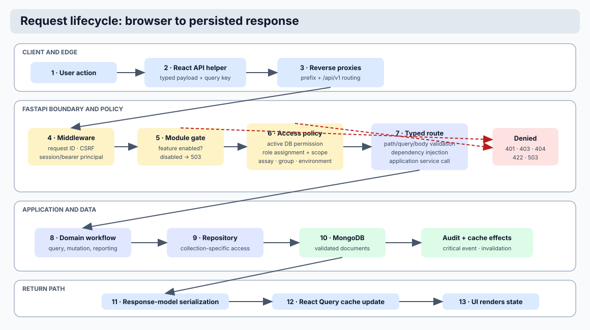
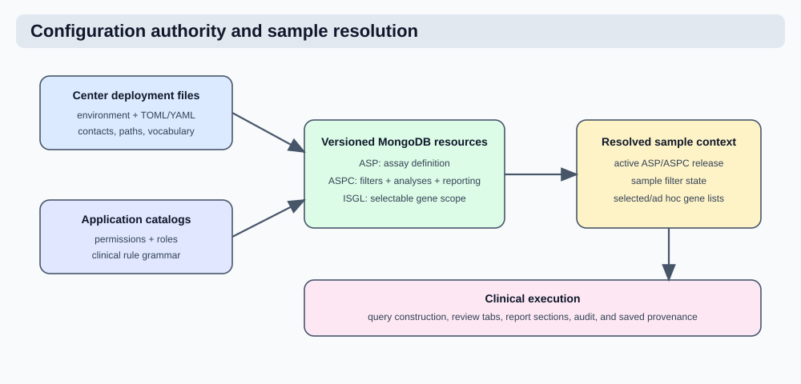

# Application Architecture



This document explains how Coyote3 operates as a connected system. It is
written for developers, operators, and advanced users who need to understand
the relationships among the UI, API, background workers, database collections,
and clinical review workflows.

## System Purpose

Coyote3 is a clinical genomics review and reporting platform. It receives validated sample manifests and analysis files, persists normalized MongoDB documents, applies assay-specific configuration, exposes sample review workflows in React, and stores report and audit snapshots so clinical decisions can be reconstructed later.

!!! info "Architecture reference"

    For a concise end-to-end map, use the
    [system overview](../product/complete_application_manual.md). For
    implementation guidance, use the
    [complete developer manual](../developer/complete_developer_manual.md).

The application is organized around a few stable principles:

- the React UI never owns clinical rules
- the FastAPI backend owns API contracts, workflow logic, authorization, and validation
- MongoDB collections are accessed through repositories and typed Pydantic document contracts
- Celery runs background work such as ingest and retention maintenance
- Redis is used for cache/session/task infrastructure, not as a clinical source of truth
- runtime controls may be toggled from Admin, while secrets and infrastructure endpoints stay in environment configuration

## Runtime Components

The platform runs as separate services:

- `frontend`: React application served through the web container or reverse proxy
- `api`: FastAPI application, business services, authorization, and persistence access
- `worker`: Celery worker for ingest, dependent writes, and maintenance tasks
- `beat`: Celery scheduler for watched-folder ingest and nightly maintenance
- `redis`: broker/cache/session infrastructure
- `mongo`: clinical, operational, and configuration persistence

The API and worker initialize the same runtime configuration and Mongo repositories. This keeps request-driven and background-driven writes on the same contract path.

## Frontend Data Table Contract

Clinical tables use a single React pattern:

- `@tanstack/react-table` owns table state, rendering, multi-column sorting,
  filtering, row selection, and export row access.
- `@tanstack/react-query` owns API request caching, request de-duplication,
  stale-time behavior, and mutation-driven invalidation.
- `frontend/src/hooks/useClinicalTableState.ts` is the shared hook for
  server-paginated clinical review tables. It keeps page, page size, search,
  and multi-column sort state in the URL, debounces search text, and exposes
  shared cache timings.
- `frontend/src/hooks/useUrlTableState.ts` is the lower-level URL-state helper
  used by both server-paginated tables and client-side tables that need sort
  state to survive navigation.
- `frontend/src/components/data-table/DataTable.tsx` is the common table
  renderer. Header clicks build multi-column sort order by default, and sort
  priority numbers are shown when more than one column participates.

Server-paginated clinical tables send sort state as comma-separated
`field:direction` entries. The backend applies search and all sort keys to the
complete filtered result set before pagination. This ensures that sorting by
case VAF, control VAF, population frequency, tier, gene, or any other supported
column ranks all matching rows, not only the visible page.

!!! tip "Table invalidation"

    Mutations that alter persisted finding state should invalidate the affected
    React Query family, such as the current sample small-variant, CNV, fusion,
    or translocation query. The next view then refreshes from MongoDB while
    unchanged table states can still use short-lived cached results.

## Configuration Model



API configuration is centralized under `api/config/`:

- `api/config/app_config.py`: runtime configuration classes and environment loading
- `api/config/constants.py`: fixed product vocabularies such as assay categories, list types, auth providers, ASP groups, file keys, and analysis types
- `api/config/database_versions.py`: canonical `samples.database_versions` keys and the VCF-header-only normalizer
- `api/config/runtime.py`: public helper facade used by the rest of the API
- `api/config/center/collections.toml`: MongoDB collection-name mapping
- `api/config/application_metadata.py`: repository-owned product description and codebase links
- `api/config/center/contact.toml`: center-owned organization, support, hours, and contact content

Collection names must come from `api/config/center/collections.toml`. The API loads this file relative to the `api/config` package, so startup does not depend on the process working directory.

Environment variables remain the right place for deployment-specific or sensitive values:

- MongoDB and Redis URLs
- API/session/token secrets
- LDAP and SMTP credentials
- mounted filesystem roots
- CORS, cookie, and production hardening settings
- organization identity and public content file paths
- OpenAPI route grouping through the canonical tag taxonomy in
  `api/interfaces/http/tags.py`

Admin-controlled runtime settings are stored in MongoDB `app_controls`. Those controls are for behavior switches and retention policies, not infrastructure secrets.

### Database-version metadata

Sample reference and annotation versions are stored only in the nested
`database_versions` object. The canonical keys are `assembly`, `clinvar`,
`cosmic`, `dbsnp`, `ensembl`, `gencode`, `genebuild`, `gnomad`,
`hgmd_public`, `polyphen`, `sift`, and `vep`. `database_versions.vep` is the
authoritative VEP metadata version for DNA filtering, transcript display, and
report generation. Flat fields such as `vep_version` are rejected by the sample
contract.

When a manifest or API client supplies `database_versions`, it must submit the
keys exactly as listed. DNA VCF headers are the normal source; punctuation and
case in a recognized header label are normalized during ingest before being
saved under the canonical key. Explicit manifest values take precedence for the
same key.

!!! warning "Configuration boundary"

    Keep secrets, infrastructure endpoints, and mount paths in environment configuration. Use Admin application controls only for runtime behavior switches and retention policy.

Public content is controlled through explicit files under
`api/config/center/` instead of scattered UI copy. `contact.toml` drives the
Contact page and `assay_catalog.yaml` drives the public assay catalog narrative.
This allows each center or section to deploy the same application image with
local service names, support contacts, sample-type descriptions, and TAT values.

## Collection Mapping

The Mongo adapter reads `DB_COLLECTIONS_CONFIG` from the active config object. Each configured collection key becomes an adapter attribute, and repositories bind to those attributes.

Example flow:

```text
api/config/center/collections.toml
  -> DefaultConfig.DB_COLLECTIONS_CONFIG
  -> MongoAdapter.setup()
  -> adapter.samples_collection, adapter.variants_collection, ...
  -> SampleRepository, VariantsRepository, ...
  -> application services
  -> API routes and Celery tasks
```

The application should not hardcode clinical collection names in services or routes. Exceptions are operational singleton collections such as `app_controls`, API sessions, and audit events where the name is explicitly configured or intentionally fixed.

!!! tip "Adding collections"

    Add collection names through `api/config/center/collections.toml`, then bind them through repositories and typed contracts. Avoid hardcoded collection names in routes or domain services.

## Document Contracts

MongoDB document shapes are defined in `api/contracts/schemas/`. They are grouped by domain:

- `samples.py`: sample, report, and sample-comment documents
- `dna.py`: SNV, CNV, translocation, biomarker, coverage, and reported variant documents
- `rna.py`: fusion, expression, classification, and RNA QC documents
- `assay.py`: ASP, ASPC, ISGL, blacklist, and assay mapping documents
- `governance.py`: users, roles, and permissions
- `reference.py`: annotation and knowledgebase documents
- `app_controls.py`: runtime control document
- `registry.py`: collection-to-contract registry

All write paths should validate against these contracts before insertion or update. This applies to ingest, admin resource management, internal collection writes, and future migration scripts.

## Clinical Configuration Resources

### ASP

ASP documents describe the physical assay: assay ID, family, category, platform, covered genes, germline genes, expected files, required files, and assay metadata. ASP IDs are business identifiers and must be unique.

### ASPC

ASPC documents describe the active rulebook for the unique
`asp_id`/`subpanel_id`/`environment` scope. They contain enabled analysis
types, `analysis_intents`, frozen nested filter profiles, reporting settings,
and report sections. Sample filters are seeded from ASPC during ingest.
Resetting filters restores the sample's recorded ASPC defaults.

### ISGL

ISGL documents describe curated in-silico gene lists. List types use canonical constants:

- `snv`
- `cnv`
- `fusion`
- `expression`
- `pgx`
- `adhoc_snv`
- `adhoc_cnv`
- `adhoc_fusion`
- `adhoc_expression`
- `adhoc_pgx`

The UI separates ad-hoc and non-ad-hoc list types. ISGL scope is represented by
three related fields:

| Field | Meaning | Admin behavior |
| --- | --- | --- |
| `asp_groups[]` | Assay groups in which the list may be used, such as `hematology` or `solid` | Selecting one or more groups reveals the union of active ASPs in those groups. |
| `asp_ids[]` | Specific ASPs allowed to use the list | The user selects one or more ASPs from the group-filtered choices. Removing an assay group also removes ASP selections that no longer belong to the remaining groups. |
| `diagnosis[]` | Clinical diagnosis or in-silico subpanel identifiers associated with the list | The form accepts comma-separated or newline-separated values and stores a deduplicated array. An empty array means assay-wide rather than diagnosis-specific scope. |

ISGL does not duplicate `subpanel_id`. That singular field belongs to sample and
ASPC identity, where it selects one effective configuration. A gene list can be
reused by several diagnoses/subpanels, so ISGL stores those tags in the
multi-valued `diagnosis[]` field. Runtime ISGL matching and public catalog
grouping use `diagnosis[]`; the public catalog treats an empty list as the
`base` scope.

## Sample Ingest Flow

Sample ingest starts from a validated sample manifest, usually a `coyote3.yaml` file. The service parses the payload, normalizes paths, resolves assay policy, validates required files, reads source analysis files, and writes the canonical sample and dependent analysis documents.

High-level flow:

```text
coyote3.yaml
  -> parse and normalize null/null-like values
  -> resolve ASP file policy by assay
  -> resolve ASPC by assay + profile + subpanel/base
  -> create sample document with canonical files and filter state
  -> parse VCF/CNV/coverage/fusion/etc.
  -> write dependent collection documents
  -> mark manifest .done or .failed for watched-folder ingest
  -> record audit events
```

The Celery worker can ingest explicitly queued bundles or scan the configured watch directory. The watch task should rename successfully processed manifests with the configured `.done` suffix and failed manifests with the configured failure suffix.

!!! caution "Ingest safety"

    Ingest changes can affect sample availability, reportability, and downstream search. Validate required files, ASPC resolution, and dependent collection counts before treating a migration or parser change as complete.

## Sample Review Flow

When a sample is loaded, the backend returns:

- sample identity and status
- assay, profile, subpanel, paired/single-sample state
- biomarker summary when present
- available tabs derived from ASPC analysis types
- effective filters by analysis domain
- row data from the relevant analysis collection

The UI should show only analysis tabs enabled for the sample’s ASPC context. For paired samples, case and control values are rendered separately. For unpaired samples, control columns should be hidden.

Filters are domain-specific:

- SNV filters apply to SNV rows and SNV/adhoc SNV lists
- CNV filters apply to CNV rows and CNV/adhoc CNV lists
- fusion filters apply to fusion rows and fusion lists
- coverage filters apply to coverage thresholds and coverage views

Changing filters should re-query data and update temporary report preview state. Persisting filters should update the sample document’s filter blob in the correct domain section.

## Variant And Finding Review

Small variants, CNVs, fusions, and translocations have list pages and detail pages. List pages support search, export, selection, and bulk actions where clinically appropriate. Detail pages must prioritize:

- finding identity
- sample identity and link back to the sample
- called-by/caller badges
- classification/tier state and actions
- comments and annotations
- knowledgebase and population/quality evidence
- panel-of-normal and caller evidence where available

Flags are displayed as individual badges. Flag behavior and descriptions are metadata-driven through `api/config/center/filter_flag_metadata.yaml`. Badges should use consistent severity coloring:

- pass-like values: green
- warning-like values: yellow/amber
- fail-like values: red
- other configured categories: themed metadata colors

VEP consequence display is metadata-driven by VEP metadata. UI labels remain stable while underlying VEP terms may differ by VEP version.

## Reporting Flow

Reports are generated from the sample’s current effective filter state and ASPC reporting configuration.

Temporary preview flow:

```text
sample + report type
  -> backend builds report context
  -> backend snapshots current reportable rows
  -> backend renders report HTML
  -> UI displays temporary preview
```

Saving a report persists:

- report metadata
- report HTML/PDF artifacts when configured
- reported-variant snapshot rows
- ASPC object/context used for the report
- filter snapshot used for the report

This means later searches can answer which samples reported a gene/variant/tier and which filters/configuration were in force at report time. Report snapshots are not just display data; they are part of the clinical reconstruction model.

!!! warning "Report reconstruction"

    Saved reports must carry the reportable finding snapshot, filter snapshot, and ASPC context. Do not rely on current mutable sample filters to explain an old report.

## Comments And Annotations

Sample-level comments belong in the `sample_comments` collection. Finding-level comments and annotations are shown on detail pages and may be local to a sample finding or global to the variant/finding identity, depending on the selected option.

Comments support Markdown rendering. Sample comments may show live preview while finding-detail comments use an explicit preview/edit flow to keep the detail page compact.

Hidden/unhidden comment actions should be auditable and visible according to user permissions.

## Access Control

Coyote3 uses role-driven permissions with PyCasbin-style RBAC and scoped checks. User documents carry assigned roles and scope attributes such as environments, assays, and assay groups. User-specific allow/deny permission overrides are not part of the current model.

Authorization rules:

- roles define effective permissions
- role levels provide coarse hierarchy
- permission strings use `resource:action[:scope]`
- user scopes limit what samples/assays are visible
- admin APIs require explicit admin permissions
- internal APIs use an internal token gate and should not be used by browsers

Authentication provider behavior comes from `user.auth_type`, which is a list. LDAP login uses email. Local login uses username and local password.

## Admin Resource Model

Admin pages are contract-driven, not DB-schema-driven. Managed forms are generated from backend-owned models and resource metadata. The UI does not expose raw JSON editors for normal resource editing. Admin Samples is an explicit operational exception: authorized administrators edit a complete document, but writes still pass through the sample service, `SamplesDoc` validation, route-controlled identity, permission checks, and audit middleware.

Clinical configuration resources such as ASP, ASPC, and ISGL use immutable
revision rotation. Each edit preserves the business identifier, increments the
version, creates a new active document, and retires the previous revision.
Users, roles, and permissions are updated in place with version metadata and
audit entries so access governance remains simple to query and migrate.

## Application Controls

Runtime controls live in the `app_controls` collection and are managed from Admin -> Application Controls.

Controls include:

- Celery task family gates
- module visibility switches
- finding-type tiering action switches
- audit retention days
- notification retention days
- disk log retention days
- disk log gzip threshold

The page also queues explicit public reference maintenance. The public OncoKB
refresh is an HGNC-backed Celery task: it reads the complete local HGNC identity
catalogue, fetches each public OncoKB catalogue endpoint once, and reconciles
the two managed public OncoKB gene collections.

Finding-type tiering controls are stored below `curation.tiering`. They govern
which Tier 1-4 mutation controls the React application presents for small
variants, CNVs, fusions, and translocations. They do not remove stored
annotations or alter the backend classification API. This separates a
center's current UI workflow from the persisted clinical identity contract.

Disabling a Celery task family prevents new executions from doing work. It does not resize the worker pool or terminate tasks already running. Capacity is effectively returned as tasks stop being queued or return early.

!!! info "Task controls"

    Application controls gate behavior. Worker process count and CPU capacity are controlled by deployment settings, not by toggling a task family off.

## Audit, Logs, And Retention

Audit events are durable MongoDB documents. Every important access, mutation, ingest, report, and runtime failure should emit an audit event with bounded, redacted metadata.

Audit events have two retention classes. Operational events receive
`expires_at` and are subject to the MongoDB TTL index and nightly retention
maintenance. Traceability events are immutable, have no expiry timestamp, and
are excluded from application cleanup. Managed ASP, ASPC, and ISGL mutations
use the traceability class.

Runtime logs are JSON lines written to stdout and optionally to disk. Disk logs rotate daily. The retention maintenance task gzips old plain log files and deletes files beyond configured retention. In production, stdout/centralized logging remains the primary operational log path.

## Frontend Structure

The React application is organized around:

- page components in `frontend/src/pages`
- reusable layout components in `frontend/src/components/layout`
- table components in `frontend/src/components/data-table`
- detail/review components in `frontend/src/components/detail`
- comments, filters, forms, cards, and admin components under their respective component folders
- API formatting and variant UI helpers in `frontend/src/lib`

### Responsibility boundaries

Keep page files responsible for routing, query orchestration, local interaction
state, and layout composition. Move reusable domain presentation out of the
page once it is independently meaningful:

- `components/detail/VariantKnowledgebase.tsx` owns knowledgebase summaries,
  expandable evidence blocks, ClinPGx evidence-table definitions, and external
  knowledgebase links for a small-variant detail view.
- `components/detail/TranscriptConsequencesTable.tsx` owns alternate-transcript
  table rendering and consequence badge sizing.
- `lib/variant-badge-primitives.tsx` owns the common badge tooltip mechanics,
  severity classes, and viewport-aware tooltip positioning.
- `lib/variant-ui.tsx` owns variant-domain badges and consumes those primitives;
  it remains the stable public import for existing variant views.

The ingest service follows the same pattern. `application/ingest/service.py`
coordinates the workflow and persistence boundary, while
`application/ingest/dependent_writes.py` owns dependent-document writes,
replacement snapshots, restoration, and cleanup. New collection-specific
ingest behavior belongs in a focused helper or parser rather than in the
orchestration service.

The frontend should consume backend contracts and metadata rather than duplicating clinical logic. Hardcoded colors and clinical vocabularies should be avoided when a backend/config constant or metadata file exists.

API calls should go through `frontend/src/lib/api.ts`. That wrapper provides:

- typed methods such as `api.get<T>()`, `api.post<T>()`, `api.put<T>()`, and `api.delete<T>()`
- centralized success-envelope unwrapping through `responsePayload`, `responseItems`, `unwrapPayload`, and `unwrapItems`
- consistent global notification behavior for failed requests

Normal clinical pages should not display raw backend JSON. JSON inspectors are reserved for explicit debug, admin diagnostic, and route-audit workflows. Clinical views should render domain-specific cards, tables, and badges from the same payload.

Route-level contract coverage should verify every page in `frontend/src/lib/routes/ui-route-registry.ts`:

- expected endpoint shape and required backend fields
- empty state rendering
- permission/error state rendering
- export/download behavior when the route offers it

!!! info "Frontend contract tests"

    The route registry is the source checklist for page-level API contract tests. When a frontend test runner is added, each route entry should have a matching test that mocks the listed API dependencies and verifies the fields listed in `dataUsed`.

## Developer Rules

When adding or changing functionality:

1. Define or update the Pydantic contract first.
2. Register collection models in the schema registry if the document is persisted.
3. Keep collection names in `api/config/center/collections.toml`.
4. Add repository/service logic behind a domain boundary.
5. Expose API routes with response models.
6. Emit audit events for mutations and important operational actions.
7. Keep the UI contract-driven and avoid raw payload displays unless the page is explicitly for inspection.
8. Add focused tests for contracts, query behavior, and workflow side effects.
9. Update this documentation when the behavior changes.
