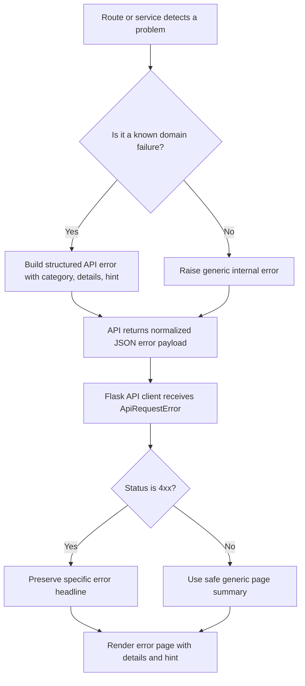

# Error Contract

## Error Propagation Diagram

```text
Route / service detects failure
  |
  +--> known domain/setup/validation issue
  |       |
  |       v
  |   build normalized API error payload
  |
  +--> unexpected fault
          |
          v
      internal error handling
                |
                v
         API returns error response
                |
                v
     Flask API client translates upstream failure
                |
                +--> 4xx -> preserve specific message/details/hint
                +--> 5xx -> show safe generic summary
```

This document defines the intended error behavior across the API and web layers.

The goal is simple:

- errors should be specific
- errors should be actionable
- errors should be structurally consistent
- page-level errors should preserve useful domain context from the API

## Why This Exists

Historically, Coyote3 had a mix of:

- precise domain errors
- generic `Forbidden`
- generic `not found`
- vague page summaries such as `Unable to load DNA findings`

That made real operational problems hard to understand, especially when the
underlying issue was setup-related rather than permission-related.

Examples of bad outcomes:

- missing ASP surfaced as a vague findings-page load error
- missing ASPC looked like a generic forbidden or config-not-found failure
- sample scope denials did not explain what scope was violated

The error contract exists to prevent that drift.

## Standard API Error Shape

API errors should use this payload shape:

```json
{
  "status": 422,
  "error": "ASPC not registered for assay 'hema_GMSv1' in environment 'production'",
  "details": "Sample '26MD04507p' belongs to environment 'production', but no ASPC exists for assay 'hema_GMSv1' in that environment.",
  "category": "setup",
  "hint": "Create and activate the ASPC for this assay/environment combination."
}
```

Fields:

- `status`
  - HTTP status code
- `error`
  - short user-facing summary
- `details`
  - concrete context for operators and developers
- `category`
  - stable error family
- `hint`
  - remediation guidance when useful

## Error Categories

Current intended categories:

- `auth`
  - login/session/role/permission failures
- `scope`
  - assay, assay-group, or environment visibility failures
- `validation`
  - invalid user input or malformed payloads
- `setup`
  - missing or inconsistent system configuration
- `not_found`
  - resource genuinely absent
- `conflict`
  - duplicate or state-conflict failures
- `internal`
  - unexpected server-side faults

These categories are meant to help:

- log interpretation
- UI page rendering decisions
- test stability
- future analytics on operational failure modes

## Shared API Helpers

Shared helpers live in `api/http.py`.

Primary helper:

- `api_error(status_code, message, details=None, category=None, hint=None)`

Convenience helpers:

- `validation_error(...)`
- `not_found_error(...)`
- `forbidden_error(...)`
- `setup_error(...)`

Use these instead of ad hoc `HTTPException(...)` whenever possible.

## Web-Layer Mapping

The web layer receives upstream API failures through:

- `coyote/services/api_client/base.py`
- `coyote/errors/exceptions.py`
- `coyote/services/api_client/web.py`

Current intended behavior:

- 4xx domain/setup errors should preserve the specific `error` message
- `details` and `hint` should appear in the error page body
- 5xx errors should remain generic and safe

This means a page should show:

- `ASPC not registered for assay 'hema_GMSv1' in environment 'production'`

instead of only:

- `Unable to load DNA findings`

## Error Authoring Rules

When adding new errors:

1. Prefer domain language over technical shorthand.
2. Put the short summary in `error`.
3. Put contextual specifics in `details`.
4. Add `hint` when there is a realistic next step.
5. Use `setup` when the system is missing required configuration.
6. Use `scope` when the user is outside assay/group/environment visibility.
7. Do not collapse setup problems into generic `Forbidden`.

## Message Style

Good error messages are:

- explicit
- concrete
- short enough to scan
- specific enough to act on

Good examples:

- `ASP not registered for assay 'hema_GMSv1'`
- `ASPC not registered for assay 'hema_GMSv1' in environment 'production'`
- `Sample 'S1' is outside your assay scope`
- `Sample is missing assay metadata`

Avoid:

- `Forbidden`
- `Failed`
- `Config missing`
- `Unable to load ...` as the only message

Those generic phrases are acceptable only as fallback summaries around a more
specific underlying message.

## Current Priority Paths

The most important routes and services to keep aligned with this contract are:

- DNA findings and variant detail
- RNA findings and fusion detail
- CNV and coverage pages
- report preview and report save
- sample edit and sample filter reset
- ingest and validation flows
- admin create/update flows for ASP, ASPC, ISGL, users, roles, permissions

## Flowchart



## Recommended Next Steps

The contract is only useful if it stays consistent.

The next cleanup areas should be:

1. convert more ad hoc `api_error(...)` calls to category-specific helpers
2. standardize admin resource create/update/delete errors
3. standardize ingest validation errors with per-file remediation hints
4. standardize public/catalog route not-found messages
5. add tests for each major error family

See also:

- [System Relationships](system_relationships.md)
