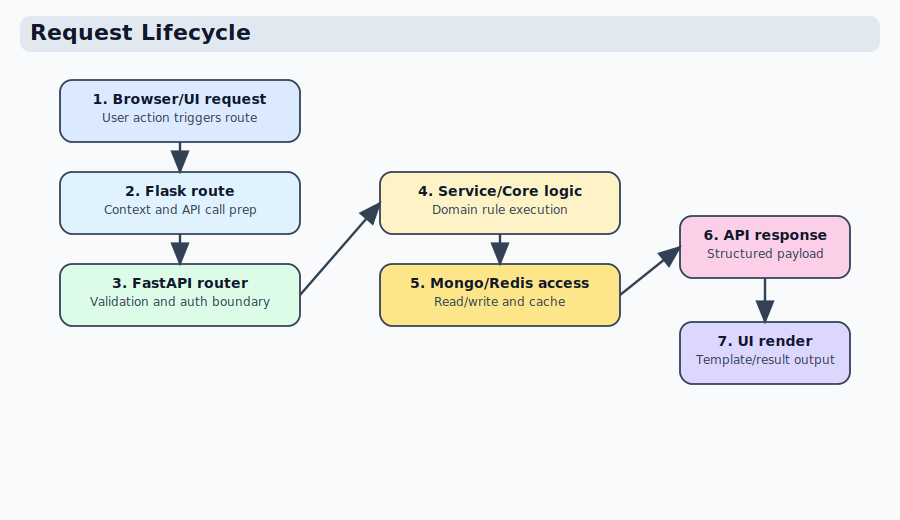

# Request Lifecycle

## High-level diagram

## UI request path

1. User hits Flask route (`coyote/blueprints/...`)
2. View gathers context and calls API endpoint(s)
3. API validates request contracts
4. Service layer executes business operation
5. Repository/handler talks to Mongo
6. API returns response
7. UI renders template with result/error

## API request path

1. Router receives HTTP request
2. Security checks run (auth/session/token/permissions)
3. Pydantic request contract validation
4. Service orchestration
5. Core domain helpers as needed
6. Mongo write/read through handler or collection
7. Pydantic response contract serialization

## Error handling principles

- Fail early at boundary when shape or auth is invalid
- Keep domain errors explicit (not silent fallthrough)
- Return actionable API summaries
- Log enough context for troubleshooting without leaking secrets
