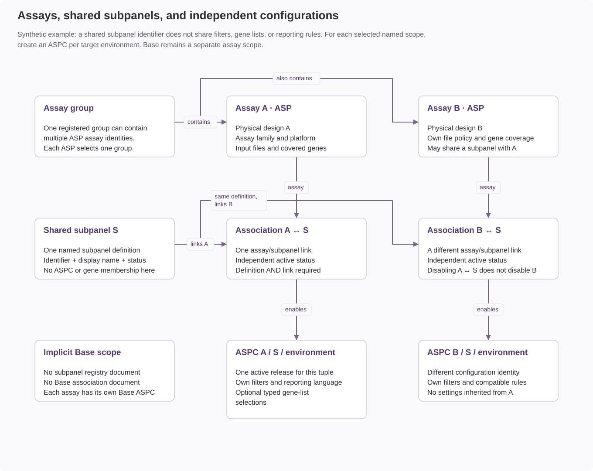
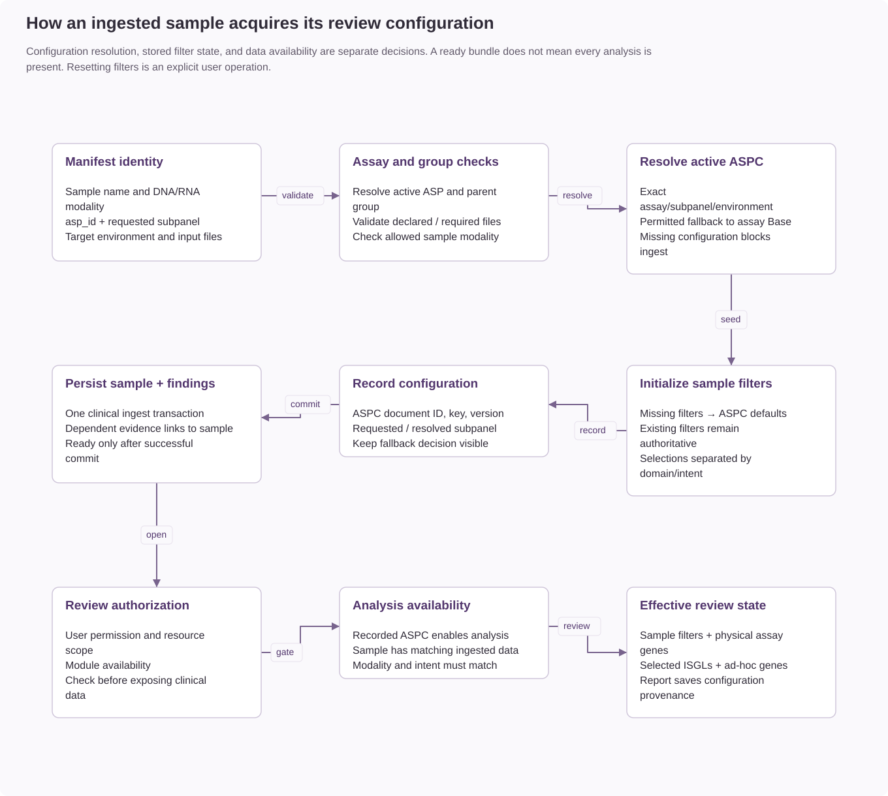
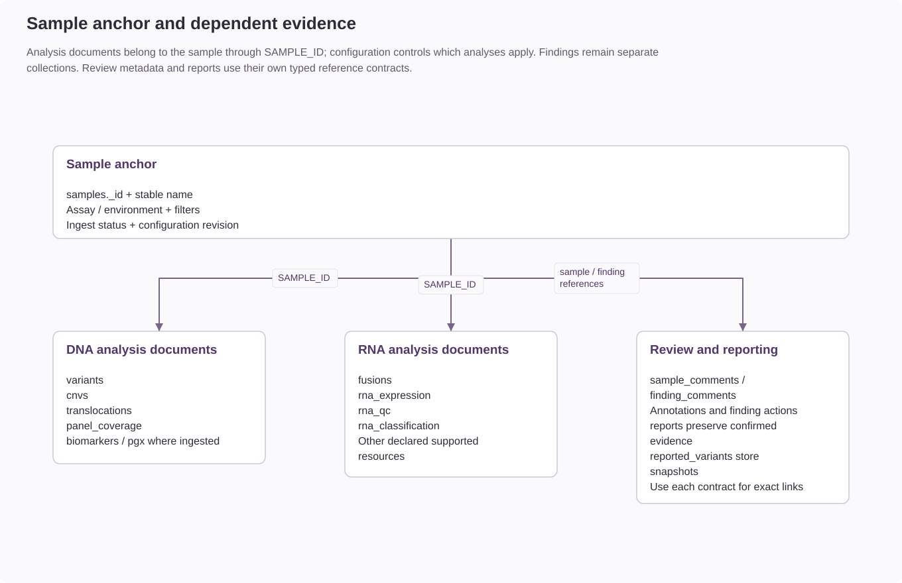
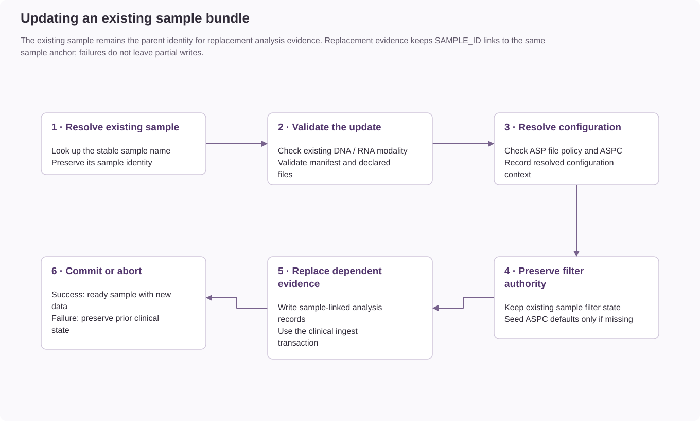
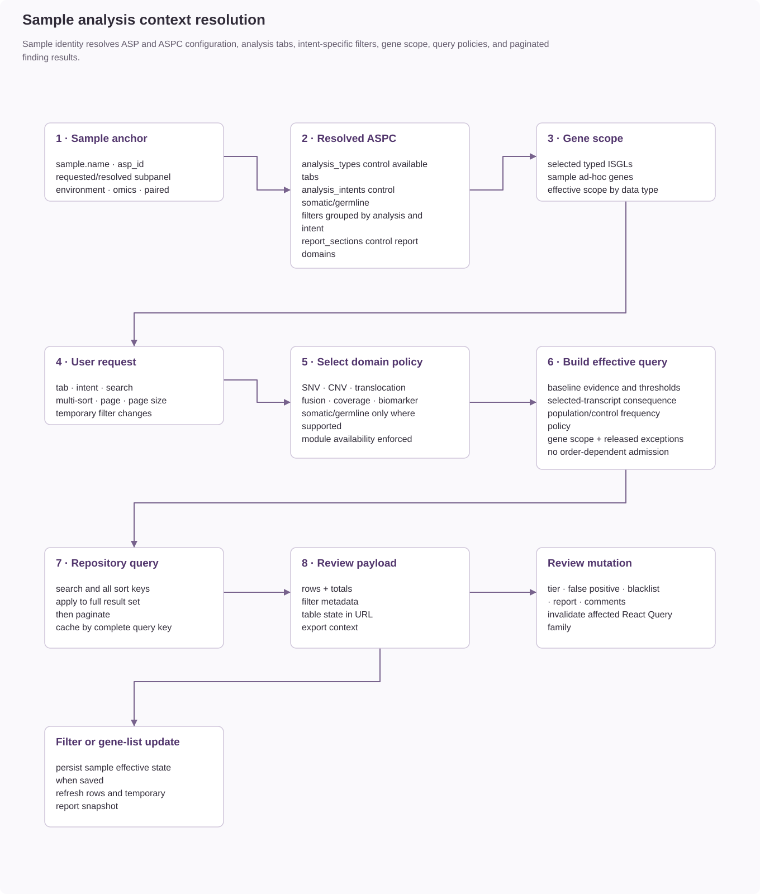
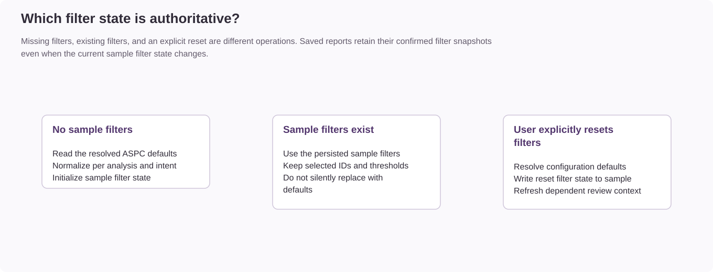
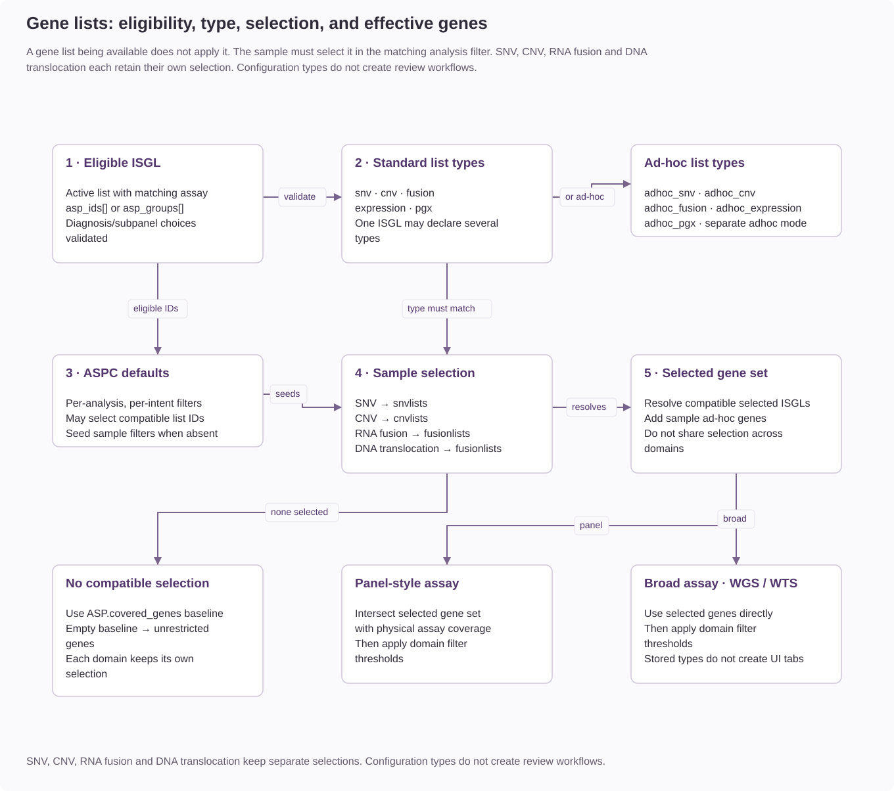
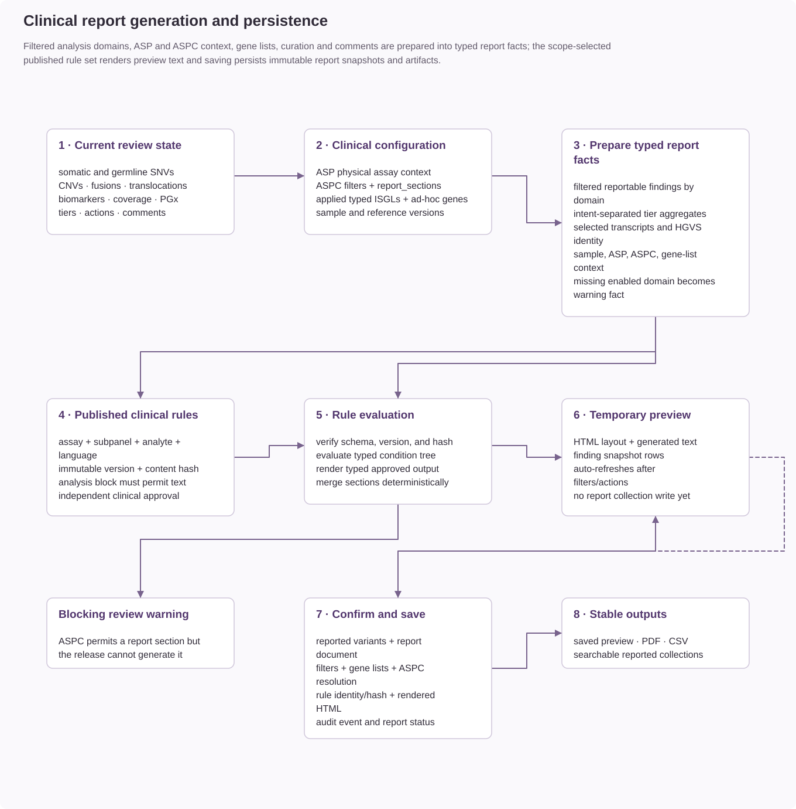
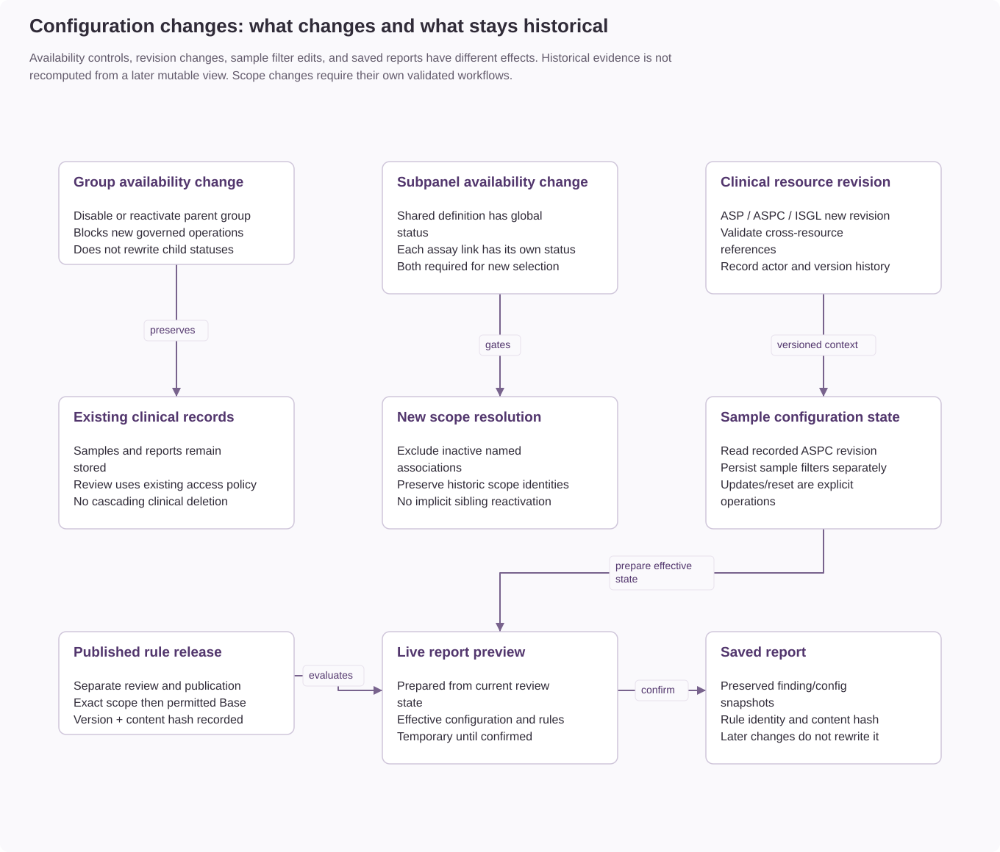
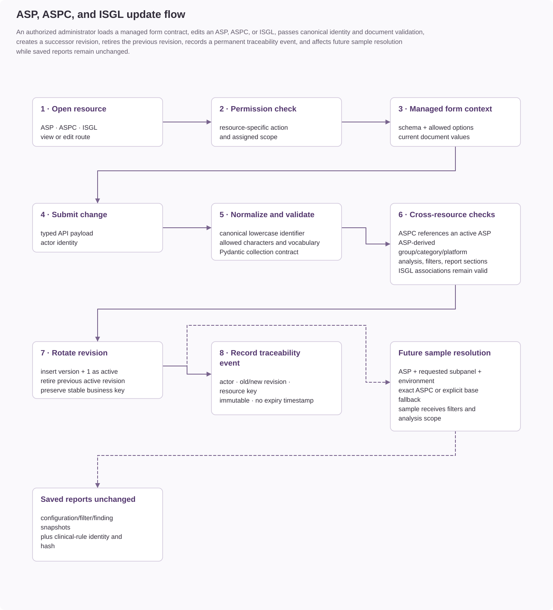

# Resource relationships

Assay definitions, configurations, gene lists, and access assignments determine how
Coyote3 ingests samples and presents their results for review.

The overview diagram groups analysis evidence for readability. ISGL selection is
optional; it is not a parent of the sample. Arrows show dependencies or evidence
contributions, not foreign-key constraints. For the complete storage inventory,
see the [database resource map](mongodb-topology.md).

## Relationship Legend

Solid arrows identify required lookups, dependencies, or data contributions.
Dashed arrows identify optional selections or integrations. Resource boxes name
persisted records; workflow boxes describe validation, resolution, or review steps.
Refer to each figure's labels for its specific relationship semantics.

## 1. Configuration Relationships

An assay group registers the parent grouping. Named subpanels are shared definitions
connected to assays through `subpanel_associations`; Base has no registry document.
Setup activation creates the operational resources after independent review.
Clinical-rule publication and public-catalog publication have separate lifecycles.
See [assay setup](../administration/assay-setup.md) for the creation procedure.

### 1.1 Core configuration model

What this means in practice:

- ASP is the physical assay anchor.
- ASPC is a required assay-plus-subpanel-plus-environment configuration. The
  `base` subpanel is used when no specific subpanel configuration exists.
- ISGL is optional. It is assay-scoped and becomes active only when selected into sample filter state.

### 1.2 Cardinality view

| Relationship | Cardinality / lookup |
| --- | --- |
| ASP to ASPCs | Zero or more; one active release per subpanel/environment tuple. |
| ASP to clinical rules | Zero or more rule identities; one active published release per identity. |
| ASP to ISGL | Optional lists matched through `asp_ids[]` or `asp_groups[]`. |
| ASPC to published rules | Resolve exact subpanel, then assay Base, for matching analyte and language. |
| ASPC to ISGL | Optional IDs selected in analysis-specific defaults. |

### 1.3 Creation order

The setup workflow can stage an ASP before it becomes operational. Published
rules may reference that saved draft assay; activation then commits the ASP,
associations, staged lists, and ASPCs together. The table below describes resource
prerequisites; see [assay setup](../administration/assay-setup.md) for the staged procedure.

Create center configuration in this order. The API enforces these references; an
administrator cannot compensate for a missing parent by entering an arbitrary identifier.

| Order | Entity | Prerequisites | Required before |
| --- | --- | --- | --- |
| 1 | Permission catalog and roles | Identity database and initial administrator | Assigning application access to users. Bundled records are synchronized with `scripts/sync_rbac_catalog.py`. |
| 2 | User accounts | Required roles and permissions | Clinical authoring, review, publication, configuration, and sample operations. |
| 3 | ASP | None in clinical configuration | Clinical rule sets, ISGL scope, ASPCs, and sample ingest. The ASP defines analyte, assay family, files, physical gene coverage, and accreditation. |
| 4 | Clinical rule set draft | Active ASP | Clinical review and publication. The selected analyte must match the ASP. |
| 5 | Published clinical rule set | Valid draft, independent clinical reviewer, and publisher | Required when activating an ASPC with report sections. Only an active published release can satisfy scope-based selection. |
| 6 | ISGL | Active ASP directly through `asp_ids`, or an applicable active ASP group | Selecting optional SNV, CNV, fusion, expression, or PGx gene scopes in an ASPC or sample. ISGLs are optional and can be created before or after rule publication. |
| 7 | ASPC | Active ASP and active published clinical rule set; any referenced ISGLs must already exist and support the selected analysis | Sample ingest for its assay, subpanel, and environment. |
| 8 | Sample | Resolvable active ASP and ASPC; required files declared by the ASP | Findings, comments, classifications, coverage review, and reports. |
| 9 | Saved report | Ready sample, prepared findings, report permission, and resolvable published rule release | Historical report review and reported-finding cohort searches. |

Knowledgebase releases are independent of this creation chain. They can be installed before
or after clinical configuration and enrich supported pages only when configured. VEP metadata
and HGNC references must be available before workflows that validate their corresponding
annotations or consequence choices.

### 1.4 Sample-to-configuration mapping

| Sample field | Resolution or stored identity |
| --- | --- |
| Assay, subpanel, environment | Resolve ASP and the required ASPC scope at ingest/update. |
| `current_aspc_id` / `current_aspc_version` | Preserve the resolved ASPC revision. |
| `snv.snvlists` / `cnv.cnvlists` | Select matching ISGL IDs within the analysis and intent. |
| `fusion.fusionlists` / `translocation.fusionlists` | Independent RNA fusion and DNA translocation selections. |
| Analysis `adhoc_genes` | Sample-specific gene overlay. |

## 2. Ingest Relationships

### 2.1 New sample ingest

### 2.2 Sample anchor and dependent collections

### 2.3 Update ingest

## 3. Sample Load Relationships

### 3.1 Read-time configuration resolution

### 3.2 Filter authority rules

## 4. Effective Gene Scope Relationships

### 4.1 SNV, CNV, fusion, and translocation scope

### 4.2 Effective gene calculation

The diagram above branches by assay family: panel-style assays intersect
selected genes with physical coverage; broad WGS/WTS assays use the selected
genes directly.

The selected ISGL document must declare the matching `list_type`. For example,
an ID stored under `cnvlists` is ignored by query assembly and rejected by the
selection endpoint unless its document includes `cnv` or `adhoc_cnv`.

`list_type` does not select the ISGL. A document declaring
`list_type: [snv, cnv, fusion]` is eligible for those analysis selectors, but it
is applied only where its `isgl_id` is persisted: `snvlists`, `cnvlists`, or
`fusionlists`. DNA translocations accept fusion-compatible lists through their
own `translocation.fusionlists` selection. These query scopes remain independent
while allowing one curated list to be reused deliberately.

If no compatible selection exists for a target, `ASP.covered_genes` is the
baseline effective set. If the ASP has no covered genes, the effective set is
unrestricted. Selected lists are intersected with physical coverage for panel
assays and used directly for WGS/WTS designs.

## 5. Report and Interpretation Relationships

## 6. Admin Resource Dependencies

Availability changes gate new operations. They do not cascade inactive flags or
delete historical clinical evidence. Samples record their ASPC revision, while
saved reports preserve their confirmed configuration and finding snapshots.

### 6.1 ASP creation and update

### 6.2 ASPC creation and update

An ASPC requires an existing or staged assay definition and a validated
assay/subpanel/environment scope. Group, category, and platform derive from the
assay. Activation validates the required published clinical rules and selected
gene lists. See the configuration-update diagram above and the
[assay setup procedure](../administration/assay-setup.md).

### 6.3 ISGL creation and update

An ISGL stores `asp_ids[]` and `asp_groups[]` eligibility metadata. It becomes
available only for compatible assay scopes and analysis types, and affects
review only when selected. The [gene-list selection diagram](#4-effective-gene-scope-relationships)
shows how that selection combines with physical assay coverage.

## 7. Operational Summary

| Resource | Responsibility |
| --- | --- |
| ASP | Required physical assay anchor. |
| ASPC | Configuration for assay, subpanel, and environment. |
| ISGL | Optional, explicitly selected gene scope. |
| Sample | Parent clinical record with configuration and filter state. |
| Sample-linked findings | Dependent analysis evidence. |

## 8. Companion References

- [Clinical Data Preparation And Reporting Flow](clinical-data-and-reporting.md)
- [Clinical Data Architecture and Workflow Integration](../reference/dna-rna-data-model.md)
- [Assay Configuration and Dynamic Query Orchestration](../reference/assay-filtering.md)
