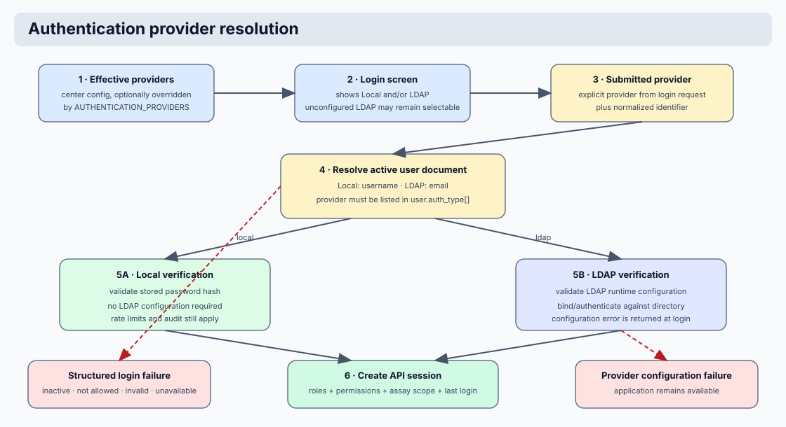

# Security Model

## Security Flow Diagram



```text
Incoming request
  |
  v
Identify auth mechanism
  |
  +--> session cookie
  +--> bearer token
  +--> internal token
  |
  v
Resolve user / principal
  |
  v
Apply access rules
  |
  +--> permission granted by an assigned role
  +--> assay / scope visibility
  |
  v
Allow request or return structured denial
```

## Layers

1. Authentication (session/login)
2. Authorization (role-derived permission checks)
3. Internal token gate for selected system-to-system routes
4. Environment secret hardening (prod/dev strict behavior)

Roles, permissions, environments, assay groups, assays, and `superuser`
visibility are resolved in the API security layer before request handlers run.

## Package boundaries

Coyote3 keeps security code in two deliberately separate packages:

- `api/security` contains policy and application security behavior. It resolves
  users from sessions or tokens, evaluates route permissions through
  `require_access`, constructs the Casbin-backed RBAC/ABAC policy, issues and
  verifies password-action tokens, and emits security/audit events.
- `api/infra/security` contains storage and runtime infrastructure for security
  concerns. It owns Mongo-backed API session persistence and security index
  creation. It must not contain route permissions, role semantics, or clinical
  authorization decisions.

Route modules should depend on `api.security.access.require_access` or the
thin dependency re-export in `api.app.deps.auth`. They should not query role or
permission collections directly and should not implement local minimum-role
checks. The API remains the authorization source of truth; UI visibility is only
an ergonomic reflection of the session payload.

!!! info
    Keep policy decisions close to `api/security` and persistence details close
    to `api/infra/security`. This makes authorization auditable and keeps
    storage changes from silently changing access behavior.

!!! warning
    Do not add user-level allow/deny overrides or ad-hoc role gates in route
    handlers. A route should declare the required permission id and let the
    Casbin-backed policy decide whether the current user satisfies it.

## Role permissions

Permission checks use the `resource:action[:scope]` naming convention (see
`docs/developer/permissions_naming.md` for the full inventory and naming rules).
User documents do not carry allow/deny permission overrides. Effective
permissions are derived from the assigned roles only.

Role and permission policy edits update the existing document in place. Each
edit increments `version`, appends `version_history`, updates mutation metadata,
and emits an audit event through the normal mutation/audit path. Runtime
authorization resolves the single current role or permission document by
`role_id` or `permission_id`. MongoDB enforces one document per `role_id` and
one document per `permission_id`.

Role documents may carry a `color` value for UI display. This color is not part
of authorization. It is rendered as a visual accent only; readable foreground
text is controlled by the UI theme so role badges stay accessible in both light
and dark mode.

Clinical configuration resources use the same in-place model: ASP, ASPC, and
ISGL retain one active first-version document per business key. Their mutation
events are captured in the audit stream. Report reproducibility comes from the
saved report's resolved ASPC reference and filter snapshot, not from inactive
duplicate configuration documents.

### Canonical role levels

Default role hierarchy used across API access checks:

- `external` -> `0`
- `viewer` -> `1`
- `intern` -> `5`
- `user` -> `9`
- `manager` -> `99`
- `developer` -> `9999`
- `admin` -> `99999`

Role levels order roles for display and compatibility metadata. They do not
grant an API capability. A manager can access an administrative function only
when one of the manager's assigned roles contains that function's permission.
The same rule applies to `admin`: only `superuser` has an unconditional bypass.

### Administrative capability matrix

Administrative permission policies are normal documents in the MongoDB
`permissions` collection. Role documents in `roles` reference their stable
`permission_id` values. Permission definitions are not maintained in Python.
Each protected route names the single `permission_id` required to call it, and
the authorization layer resolves that identifier against active MongoDB
permission and role documents.

The application ships the canonical policy and built-in role catalogs in
`api/config/bootstrap/rbac`. They are installed explicitly during first
deployment into an empty governance database. After initialization, MongoDB is
the runtime source of truth. Normal startup never replaces center role grants or
permission documents. Application upgrades that add a policy use the explicit
`scripts/sync_rbac_catalog.py` maintenance command.

The synchronization operation is a union. It inserts missing bundled
permissions and roles, marks bundled permissions active and system-managed, and
adds missing bundled grants to matching roles. It does not delete center-created
permissions or roles, remove extra grants, or replace role metadata. This makes
the command suitable after an application upgrade introduces new authorization
capabilities.

Bundled permission documents carry `system_managed: true`. They form the stable
authorization vocabulary required by application routes and therefore cannot
be edited, deactivated, or deleted through the API or administration UI. They
remain assignable: administrators grant or revoke them by editing role
documents. A center-created permission is stored with `system_managed: false`
and remains editable through normal permission-policy workflows.

This separation gives each layer one responsibility:

| Layer | Responsibility |
| --- | --- |
| `api/config/bootstrap/rbac/permissions.seed.ndjson` | Canonical labels, categories, descriptions, tags, and identifiers shipped by the application. |
| MongoDB `permissions` | Deployed permission catalog used at runtime. |
| MongoDB `roles` | Permission assignments for each role. |
| MongoDB `users` | Role assignments and user scope. |
| Route declaration | Identifier of the permission required for that operation; it does not define or grant the permission. |
| Casbin policy builder | Resolves active database documents and evaluates the request. |

Administrative resources use independent list, view, create, edit, and delete
permissions. A role may therefore be read-only for one resource, an editor for
another, and have no access to the remaining administration pages.

| Administrative resource | List | View | Create | Edit | Delete |
| --- | --- | --- | --- | --- | --- |
| Users | `user:list` | `user:view` | `user:create` | `user:edit` | `user:delete` |
| Roles | `role:list` | `role:view` | `role:create` | `role:edit` | `role:delete` |
| Permission policies | `permission.policy:list` | `permission.policy:view` | `permission.policy:create` | `permission.policy:edit` | `permission.policy:delete` |
| Assay panels (ASP) | `assay.panel:list` | `assay.panel:view` | `assay.panel:create` | `assay.panel:edit` | `assay.panel:delete` |
| Assay configurations (ASPC) | `assay.config:list` | `assay.config:view` | `assay.config:create` | `assay.config:edit` | `assay.config:delete` |
| In-silico gene lists (ISGL) | `gene_list.insilico:list` | `gene_list.insilico:view` | `gene_list.insilico:create` | `gene_list.insilico:edit` | `gene_list.insilico:delete` |

Global sample administration and operational tools use these capabilities:

| Capability | Permission |
| --- | --- |
| List samples in Admin Samples | `sample:list:global` |
| Inspect one sample in Admin Samples | `sample:view:global` |
| Edit any sample through Admin Samples | `sample:edit:global` |
| Delete a sample and dependent records | `sample:delete:global` |
| View application controls and runtime state | `app.controls:view` |
| Change application controls | `app.controls:edit` |
| Run maintenance immediately | `app.maintenance:run` |
| Review audit events | `audit_log:view` |
| Review schema contracts | `schema:list` |
| View administrative dashboard insights | `dashboard.admin:view` |
| Manage ingest workflows | `internal.ingest:manage` |
| Inspect task state | `internal.task:view` |
| Review the UI route audit | `ui.route_audit:view` |
| Broadcast notifications to active users | `notification.broadcast:create` |

The seed catalog is validated against route declarations by the API security
test suite. A route cannot introduce an undeployable permission identifier
without causing that validation to fail.

!!! warning
    `role:edit` and `permission.policy:edit` can change authorization policy.
    Assign them only to trusted security administrators. A manager who only
    maintains users normally needs selected `user:*` permissions and should not
    receive role or permission-policy editing rights.

### Notification authorization

Authenticated notification list, read, and dismissal routes always use the
username from the verified session. A caller cannot supply another username to
inspect or modify another account's inbox. Broadcast recipient discovery and
publication require `notification.broadcast:create`; assigning an Admin page
link without this permission does not grant API access.

The **Admin > Broadcast Notifications** page is available to roles granted
`notification.broadcast:create`. A broadcaster can address:

- every active user;
- active users assigned any selected role; or
- explicitly selected active users.

Role-targeted broadcasts resolve the matching active usernames when the message
is created. The stored audience therefore remains stable if role assignments
change later. The inbox, read state, and dismissal state remain private to each
recipient.

The public password-reset request remains neutral to prevent account
enumeration. When the identifier resolves to an active local account, the API
creates a security notification addressed to active users assigned the `admin`
or `superuser` role. Requests for missing, inactive, or externally managed
accounts do not disclose account state and do not generate an administrative
notification.

### User account editing boundaries

User administration deliberately uses a small permission model. The
`user:edit` permission allows editing a user account's profile, role assignments,
authentication providers, active state, and assay/environment scope. It does
not allow changing a password. Password creation and replacement use dedicated
invite, reset, and authenticated password-change flows so credentials never
travel through the generic user form.

The `superuser` role is a protected boundary. Only an authenticated superuser
may assign or remove that role, disable a superuser account, or delete a
superuser account. Other account fields remain governed by the normal
`user:edit` and `user:delete` permissions.

Every authenticated user may edit only these fields on their own profile:

| Field | Purpose |
| --- | --- |
| `firstname` | Given name displayed in the application |
| `lastname` | Family name displayed in the application |
| `fullname` | Preferred complete display name |
| `job_title` | Position or clinical function |

Self-service profile editing cannot change username, email, authentication
provider, password, roles, account status, environments, assay groups, or assay
scope.

The catalog also retains `user:manage`, `user:role:edit`, and
`user:group:edit` because deployed centers already use those identifiers in
role assignments. New route authorization should use the independent
`user:list`, `user:view`, `user:create`, `user:edit`, and `user:delete`
permissions shown in the capability matrix. The retained identifiers remain
system-managed compatibility policies and may continue to be assigned where a
center's role model requires them.

### Policy Enforcement

Authorization uses `require_access` with Casbin-backed RBAC and ABAC checks.
Routes declare permission ids, not minimum role or level gates. The assigned
roles decide which permissions a user receives, and optional resource context
applies assay, environment/profile, and assay-group scope. Superusers bypass all
checks via an early return.

```python
@router.patch("/.../flags/false-positive")
def mark_false_variant(
    user: ApiUser = Depends(require_access(permission="snv:manage")),
):
    # Authorized if an assigned active role grants "snv:manage"
```

- `superuser` is the only unrestricted runtime role and bypasses permission and assay-scope checks.
- `admin` is not unrestricted; it remains subject to assigned permissions and normal scope handling.
- Denied access checks are written to durable audit events. Successful access
  checks are not persisted as audit rows; they remain observable through request
  logs and metrics.

## Durable audit scope

The `audit_events` collection is for significant security, clinical, and
administrative events. It stores authentication outcomes, authorization
denials, sample ingest outcomes, mutating API actions, report creation, variant
curation/classification changes, admin resource changes, application-control
changes, maintenance outcomes, and unexpected API failures.

Routine successful read-only requests are not inserted into `audit_events`.
This keeps the audit log reviewable and prevents normal browsing from drowning
out actions that matter for clinical reconstruction or operations.

## Bootstrap superuser rule

- First-time deployment installs the canonical permission and role catalogs and
  creates one local bootstrap account assigned `superuser`.
- The command runs only when `users`, `roles`, and `permissions` are all empty.
- A fully initialized deployment is left unchanged. A partially initialized
  deployment without a superuser is rejected for manual review instead of being
  overwritten.
- Additional superusers must be created by an authenticated existing superuser
  through normal user management.

The built-in role catalog includes general clinical roles and focused delegated
administration roles:

| Role | Intended responsibility |
| --- | --- |
| `superuser` | Unrestricted bootstrap and security recovery authority |
| `admin` | Permission-bound full administration |
| `asp_manager` | ASP definition management |
| `aspc_manager` | ASPC configuration and filter management |
| `isgl_manager` | In-silico gene-list management |
| `operations_viewer` | Read-only runtime, audit, and diagnostics access |
| `app_control_operator` | Runtime controls and approved maintenance |
| `user_account_manager` | User lifecycle management without password access |

The catalog also includes `developer`, `tester`, `manager`, `user`, `intern`,
`viewer`, and `external`. Centers may edit built-in grants and create additional
roles after initialization.

## Authentication providers

- User documents carry `auth_type` as a provider list, for example `["ldap"]` or `["local", "ldap"]`.
- Login flow resolves the provider from the submitted identifier: email login uses LDAP, username login uses local password auth.
- Human center users default to `["ldap"]`. A user may be explicitly configured as `["local", "ldap"]` when the center wants both LDAP login by email and local password login by username.
- Coyote service accounts (`coyote3.admin` and `coyote3.*`) default to `["local"]` and are kept separate from LDAP-only center users.
- Local users (`local`) can use Coyote3-managed password flows:
  - authenticated password change
  - reset/set-password one-time token flows
  - admin invite flow for new local users
  - when SMTP is unavailable, invite/reset still issue one-time setup links and API/UI return warnings so admins can share links manually
- LDAP users authenticate against LDAP and should normally change passwords in the identity provider.

### Auth and password lifecycle flow

```text
login(identifier, password)
  -> identifier contains "@": load by email and require auth_type contains ldap
  -> otherwise: load by username and require auth_type contains local
     -> local: verify local password hash
     -> ldap:  verify via LDAP bind/auth using email
  -> on success: issue session (includes auth_type, must_change_password)

admin creates local user
  -> issue one-time invite token
  -> try SMTP delivery
     -> success: user receives setup link
     -> fail/no SMTP: API returns warning + setup_url for manual share

forgot password (local user)
  -> issue one-time reset token
  -> same SMTP/fallback behavior as invite
```

## API session transport

The login endpoint `POST /api/v1/auth/sessions` creates an opaque API session
token and stores it in the configured `api_sessions` collection. The response
sets that token as an HTTP-only cookie named by `API_SESSION_COOKIE_NAME`.
The request authentication layer accepts the same token through either:

- the configured API session cookie (`ApiSessionCookie` in OpenAPI), or
- `Authorization: Bearer <token>` (`BearerAuth` in OpenAPI).

This keeps browser sessions and API-only clients on the same audited session
model. See [API Authentication](../api/authentication.md) for command examples
and Swagger behavior.

### Access semantics diagram

```text
API route access (`require_access`)
  -> superuser bypass
   OR all configured checks pass:
      permission match
      assay/environment/group scope

UI visibility
  -> derived from session permissions and resource context
  -> API remains authoritative for all mutations and protected reads
```

### Planned hardening items

- Add LDAP/IdP-native self-service password change integration endpoint/UI where supported by center policy.
- Harden email delivery with center-approved SMTP/API provider configuration and monitoring.

## Internal routes

- Ingest routes under `/api/v1/internal/ingest/*` use authenticated user session + RBAC (admin-level for collection/bootstrap operations).
- Selected infrastructure/internal metadata routes still use internal token gate.
- All internal routes should remain network-restricted.

## Secrets and credentials

Do not commit real secrets.

Required secrets include:

- `SECRET_KEY`
- `INTERNAL_API_TOKEN`
- Mongo credentials (`MONGO_ROOT_*`, `MONGO_APP_*`)

## Mongo security

- Use dedicated app user with least required role (`readWrite` on target DB)
- Use separate Mongo instances per environment for strict isolation
- Never rely on unauthenticated DB in multi-user or non-local environments

See also:

- [System Relationships](system_relationships.md)
