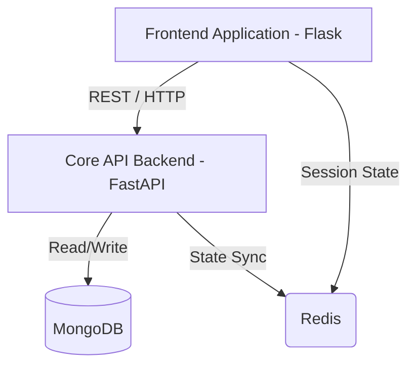

# System Architecture

## Architecture Philosophy

The Coyote3 architecture is engineered for **uncompromising modularity** and **auditable precision**. In high-stakes clinical diagnostic environments, the separation of concerns is not just a best practice—it is a requirement for safety, scalability, and maintainability.

The platform follow a strict "Separated Layer" topology:

1.  **UI Core (`coyote/`)**: A lean Flask-based rendering engine. It handles presentation, session management, and routing, but contains **zero clinical business logic**.
2.  **API Core (`api/`)**: A high-concurrency FastAPI engine. This is the "brain" of the system where all genomic calculations, authorization checks, and data orchestrations occur.
3.  **Persistence Layer**: MongoDB provides the high-fidelity indexing required for clinical records, while Redis acts as the cross-process session synchronizer.

---

## Technical Topology

The interaction between layers is strictly one-way and asynchronous:

---

## Internal Modular Standards

### 1. The API Engine (The Source of Truth)

The `api/` directory contains the definitive logic of the platform. It is organized into functional layers to minimize cross-coupling:

*   **Routers (`api/routers/`)**: Define the public-facing HTTP interface. They use Pydantic models to enforce strict schema validation on every request, ensuring no malformed data reaches the core logic.
*   **Services (`api/services/`)**: The orchestration layer. Services coordinate complex operations across multiple database collections (e.g., generating a report from variants, samples, and annotations).
*   **Core (`api/core/`)**: Pure, data-agnostic computational logic. This is where clinical formulas and genomic transformations reside.
*   **Contracts (`api/contracts/`)**: The "Legal Agreements" of the system. Pydantic schemas define exactly how data MUST look when entering the API or being saved to the database.

### 2. The Presentation Layer (Coyote)

The `coyote/` directory manages the user's window into the clinical data. It is structured into **Blueprints**, each representing a functional domain (DNA, RNA, Admin).

*   **Blueprints**: Manage the URL routing and Jinja template rendering.
*   **Static Assets**: Standardized CSS/JS controllers ensuring a premium, responsive interface.

---

## Runtime Infrastructure

### API Concurrency
The API utilizes an **ASGI event-loop** (Uvicorn/Uvicorn), allowing it to handle thousands of concurrent connections efficiently. Heavy I/O operations (like database reads) are performed asynchronously, ensuring the engine remains responsive even under intense workloads.

### UI Pre-Fork Model
The UI application runs on a **WSGI pre-fork model** (Gunicorn). This ensures that each user session is handled in an isolated process, providing stability and security. By offloading all "heavy lifting" to the API, the UI remains lightning-fast for the clinician.

### Resilience and State
*   **Database Handlers**: Every MongoDB interaction is gated by specialized Handlers (`api/infra/mongo/handlers`). This prevents raw database queries from leaking into business logic.
*   **Redis Cache**: Used for real-time session sharing and ephemeral data. If Redis is unavailable, the system intelligently downgrades to a cache-less state to ensure zero clinical downtime.
