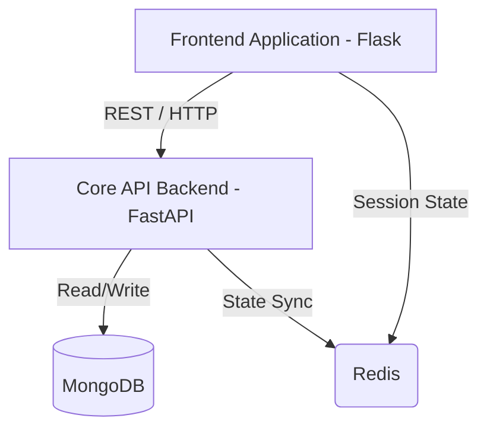

# System Architecture

## Architecture Philosophy

Coyote3 is split into separate layers so the UI, API, and persistence code stay predictable and maintainable. In a clinical system, this separation is part of the safety model, not just a code-style preference.

The platform follows a strict separated-layer design:

1.  **UI Core (`coyote/`)**: Flask-based rendering, session handling, and web routing. It should not contain clinical business logic.
2.  **API Core (`api/`)**: FastAPI-based backend logic, authorization checks, and domain workflows.
3.  **Persistence Layer**: MongoDB stores application data, and Redis supports shared session state and caching.

---

## Technical Topology

The interaction between layers is strictly one-way and asynchronous:

---

## Internal Structure

### 1. The API Layer

The `api/` directory contains the main system logic. It is organized into separate layers to keep responsibilities clear:

*   **Routers (`api/routers/`)**: Define the public-facing HTTP interface. They use Pydantic models to enforce strict schema validation on every request, ensuring no malformed data reaches the core logic.
*   **Services (`api/services/`)**: Use-case workflows that coordinate operations across collections.
*   **Core (`api/core/`)**: Pure computational logic and transformation code.
*   **Contracts (`api/contracts/`)**: Pydantic schemas that define how data must look at API and persistence boundaries.

### 2. The Web Layer

The `coyote/` directory contains the web application. It is organized into **Blueprints** for functional domains such as DNA, RNA, and Admin.

*   **Blueprints**: Manage the URL routing and Jinja template rendering.
*   **Static Assets**: CSS and JavaScript used by the templates.

---

## Runtime Infrastructure

### API Concurrency
The API uses an **ASGI event loop** (Uvicorn). Heavy I/O operations such as database reads can run asynchronously, which helps keep the service responsive under load.

### UI Pre-Fork Model
The UI application runs on a **WSGI pre-fork model** (Gunicorn). Each user session is handled in an isolated process, which improves stability and security. Compute-heavy work stays in the API layer so the UI remains responsive.

### Resilience and State
*   **Database Handlers**: Every MongoDB interaction is gated by specialized Handlers (`api/infra/mongo/handlers`). This prevents raw database queries from leaking into business logic.
*   **Redis Cache**: Used for shared session state and short-lived cached data. If Redis is unavailable, the system falls back to a cache-less mode.

---

## HTTP Boundary Reference

For a focused view of inbound versus outbound HTTP ownership, see [HTTP Layers and Boundaries](http_layers.md).

For dependency and data-shape diagrams covering ASP, ASPC, ISGL, samples, and findings, see [System Relationships](system_relationships.md).
