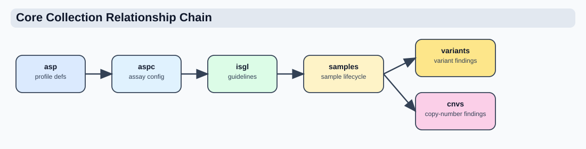

# System Relationships



This page documents the main runtime relationships in Coyote3, grounded in the current code paths for resource management, sample ingest, and sample loading.

## Relationship Legend

```text
-->   required lookup or dependency
-?>   optional runtime relationship
[]    persisted document or collection
()    derived runtime value
```

## 1. Configuration Relationships

### 1.1 Core configuration model

```text
[ASP: assay_specific_panels]
  key: asp_id
  maps to: sample.asp_id
  owns: assay metadata, covered_genes, germline_genes, file policy
      |
      +--> [ASPC: asp_configs]
      |      logical scope: asp_id + subpanel_id + environment
      |      maps to: sample.asp_id + sample.subpanel_id + sample.environment
      |      owns: default filters, reporting, analysis_types, catalog metadata
      |
      -?> [ISGL: insilico_genelists]
             key: isgl_id
             linked by: asp_ids[] and asp_groups[]
             owns: optional curated gene subsets
```

What this means in practice:

- ASP is the physical assay anchor.
- ASPC is a required assay-plus-subpanel-plus-environment configuration. The
  `base` subpanel is used when no specific subpanel configuration exists.
- ISGL is optional. It is assay-scoped and becomes active only when selected into sample filter state.

### 1.2 Cardinality view

```text
One ASP
  -> zero or many ASPCs
     one active release per subpanel/environment tuple

One ASP
  -?> zero or many ISGLs
      matched by asp_ids[] and asp_groups[]

One ASPC
  -?> may suggest or seed defaults
      but does not own ISGL documents
```

### 1.3 Sample-to-configuration mapping

```text
[sample]
  assay                -------> [ASP.asp_id]
  assay + subpanel_id
        + profile      -------> [ASPC scope at ingest/update]
  current_aspc_id      -------> [ASPC revision recorded on sample]
  current_aspc_version -------> [recorded ASPC revision version]

[sample.filters]
  snv.snvlists         -?> [ISGL.isgl_id]
  cnv.cnvlists         -?> [ISGL.isgl_id]
  fusion.fusionlists   -?> [ISGL.isgl_id]
  <domain>.adhoc_genes -?> sample-specific target overlay
```

## 2. Ingest Relationships

### 2.1 New sample ingest

```text
Incoming sample payload
  |
  +--> validate sample contract
  |
  +--> resolve ASP by sample.asp_id
  |       |
  |       +--> expected_files / required_files policy
  |       +--> ASP category influences allowed ingest keys
  |
  +--> resolve active ASPC by assay + subpanel + profile
  |       |
  |       +--> fall back to subpanel_id="base" when permitted
  |       +--> persist current_aspc_id/key/version
  |
  +--> if sample.filters is missing
  |       |
  |       +--> seed default sample.filters from ASPC.filters
  |
  +--> validate every required and declared file
  |
  +--> parse all declared dependent analysis files
  |
  +--> create [sample] with ingest_status="loading"
  |
  +--> write dependent collections with SAMPLE_ID back-links
  |
  +--> mark [sample] ingest_status="ready" only after all writes succeed
  |
  +--> on failure remove the incomplete sample/dependents and audit the error
```

### 2.2 Sample anchor and dependent collections

```text
[sample]
  _id
  name
  assay
  profile
  filters
  ingest_status
      |
      +--> [variants]         by SAMPLE_ID
      +--> [cnvs]             by SAMPLE_ID
      +--> [panel_coverage]   by SAMPLE_ID
      +--> [fusions]          by SAMPLE_ID
      +--> [translocations]   by SAMPLE_ID
      +--> [biomarkers]       by SAMPLE_ID
      +--> [rna_expression]   by SAMPLE_ID
      +--> [rna_qc]           by SAMPLE_ID
      +--> [rna_classification] by SAMPLE_ID
```

### 2.3 Update ingest

```text
Existing [sample] by name
  |
  +--> preserve sample identity
  +--> validate update payload against existing omics layer
  +--> if filters is still missing, seed from ASPC
  +--> replace dependent SAMPLE_ID-linked documents
  +--> keep sample as the parent anchor
```

## 3. Sample Load Relationships

### 3.1 Read-time configuration resolution

```text
[sample]
  |
  +--> resolve the ASPC revision recorded on the sample
  |
  +--> resolve ASP using sample.asp_id
  |
  +--> resolve selected ISGLs using sample.filters
  |
  v
(effective runtime context)
  = resolved active ASPC analyses/reporting
  + sample filters or ASPC defaults
  + ASP covered genes / germline genes
  + optional ISGL genes
  + optional ad hoc genes
```

### 3.2 Filter authority rules

```text
If sample.filters is missing
  -> normalize resolved ASPC.filters into domain namespaces

If sample.filters exists
  -> sample.filters is authoritative

Reset sample filters
  -> write resolved active ASPC defaults back onto the sample
```

## 4. Effective Gene Scope Relationships

### 4.1 SNV, CNV, and fusion scope

```text
SNV target
  sample.filters.somatic.snv.snvlists
  + sample.filters.somatic.snv.adhoc_genes
  -?> selected ISGL genes
  -> if nothing selected: ASP.covered_genes
  -> if ASP.covered_genes is empty: no gene restriction

CNV target
  sample.filters.somatic.cnv.cnvlists
  + sample.filters.somatic.cnv.adhoc_genes
  -?> selected ISGL genes
  -> if nothing selected: ASP.covered_genes
  -> if ASP.covered_genes is empty: no gene restriction

Fusion target
  sample.filters.somatic.fusion.fusionlists
  + sample.filters.somatic.fusion.adhoc_genes
  -?> selected ISGL genes
  -> if nothing selected: ASP.covered_genes
  -> if ASP.covered_genes is empty: no gene restriction

Translocation target
  -> no current ISGL contract
  -> never inherit SNV, CNV, or fusion selections
```

### 4.2 Effective gene calculation

```text
ASP.covered_genes
  |
  +--> baseline effective set
  |
  +--> intersect with an analysis-compatible selected ISGL/ad hoc gene set
       for panel-style assays
  |
  +--> use selected genes directly
       for broad-family assays like WGS/WTS
```

The selected ISGL document must declare the matching `list_type`. For example,
an ID stored under `cnvlists` is ignored by query assembly and rejected by the
selection endpoint unless its document includes `cnv` or `adhoc_cnv`.

`list_type` does not select the ISGL. A document declaring
`list_type: [snv, cnv, fusion]` is offered by all three selectors, but it is
applied only where its `isgl_id` is persisted: `snvlists`, `cnvlists`, or
`fusionlists`. This keeps the three query scopes independent while allowing
one curated list to be reused deliberately.

If no compatible selection exists for a target, `ASP.covered_genes` is the
baseline effective set. If the ASP has no covered genes, the effective set is
unrestricted. Selected lists are intersected with physical coverage for panel
assays and used directly for WGS/WTS designs.

## 5. Report and Interpretation Relationships

```text
[sample]
  + [ASPC]
  + [ASP]
  + optional selected [ISGL]
  + findings by SAMPLE_ID
      |
      v
interpretation / reporting workflows
      |
      +--> filtered evidence selection
      +--> classification/comment state
      +--> prepared report context
      +--> report composition and preview
      +--> immutable report metadata and finding snapshots on save
```

## 6. Admin Resource Dependencies

### 6.1 ASP creation and update

```text
Create ASP
  -> independent resource creation
  -> establishes assay anchor used elsewhere
```

### 6.2 ASPC creation and update

```text
Create ASPC
  -> requires selected ASP to exist
  -> copies ASP-derived asp_group / asp_category / platform
  -> validates one active ASP + subpanel + environment tuple
```

### 6.3 ISGL creation and update

```text
Create ISGL
  -> independent resource creation
  -> stores asp_ids[] / asp_groups[] targeting metadata
  -> becomes available to samples only when assay scope matches
```

## 7. Operational Summary

```text
ASP
  -> required assay anchor

ASPC
  -> required runtime config for assay + subpanel + environment resolution

ISGL
  -> optional scoped gene list

sample
  -> parent record for all findings

SAMPLE_ID-linked findings
  -> dependent evidence documents
```

## 8. Companion References

- [Clinical Data Preparation And Reporting Flow](clinical_data_and_reporting_flow.md)
- [Clinical Data Architecture and Workflow Integration](../product/workflow_dna_rna.md)
- [Assay Configuration and Dynamic Query Orchestration](../product/aspc_driven_query_strategy.md)
