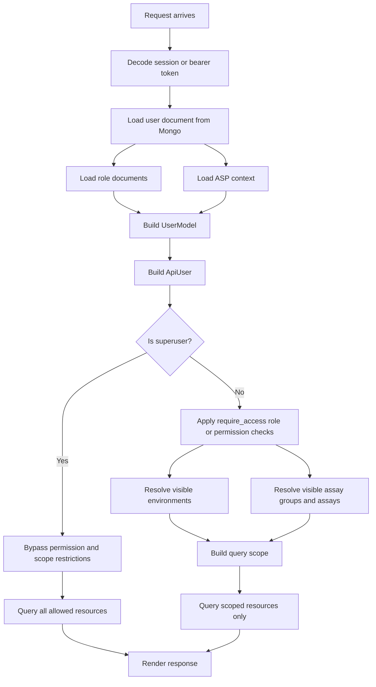

# User Scope And Visibility

This document explains how Coyote3 decides what a user can see and do, with a
focus on roles, permissions, assays, assay groups, environments, and the
special behavior of `superuser`.

It is intended as a practical runtime guide for developers and operators who
need to understand:

- where user scope is stored
- where UI options come from when creating or editing users
- how request-time access is resolved
- why a user sees some samples, assays, and profiles but not others
- how `superuser` differs from normal scoped users

## Scope Model

User access in Coyote3 is made from two different dimensions:

1. Authorization
- roles
- permissions
- explicit deny-permissions
- access level

2. Visibility scope
- environments
- assay groups
- assays

These are related, but they are not the same thing.

Examples:

- A user may have permission to edit samples, but still only see samples for
  the assays assigned to them.
- A user may have a high role level, but still be limited to `production`
  samples if their environment scope only includes `production`.
- A `superuser` bypasses both permission gates and scope restrictions.

## Source Of Truth

### Stored user document

The durable source of truth is the user document in the database.

The main schema lives in `api/contracts/schemas/governance.py`.

Important user fields:

- `roles`
- `permissions`
- `deny_permissions`
- `environments`
- `assay_groups`
- `assays`
- `must_change_password`
- `auth_type`

These values are stored on the user document and then normalized into the
runtime user model.

### Runtime user model

The runtime model is built in `api/core/models/user.py`.

This model computes the effective user state used across the application:

- effective role
- effective access level
- normalized permissions
- denied permissions
- assay group access
- assay access
- environment access
- `is_superuser`

The API-facing runtime representation is built in `api/security/access.py`.

## Roles vs Scope

### Roles and permissions

Roles define broad privilege shape:

- `viewer`
- `user`
- `manager`
- `developer`
- `admin`
- `superuser`

Permissions define specific actions:

- `sample:edit:own`
- `report:create`
- `sample:list:global`
- `permission.policy:view`

The permission model is described in [security_model.md](security_model.md).

### Scope fields

Scope fields control what data is visible:

- `environments`
- `assay_groups`
- `assays`

This means a user can be allowed to use a feature, but still only over a
restricted dataset.

Examples:

- a user can have `sample:edit:own`
- but only for assays in `user.assays`
- and only for environments in `user.environments`

## Where User Form Options Come From

When admins create or edit users, the available options do not all come from
the same place.

### Roles

Role options come from the roles collection.

They are loaded in `api/services/accounts/users.py`:

- `self.roles_handler.get_all_role_names()`

These are attached to the managed form in:

- `api/services/accounts/users.py`

### Permissions

Permission options come from the permissions collection.

They are loaded in:

- `api/services/accounts/users.py`

through:

- `self.permissions_handler.get_all_permissions(is_active=True)`

### Assay groups

Assay groups use a fixed platform vocabulary, not a free-text or DB-derived list.

The canonical source is:

- `shared/config_constants.py`

Current values:

- `hematology`
- `solid`
- `pgx`
- `tumwgs`
- `wts`
- `myeloid`
- `lymphoid`
- `dna`
- `rna`

Those values are used in:

- ASP contracts
- ASPC contracts
- user scope assignment
- genelist scope assignment
- admin form dropdowns / checkbox groups

So:

- assay-group choices are contract-defined
- centers can register any ASP they need
- each ASP must link to one of the existing assay groups
- adding a new assay group is a product/release change, not an ad hoc admin edit

### Assays

Assay options are also derived from ASP records.

The user service returns an `assay_group_map`, which is used by the UI to
represent which assays belong to which assay groups.

That map is built from all ASP records using:

- `api/services/accounts/users.py`

which call:

- `api/common/assay_filters.py`

The resulting structure groups ASPs by:

- `asp_group`
- with child entries for:
  - `assay_name`
  - `display_name`
  - `asp_category`

So assays shown in the UI are DB-derived from ASP definitions, but they are
organized under the fixed assay-group vocabulary above.

### Environments

Environment options are fixed product constants rather than DB-derived.

The canonical source is:

- `shared/config_constants.py`

Current values:

- `production`
- `development`
- `testing`
- `validation`

Those values are reused in the admin forms and validated again in the user and
sample contracts:

- `api/contracts/schemas/governance.py`
- `api/contracts/schemas/samples.py`

So today:

- roles: DB-derived
- permissions: DB-derived
- assay groups: fixed contract vocabulary
- assays: DB-derived from ASPs
- environments: fixed contract vocabulary

### Other fixed option sets

Several other admin/runtime vocabularies also come from
`shared/config_constants.py`:

- ASP family:
  - `panel-dna`
  - `panel-rna`
  - `wgs`
  - `wts`
- ASP category:
  - `dna`
  - `rna`
- auth type:
  - `coyote3`
  - `ldap`
- platform:
  - `illumina`
  - `pacbio`
  - `nanopore`
  - `iontorrent`
- permission categories:
  - `Analysis Actions`
  - `Assay Configuration Management`
  - `Assay Panel Management`
  - `Audit & Monitoring`
  - `Data Downloads`
  - `Gene List Management`
  - `Permission Policy Management`
  - `Reports`
  - `Role Management`
  - `Sample Management`
  - `Schema Management`
  - `User Management`
  - `Variant Curation`
  - `Visualization`

## Request-Time Flow

### Login and request user creation

At request time, the application loads the stored user document and builds a
runtime user model.

Main path:

1. decode session or token
2. load user document from Mongo
3. load related role docs and ASP context
4. build `UserModel`
5. build `ApiUser`
6. enforce route-level access
7. apply resource-level visibility scope

Important code:

- `api/security/access.py`
- `api/core/models/user.py`

### Runtime flowchart

## How Users “Get Things Done”

Below is the practical end-to-end flow for a normal scoped user and for a
superuser.

### Normal user flow

1. user logs in
2. session resolves to a stored user document
3. runtime user is built from:
- stored roles
- stored permissions
- stored deny-permissions
- stored environments
- stored assay groups
- stored assays

4. route access is checked
5. if allowed, query services apply scope restrictions
6. only matching assays and environments are returned
7. the UI renders only those samples and resources

Example:

- user has `sample:edit:own`
- user environments = `["production"]`
- user assays = `["hema_GMSv1"]`

Result:

- user can edit samples
- but only production samples
- and only samples belonging to `hema_GMSv1`

### Superuser flow

1. user logs in
2. runtime user resolves `is_superuser = True`
3. route access short-circuits successfully
4. scope restrictions are skipped
5. sample list and other scoped resources are queried without assay/env restriction

Result:

- all assays visible
- all assay groups visible
- all environments visible
- all normal permission gates bypassed

This is the only unrestricted runtime role.

## Sample Listing Flow

The sample catalog is a good example of how scope is applied.

Main path:

- web route: `coyote/blueprints/home/views_samples.py`
- API route: `api/routers/samples.py`
- service: `api/services/sample/catalog.py`
- Mongo handler: `api/infra/mongo/handlers/samples.py`

Runtime behavior:

### Normal user

The sample catalog service resolves:

- `accessible_assays`
- `query_envs`

from the authenticated user and optional UI filters.

Then the Mongo handler applies those values as query filters.

### Superuser

The sample catalog service passes:

- `accessible_assays = None`
- `query_envs = None` when using all profiles

That means the Mongo query is intentionally unscoped.

This behavior is implemented in:

- `api/services/sample/catalog.py`
- `api/infra/mongo/handlers/samples.py`

## Why ASP Data Matters For User Scope

ASPs are not only panel definitions. They also provide the vocabulary used to
scope users to the assay model installed in the center.

That means:

- user scope UI depends on ASP data being present
- assay-group choices depend on ASP `asp_group`
- assay choices depend on ASP `assay_name`

If ASP data is missing or incomplete:

- assay-group choices in user forms will be incomplete
- assay assignment UI will be incomplete
- visibility scoping may not match the actual installed assay landscape

## Design Summary

The current design intentionally separates:

- role and permission policy
- data visibility scope

This allows the system to express:

- what a user is allowed to do
- separately from
- what slice of the center data that user is allowed to see

The only exception is `superuser`, which is treated as unrestricted for both.

## Recommended Future Improvement

The main inconsistency left in this model is environments.

Today:

- assay groups and assays are DB-derived from ASPs
- environments are schema-defined

A cleaner long-term design would make environment choices configurable from one
authoritative source as well, so all visibility options are managed the same way.
