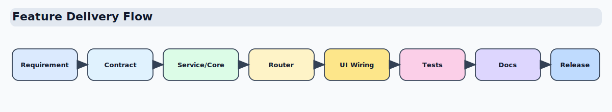
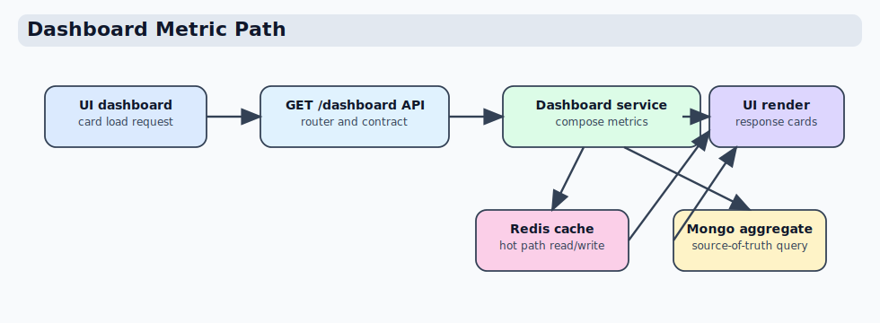

# Add New Feature

This guide shows the standard path for adding a new feature across UI, API, and persistence layers.

## Feature delivery map



## Feature implementation checklist

1. Define behavior and acceptance criteria.
2. Update UI route/template behavior.
3. Add or extend API contract models.
4. Implement service/core logic.
5. Wire router endpoint and dependencies.
6. Add or update DB/repository methods.
7. Add tests (API + unit + UI/integration as needed).
8. Update docs and operational notes.

## Add a feature in the UI layer

Typical files:

- Flask view: `coyote/blueprints/<domain>/views*.py`
- Template: `coyote/blueprints/<domain>/templates/*.html`
- API endpoint builder: `coyote/services/api_client/endpoints.py`

Example pattern:

```python
# Flask view (server-rendered UI)
payload = get_web_api_client().get_json(
    api_endpoints.dashboard("summary"),
    headers=forward_headers(),
)
return render_template("dashboard.html", **payload)
```

What to validate:

- request params are normalized before API call
- auth/session headers are forwarded
- page fails with actionable error (not silent fallback)

## Add a feature in the API layer

Typical files:

- Router: `api/routers/<domain>.py`
- Contract: `api/contracts/<domain>.py`
- Service: `api/services/<domain>_service.py`
- Dependency factory: `api/deps/services.py`

Example pattern:

```python
@router.get("/api/v1/dashboard/summary", response_model=DashboardSummaryPayload)
def dashboard_summary(
    user: ApiUser = Depends(require_access()),
    service: DashboardService = Depends(get_dashboard_service),
):
    return util.common.convert_to_serializable(service.summary_payload(user=user))
```

What to validate:

- response model includes new field(s)
- permission boundary is correct
- service logic is deterministic and testable

## Add a feature in the DB/repository layer

Typical files:

- Repository adapter: `api/infra/repositories/*.py`
- Mongo handlers: `api/infra/db/*.py`

Example pattern:

```python
# repository adapter
def get_dashboard_user_rollup(self) -> dict:
    return dict(store.user_handler.get_dashboard_user_rollup() or {})
```

```python
# DB handler
pipeline = [{"$facet": {...}}]
return self.get_collection().aggregate(pipeline)
```

What to validate:

- indexes support new query
- output shape is stable for contracts
- cache invalidation is called for write paths

## Example: add a dashboard metric

### 1) Service layer

Add a metric in `api/services/dashboard_service.py` and return it in the response model payload.

```python
# inside DashboardService.get_dashboard(...)
active_users = self._repo.count_active_users(center)
result["active_users"] = active_users
```

### 2) Repository layer

Add the query in repository class, for example `api/infra/repositories/dashboard_mongo.py`.

```python
def count_active_users(self, center: str) -> int:
    return self._users.count_documents({"center": center, "is_active": True})
```

### 3) Router/contract

Expose field in response schema used by dashboard router.

```python
class DashboardResponse(BaseModel):
    active_users: int
```

### 4) UI rendering

Update dashboard template/view to display the new metric card.

### 5) Caching and invalidation

If dashboard values are cached, invalidate when data changes.

```python
from api.infra.dashboard_cache import invalidate_dashboard_cache

invalidate_dashboard_cache(center=center)
```

### 6) Request metrics and timings

Expose timing details in service payload metadata and rely on middleware request events.

```python
# service timing map
timings_ms[name] = round((perf_counter() - t0) * 1000, 2)
payload["dashboard_meta"] = {"timings_ms": timings_ms, "scope_assays": scope_assays}
```

```python
# middleware request metric emission
emit_request_event(
    request=request,
    username=username,
    status_code=response.status_code,
    duration_ms=duration_ms,
)
```

### Dashboard metric path diagram



## Example: add a new user profile setting

1. Add field to user model/validation.
2. Add API endpoint to read/write setting.
3. Add permission checks in service.
4. Add UI control in profile page.
5. Add audit/event log if required.
6. Send notification email for sensitive settings if needed.

## Quality gates

```bash
PYTHONPATH=. ruff check api coyote tests scripts
PYTHONPATH=. pytest -q
mkdocs build --strict
```
