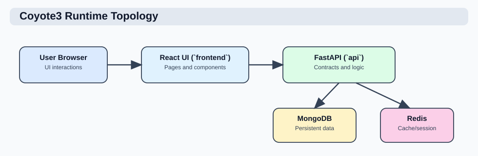

# Complete developer manual

This manual explains how to change Coyote3 without breaking its clinical,
security, or data contracts. It is for backend developers, frontend developers,
test engineers, and maintainers. Deployment operators should also read the
[deployment guide](../operations/center_deployment_guide.md).

## Development rules

Use these rules before choosing an implementation:

1. Read the existing contract and workflow before editing code.
2. Keep one source of truth for each fixed value or configurable value.
3. Put clinical decisions in application/domain services, not HTTP routes or UI components.
4. Validate MongoDB writes with the registered Pydantic document contract.
5. Access collections through repositories, not directly from routes.
6. Keep API response normalization in shared frontend API and domain helpers.
7. Add tests at the lowest useful boundary and a browser test for a changed user workflow.
8. Update the authoritative document for changed behavior.

## Repository map

| Path | Responsibility |
| --- | --- |
| `api/app` | FastAPI creation, lifecycle, middleware, dependencies, and runtime assembly. |
| `api/interfaces/http` | HTTP routers, request/response models, tags, and exception translation. |
| `api/application` | Use cases that coordinate authorization, domain logic, repositories, integrations, and audit. |
| `api/domain` | Pure clinical and product rules that do not depend on HTTP or MongoDB. |
| `api/contracts/schemas` | Pydantic contracts for persisted MongoDB documents. |
| `api/infra/mongo` | MongoDB adapter, repositories, indexes, and persistence details. |
| `api/infra/integrations` | LDAP, mail, BAM service, and other infrastructure adapters. |
| `api/infra/knowledgebase` | External and database-backed knowledgebase adapters. |
| `api/config` | Fixed product values, center configuration loaders, runtime settings, and bootstrap data. |
| `api/tasks` | Celery task entry points and schedules. |
| `frontend/src/pages` | Route-level React pages. |
| `frontend/src/components` | Shared UI, tables, filters, plots, comments, reports, and admin components. |
| `frontend/src/hooks` | Reusable React state and query behavior. |
| `frontend/src/lib` | API client, normalizers, route registry, permissions, exports, links, and shared domain display helpers. |
| `frontend/src/styles` | Theme and component-level style layers. |
| `tests` | Backend unit, API, and integration tests. |
| `frontend/tests` | Playwright browser and deployment tests. |
| `docs` | User, developer, architecture, API, testing, and operations documentation. |
| `deploy` | Compose files, images, proxy configuration, and environment examples. |
| `scripts` | Bootstrap, quality, deployment, database, and contract maintenance commands. |

## Runtime architecture



| Service | Owns | Does not own |
| --- | --- | --- |
| Frontend | Navigation, display state, form state, query cache, table state, and user interaction. | Clinical rules, permissions, or persisted truth. |
| API | Authentication, authorization, validation, workflows, reporting, and repository coordination. | Long-running scheduled execution. |
| Worker | Ingest, knowledgebase refresh, and maintenance tasks. | HTTP response handling. |
| Beat | Periodic task scheduling. | Clinical data persistence logic. |
| MongoDB | Clinical, configuration, audit, report, and operational documents. | Application decisions outside stored configuration. |
| Redis | Celery broker/results and enabled cache/session infrastructure. | Clinical source data. |
| Reverse proxy | Deployment prefix, TLS boundary, and service routing. | Application authorization. |

### HTTP request flow

```text
browser or API client
  -> reverse proxy
  -> FastAPI middleware
  -> authentication and CSRF/rate checks
  -> route dependency authorization
  -> application service
  -> domain policy and repository
  -> typed response
  -> frontend query cache and UI
```

Routes should parse and validate transport input, call one application-level
operation, and translate known errors. A route should not construct MongoDB
queries or reproduce clinical filtering logic.

### Background task flow

```text
Celery beat or authorized API action
  -> small task entry point
  -> shared runtime initialization
  -> application service
  -> repository/integration operations
  -> audit and task result
```

Task entry points must remain small. The same application service should be
usable from a task and, where appropriate, an authorized HTTP operation.

## Sources of truth

Choosing the wrong configuration layer creates hidden behavior. Use this table
when adding a value.

| Value type | Source | Examples |
| --- | --- | --- |
| Fixed software vocabulary | Python constants/config modules | Analysis types, assay groups, auth providers, nomenclature fields, collection keys. |
| Center-owned content | `api/config/center/*` | Contacts, catalog narrative, clinical vocabulary, query policy. |
| Deployment or secret | Environment variable | Mongo URI, database names, LDAP/SMTP credentials, public URL, host mount paths. |
| Runtime administrative switch | MongoDB `app_controls` | Released module availability, background work, maintenance, and retention controls. |
| Clinical assay definition | Versioned ASP/ASPC/ISGL document | Platform, covered genes, enabled analyses, filters, and report sections. |
| User preference | `users.ui_settings` | Layout, page size, and other account-owned display choices. |
| Visual token | Frontend theme/Tailwind configuration | Surface, text, border, badge, link, and chart colors. |

Do not add a fallback environment variable for a repository-owned URL or fixed
product value. Do not hardcode a center-owned term in a service. Do not put UI
labels or icons in API contracts unless they are part of a public data contract.

## MongoDB contracts

Every supported collection has a Pydantic document model registered in
`api/contracts/schemas/registry.py`. The generated field reference is
[collection contracts](../api/collection_contracts.md).

### Write rule

```text
external or UI input
  -> request/manifest validation
  -> application normalization
  -> Pydantic collection contract
  -> repository write
  -> audit where required
```

Use `model_dump(exclude_none=True)` only when absent and explicit `null` have
the same meaning for that document. If the contract requires the key to exist
with a nullable value, preserve it explicitly.

### Business identity and MongoDB identity

| Identity | Use |
| --- | --- |
| MongoDB `_id` | Internal immutable document reference. Do not expose it as the primary user label. |
| Business ID | Stable resource identity such as `asp_id`, `aspc_id`, `isgl_id`, sample name, or report ID. |
| Version | Revision of a versioned clinical or governance resource. |
| Active state | Selects the revision available for new work. Historical references remain valid. |

ASP, ASPC, and ISGL updates create a new version under the same business ID and
make the previous version inactive. Samples and reports retain the recorded
version. Roles and permissions retain traceable version changes according to
their contracts. Audit records provide action history and are not a replacement
for versioned clinical configuration.

### Repository indexes

Repositories declare the indexes required by their query patterns. Runtime
initialization calls `ensure_indexes()`. MongoDB compares requested index names
and definitions; an existing matching index is not rebuilt on every startup.
Large data backfills and new index definitions must still be planned and tested
as database operations. See
[MongoDB deployment and recovery](../operations/mongodb_deployment_and_recovery.md).

## Clinical configuration

### ASP

An ASP defines the assay independent of one sample.

| Field group | Purpose |
| --- | --- |
| Identity | `asp_id`, display name, assay group, family, and category. |
| Sequencing | Platform and valid read modes. Read technology follows the platform. |
| Gene scope | Covered genes and germline genes. |
| Input policy | Supported, expected, and required analysis files. |
| Catalog | Public visibility and reviewed assay information. |

### ASPC

An ASPC is identified by `asp_id`, `subpanel_id`, and `environment`. It defines
enabled analyses, analysis intents, filters, and report sections. Somatic and
germline filters can coexist in one document. Germline support is restricted to
released analysis types.

The sample receives a filter snapshot during ingest. Updating the ASPC does not
silently rewrite an existing sample. An explicit workflow can resolve a sample
to a newer compatible ASPC while preserving the user's current filter values.

### ISGL

An ISGL defines genes that can be selected independently for SNV, CNV, fusion,
expression, or PGX filtering. `list_type` controls where the list is offered;
the list restricts an analysis only when it is selected for that analysis.

The runtime gene rule is:

1. selected ISGL genes for the analysis;
2. otherwise ASP covered genes;
3. otherwise no gene predicate.

Detailed field and option tables are in the
[center configuration reference](../operations/center_configuration_files.md)
and [query strategy](../product/aspc_driven_query_strategy.md).

## Ingest development


Ingest is atomic at the sample-bundle level: every declared file must be read
and its dependent documents must pass their collection contracts before the
sample is committed as ready. Optional files may be absent only when they were
not declared.

### Manifest processing

| Stage | Responsibility | Failure result |
| --- | --- | --- |
| Parse | Read YAML and normalize supported top-level pipeline keys. | Manifest rejected. |
| Resolve | Find ASP and subpanel/base ASPC for the environment. | No sample committed. |
| Validate files | Check declared paths, mounts, readability, and required-file policy. | No sample committed. |
| Parse analysis | Convert VCF, CNV, coverage, fusion, expression, classification, QC, and biomarkers. | Dependent writes rolled back. |
| Normalize | Apply collection-specific field and identity rules. | Contract error recorded. |
| Persist | Write dependent collections and final sample. | Bundle restored or removed. |
| Complete | Mark watched manifest done and write audit outcome. | Failed suffix and audit event on error. |

When adding an input:

1. define its analysis and file-key policy in the correct configuration source;
2. add or update the persisted document contract;
3. implement a parser that returns contract-ready values;
4. bind the target repository and indexes;
5. include the data in rollback and sample deletion ownership;
6. update sample counts, tabs, reports, and exports where applicable;
7. add valid, missing, malformed, and rollback tests;
8. update [sample input files](../api/sample_input_files.md) and
   [sample YAML](../api/sample_yaml.md).

Do not add compatibility parsing for a format that the product does not support.
If a pipeline format changes, define the accepted format and fail clearly for
invalid input.

## Query development

Clinical result queries have three layers:

1. **Availability**: sample omics and ASPC analysis types decide whether an analysis exists.
2. **Baseline policy**: typed filters apply depth, frequency, size, effect, caller, or other general rules.
3. **Exceptions**: center policy can admit or exclude a narrow typed subset for an assay group, ASP, or subpanel.

The backend applies all predicates before sorting and pagination. UI tables
must not reimplement clinical inclusion rules. False-positive and irrelevant
records can remain visible in analysis views when requested; report selection
excludes them.

Each analysis has its own query block and allowed keys. Do not use an SNV
exception block for CNV or fusion logic. See
[query and filter strategy](../product/aspc_driven_query_strategy.md) for the
full grammar, operators, composition rules, and examples.

## Reporting development


Report rules are static YAML released with the application. A rule set maps to
`asp_id` and `subpanel_id`; changing approved rule text requires an application
release and a rule-set version change.

### Report stages

| Stage | Input | Output |
| --- | --- | --- |
| Fact preparation | Sample, ASP, ASPC, applied gene lists, filtered findings, biomarkers, and comments. | Typed report facts and aggregates. |
| Rule evaluation | Static rule set and prepared facts. | Ordered report sections and text. |
| Preview | Current state, without persistence. | Temporary HTML/PDF context and finding rows. |
| Save | Confirmed preview context. | Report, artifacts, filter/config snapshots, rule-set identity/version, and typed reported findings. |

Templates run in a restricted Jinja environment. Only documented variables,
filters, and helpers may be used. Rule conditions within one `when` list are
combined with AND; OR is represented as separate rules. This keeps each rule
testable and avoids ambiguous nested condition trees.

The report summary comes from the latest visible sample comment. Preview and
save do not generate a replacement comment. See
[clinical reporting rules](../product/clinical_reporting_rules.md) for the YAML
schema, priority protocol, available facts/helpers, and complete examples.

## Authentication, authorization, and audit

### Authentication

The deployment may enable local, LDAP, or both providers. Provider availability
is returned by the API. Missing LDAP connection details must not prevent a
local-provider deployment from starting, but LDAP attempts fail with a clear
provider error.

Browser sessions use the configured session cookie. State-changing cookie
requests use the application's CSRF protection. API clients may use the
supported bearer-session flow. Do not bypass these paths in a new route.

### Authorization

Permissions are data-backed policies installed from the bootstrap catalog on
first deployment. System policies are locked from deletion. Routes and actions
must enforce the specific permission at the API boundary; hiding a UI control
is not authorization.

For a new protected action:

1. define or reuse one precise permission in bootstrap data;
2. assign it to appropriate system roles;
3. enforce it in the HTTP dependency/application operation;
4. use the same permission to present the frontend action;
5. test allowed, unauthenticated, and forbidden cases;
6. add an audit event when the action changes critical state.

### Audit

Audit critical authentication, user/role/permission administration, ASP/ASPC/
ISGL changes, ingest outcomes, sample deletion, clinical curation, and report
creation. Use the sample name or business ID as the visible resource label and
keep MongoDB IDs in structured detail. Traceability records use their retention
classification and must not be deleted by ordinary retention cleanup.

## Frontend development

### Route and API boundaries

`frontend/src/App.tsx` declares routes. The route registry under
`frontend/src/lib/routes` records module and API dependencies for audit and
tests. A new page must define its success, empty, loading, forbidden, disabled,
and failed behavior.

Use the shared API client so session expiry, validation errors, gateway HTML,
request IDs, and notifications are handled consistently. Use React Query for
server state and mutation invalidation. Do not copy API results into a second
global store without a demonstrated need.

### Tables

| Layer | Responsibility |
| --- | --- |
| `DataTable` | Rendering, headers, row selection, pagination, and export access. |
| TanStack Table | Column definitions, sorting, filtering, and table state. |
| `useClinicalTableState` | URL-backed server pagination, search, and multi-sort. |
| React Query | Request cache, deduplication, stale time, and invalidation. |
| Backend query | Full-result filtering and sorting before pagination. |

Column definitions should use shared badges, tooltips, tier indicators, action
components, and export helpers. Keep compact fixed widths only for icon or
boolean columns. Give clinical identity and measurement columns enough space to
remain readable, then allow wrapping before enabling horizontal scrolling.

### Design and accessibility

Use semantic theme tokens from the Tailwind/theme configuration. Do not add
literal application colors to page components. Hyperlinks use the link token.
Clinical status colors must not reuse the brand color as data meaning.

Use the shared icon set, tooltip, dialog, badge, form, card, and page-shell
components. Every icon-only control needs an accessible label. Keyboard focus,
disabled state, contrast, and reduced-motion behavior are part of the component
contract.

### User settings

Store durable user-owned display choices under `users.ui_settings`. Use local
component state for temporary interaction such as an open menu. Before adding a
setting, define its default, allowed values, API update path, and behavior when
an older user document lacks the key.

## Adding an API operation

| Step | Required work |
| --- | --- |
| Contract | Define request and response models; decide public OpenAPI visibility. |
| Authorization | Select the exact permission and target-resource rule. |
| Application | Implement the use case outside the route. |
| Persistence | Add repository behavior and indexes if needed. |
| Audit | Record critical state changes and failure outcomes. |
| Error handling | Return a specific domain/HTTP error, not an unexpected 500. |
| Tests | Add service, route success, validation, unauthenticated, and forbidden tests. |
| Docs | Update the API/workflow reference and examples. |

Internal service routes and health checks remain callable but are hidden from
the supported OpenAPI client contract. OpenAPI visibility is not a security
control; authentication, permissions, tokens, proxy policy, and audit still
apply.

## Adding or changing an admin resource

The generic admin form engine is driven by backend resource metadata and schema
contracts. Keep database-owned fields read-only. Use dropdowns, checkboxes,
color inputs, and resource selectors for bounded values instead of free text.

1. Update the persisted contract and resource metadata.
2. Define list columns, filters, view fields, create fields, and edit fields.
3. Mark system-managed and database-owned fields correctly.
4. Enforce create/view/edit/delete permissions independently.
5. Test import/export JSON, live validation, versioning, and invalid payloads.
6. Update the management and field reference documentation.

## Tests

| Change | Minimum useful tests |
| --- | --- |
| Pure normalizer or policy | Unit tests for valid, boundary, missing, and invalid inputs. |
| Repository query | Unit/integration tests for predicates, sorting, pagination, and indexes. |
| API route | Success, validation, unauthenticated, forbidden, not found, and service failure. |
| React component | Render, interaction, accessibility, disabled, empty, and error states. |
| Page workflow | Request parameters, navigation, mutation invalidation, and recoverable failures. |
| Clinical route or layout | Playwright test for supported analysis availability and user interaction. |
| Deployment change | Compose render plus disposable full-stack validation. |

### Common commands

```bash
# Backend tests and coverage
PYTHONPATH=. .venv/bin/python -m pytest -q \
  --cov=api --cov-config=.coveragerc --cov-report=term-missing

# Python lint and configured strict typing boundary
PYTHONPATH=. .venv/bin/python -m ruff check api tests scripts
PYTHONPATH=. .venv/bin/python -m mypy

# Frontend checks
npm --prefix frontend run lint
npm --prefix frontend run test:coverage
npm --prefix frontend run build
npm --prefix frontend run test:e2e

# Documentation
npm run docs:lint
.venv/bin/python scripts/check_markdown_links.py
.venv/bin/python -m mkdocs build --strict

# Complete repository gate
PYTHON_BIN=.venv/bin/python bash scripts/run_quality_suite.sh
```

The authoritative test scopes, coverage gates, and deployment validation are in
[testing and quality](../testing/testing_and_quality.md).

## Documentation

Write for the person performing the task. Start with the outcome, then list
prerequisites, steps, expected result, and failure handling. Use a table for a
fixed set of fields or options. Do not describe visual implementation details
such as CSS classes in a user guide.

| Change | Update |
| --- | --- |
| User-visible workflow | Complete user manual and the focused user guide. |
| API contract | API reference and OpenAPI metadata. |
| Persisted field | Pydantic model, generated collection contracts, and owning workflow document. |
| Center configuration | Center configuration reference with key, type, allowed values, default, and effect. |
| Architecture boundary | Architecture page and an ADR when the decision needs a durable rationale. |
| Deployment behavior | Deployment or operations procedure, including rollback. |

Regenerate collection documentation after contract changes:

```bash
PYTHONPATH=. .venv/bin/python scripts/export_collection_contracts_doc.py
```

## Pull request checklist

Before requesting review:

1. The change has one clear owner and does not duplicate an existing helper.
2. Contracts, indexes, permissions, audit, cache invalidation, and deletion ownership were considered.
3. Tests cover success, failure, and authorization boundaries.
4. User and developer documentation describes current behavior, not change history.
5. Generated contracts are current and the worktree contains no secrets or clinical identifiers.
6. The relevant local quality commands pass.

## Release checklist

| Check | Evidence |
| --- | --- |
| Source quality | Repository quality suite passes. |
| Backend | Tests and clinical family coverage gates pass. |
| Frontend | Lint, unit coverage, build, and Playwright pass. |
| Documentation | Markdown lint, internal links, and strict MkDocs build pass. |
| Images | Immutable versioned API, frontend, and docs images build. |
| Database | Bootstrap/upgrade procedure and index impact reviewed. |
| Security | No secrets or clinical identifiers; auth and permission cases tested. |
| Operations | Backup restore, proxy path, health, cache, worker, and audit checked. |
| Clinical workflow | Approved synthetic DNA and RNA samples pass disposable validation. |

## Detailed references

| Subject | Reference |
| --- | --- |
| Architecture | [Application architecture](../architecture/current_application_context.md) |
| Security | [Security model](../architecture/security_model.md) |
| Collection schemas | [Collection contracts](../api/collection_contracts.md) |
| Ingest | [Ingestion API](../api/ingestion_api.md) |
| Sample files | [Sample input files](../api/sample_input_files.md) |
| Queries | [Query and filter strategy](../product/aspc_driven_query_strategy.md) |
| Reporting | [Clinical reporting rules](../product/clinical_reporting_rules.md) |
| Permissions | [Permission naming](permissions_naming.md) |
| Testing | [Testing and quality](../testing/testing_and_quality.md) |
| Deployment | [Center deployment](../operations/center_deployment_guide.md) |
| Operations | [Maintenance and quality](../operations/maintenance_and_quality.md) |
