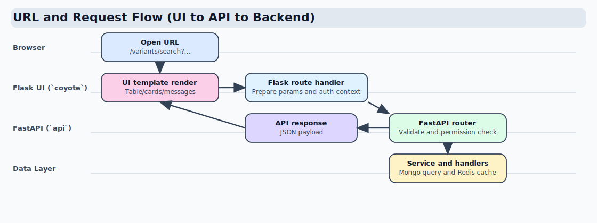
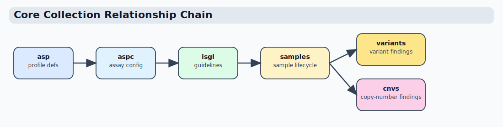
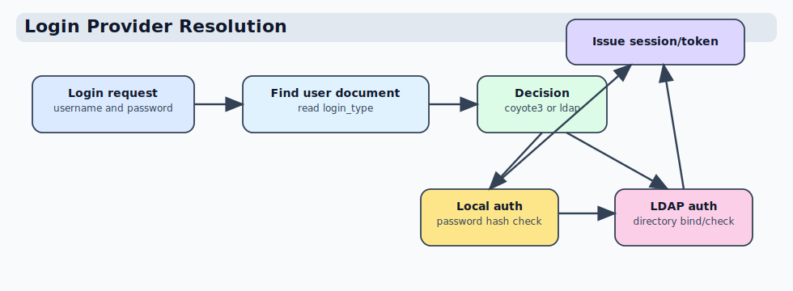

# URL And Request Flow

This section explains how a user action moves from UI to API to data storage.

## End-to-end flow



## Layer map (quick reference)

| Layer | Main location | Responsibility |
|---|---|---|
| UI routing | `coyote/blueprints` | Page routes, request context, API calls |
| API routing | `api/routers` | Request/response contracts, auth checks |
| Business logic | `api/services`, `api/core` | Domain rules and orchestration |
| Persistence | `api/infra/mongo/handlers` | Collection-scoped Mongo read-write |
| Data stores | MongoDB, Redis | Durable data and cache/session |

## Concrete example

### UI URL

A user opens a UI page such as:

```text
/variants/search?panel_type=DNA&assay_group=WGS
```

### UI layer (Flask)

The Flask view in `coyote/blueprints/...` prepares request params and calls API.

### API layer (FastAPI)

The API router in `api/routers/...` validates request schema and delegates to service.

### Service/core layer

`api/services/...` and `api/core/...` enforce business rules and authorization.

### Persistence

Handlers under `api/infra/mongo/handlers` query/update MongoDB collections.
Multi-collection workflows stay in `api/services` and `api/core`.

## Collection relationship summary

Core operational chain:

- `asp` holds assay/service profile definitions.
- `aspc` stores assay config attached to profile/version context.
- `isgl` provides interpretation/service guideline metadata used during validation and reporting.
- `samples` carries sample lifecycle and links assay/profile context.
- `variants` stores variant-level findings linked to sample scope.
- `cnvs` stores copy-number findings aligned to sample and assay context.

Practical relationship direction:



Notes:

- The exact join keys differ by workflow type, but the chain above reflects logical dependency.
- Dashboard and search endpoints aggregate across these collections.
- Cache invalidation should trigger when any upstream collection changes and affects derived views.

## Auth flow example (provider resolution)

1. Login request arrives with username/password.
2. API resolves user doc from DB.
3. `login_type` determines auth provider (`coyote3` local vs `ldap`).
4. Provider-specific authentication executes.
5. Session/token is issued on success.

For local users, password lifecycle features (first login reset/change) are handled in app flow. For LDAP users, password change remains external or future integration depending on LDAP policy.

## Login decision diagram


