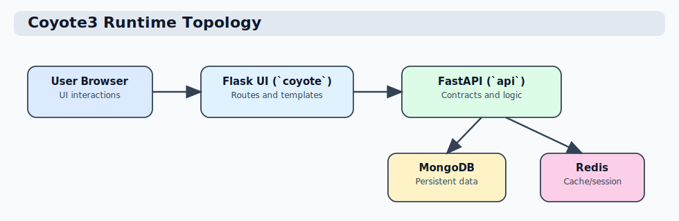

# Coyote3 Documentation

Coyote3 is a clinical genomics platform with a split runtime:

- `coyote/` Flask UI for user workflows
- `api/` FastAPI backend for domain logic, policy, and data operations
- MongoDB for persistent storage
- Redis for cache/session support

This documentation is organized as a practical flow chain:

1. Start and run the system
2. Understand UI and user workflows
3. Understand architecture and code structure
4. Use and extend APIs
5. Validate quality and testing
6. Deploy and operate in dev/stage/prod
7. Maintain and evolve the codebase safely

## Audience map

- **Clinical users / operators**: Product, UI, and workflow guides
- **Developers**: Local setup, architecture, API, testing
- **DevOps / maintainers**: Environment model, deployment guides, backups, release flow

## Fast links

- Governance and project standards: [Project Standards / Governance Overview](project/governance.md)
- Quick start: [Start Here / Quickstart](start-here/quickstart.md)
- Local development: [Start Here / Local Development](start-here/local-development.md)
- Add new feature: [Developer / Add New Feature](developer/adding-features.md)
- URL and request flow: [Developer / URL And Request Flow](developer/url-routing-and-request-flow.md)
- End-to-end route example: [Developer / Route Walkthrough (Dashboard)](developer/route-walkthrough-dashboard-summary.md)
- Developer troubleshooting: [Developer / Troubleshooting Guide](developer/troubleshooting-guide.md)
- UI map and workflows: [Product / UI Map And User Flows](product/ui-map-and-user-flows.md)
- API ingestion: [API / Ingestion API](api/ingestion-api.md)
- Collection operations and permissions: [API / Collection Operations And Permissions](api/collection-operations-and-permissions.md)
- Center deployment: [Operations / Center Deployment Guide](operations/center-deployment-guide.md)
- Initial deployment checklist: [Operations / Initial Deployment Checklist](operations/initial-deployment-checklist.md)
- Deployment cycle: [Operations / Deployment Guide](operations/deployment-guide.md)
- Auth/mail observability SLOs: [Operations / Observability SLOs And Alerts](operations/observability-slos-and-alerts.md)
- Testing and quality gates: [Testing / Testing And Quality](testing/testing-and-quality.md)
- Auth ADRs: [Architecture / ADR-0001 Auth Provider Resolution](architecture/adr-0001-auth-provider-resolution.md)
- Developer guide: [Engineering / Developer Guide](maintainers/developer-guide.md)

## Runtime topology

The UI calls API endpoints for all core operations. Business rules live in API services/core layers, not in templates.
