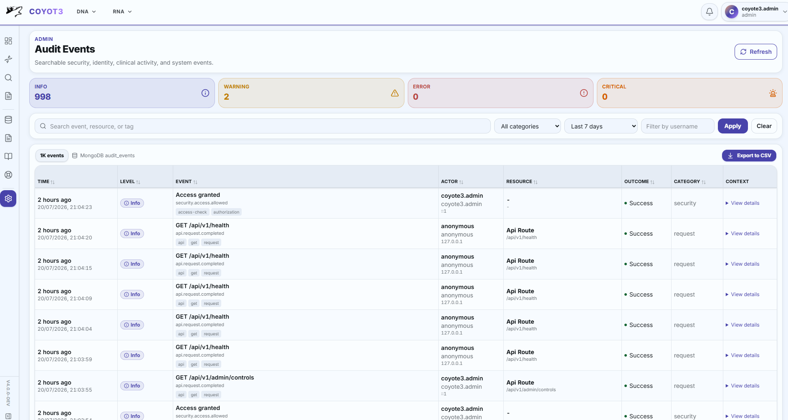
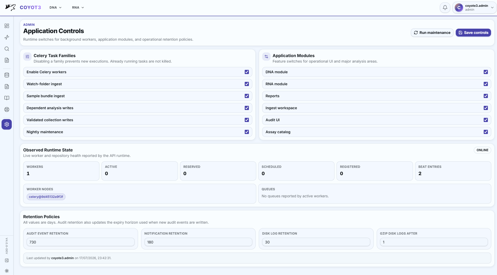

# Audit Events And JSON Logging

The administrative audit browser exposes actor, resource, outcome, and request
context without requiring operators to inspect raw database documents.



Coyote3 separates operational diagnostics from durable security and workflow audit events.

Runtime logs are JSON Lines written to stdout and, when enabled, rotating files under `/app/logs`.
Compose bind-mounts that fixed container location from `COYOTE3_LOGS_HOST_ROOT`, so API,
worker, and beat logs survive container replacement and use the center-selected host storage.
Every API request binds a request context so log records can include `request_id`, client IP,
method, and path. The API returns the correlation id in the `X-Request-ID` response header.

Durable audit events are append-only MongoDB documents in the fixed
`audit_events` collection. Events include:

- `occurred_at` and `expires_at`
- `severity`, `category`, `event_type`, and `outcome`
- actor username/fullname/roles/provider
- resource type/id/name
- request source metadata
- bounded, redacted metadata

For sample resources, user-facing audit views use the clinical sample name as
`resource.name`. The MongoDB ObjectId remains available as `resource.id` and as
`metadata.sample_oid` in the expanded details. This keeps logs readable during
operations while preserving the stable database identifier needed for forensic
follow-up.

Metadata keys resembling passwords, secrets, tokens, cookies, authorization headers, sequences,
report bodies, or file contents are redacted before storage.

API sessions are opaque random tokens. Only a SHA-256 hash is stored in the
fixed `api_sessions` collection, together with `user_id`, `csrf_token`, `created_at`,
`last_seen_at`, and `expires_at`. Disabled or missing users are rejected during session lookup.

Indexes are created at runtime for session expiry and audit retention/filtering:

- `ttl_api_session_expiry`
- `ttl_audit_expiry`
- audit indexes for time, severity, category, event type, actor, and tags

Relevant settings:

```text
API_SESSION_COOKIE_NAME
API_SESSION_COOKIE_SAMESITE
API_SESSION_TTL_SECONDS
AUDIT_RETENTION_DAYS
LOG_SERVICE_NAME
LOG_FILE_ENABLED
LOG_GZIP_AFTER_DAYS
LOG_RETENTION_DAYS
LOG_LEVEL
COYOTE3_LOGS_HOST_ROOT
NOTIFICATION_RETENTION_DAYS
```

## Recipient-scoped notifications

Durable notifications are stored in the configured `notifications` collection.
Each document contains an audience (`all` or `users`), optional recipient
usernames, category, severity, title, message, creation metadata, expiry time,
and per-user `read_by` and `dismissed_by` arrays. MongoDB removes expired rows
through the `expires_on` TTL index.

Visibility is evaluated as:

1. the audience is `all`, or the authenticated username is in `recipients`;
2. the authenticated username is not in `dismissed_by`.

Read and dismissal state is additive and scoped to one username. Dismissing an
application-wide message does not delete the shared message or affect other
users. Administrative publication emits `notification.broadcast.created` in
the audit collection. A valid local password-reset request emits a security
notification to active admin/superuser accounts and a corresponding
`authentication.password_reset.requested` audit event.

Browser-generated API success and failure messages remain local workflow
feedback. They are stored under `coyote3.notifications:<username>` and are not
treated as durable operational broadcasts.

## Application Controls



Runtime operational controls are stored in the `app_controls` MongoDB collection. The API starts
from typed defaults derived from environment configuration and overlays the single active document
with `control_id: default`.

Use Admin -> Application Controls to manage:

- Celery task family gates:
  - global Celery execution
  - complete sample ingestion
  - validated collection writes
  - retention maintenance
- application-module availability enforced by the UI and API
- retention policy values for audit events, notifications, and on-disk logs

| Control | Enabled behavior | Disabled behavior |
| --- | --- | --- |
| Allow background task execution | Controlled task families may perform work when their individual gates also allow it. | Controlled tasks return before doing application work; worker processes remain running. |
| Complete sample ingestion | Watch-folder discovery and manually submitted bundles use the same validation, parsing, dependent-write, readiness, audit, and rollback workflow. | Watch scans and manual sample-ingest tasks return before changing clinical sample collections. An ingest already executing is not cancelled. |
| Validated collection writes | Registered generic collection insert and upsert tasks may persist validated documents. | These generic Celery write tasks return before persistence. |
| Retention maintenance | Scheduled and manual maintenance may apply audit and disk-log cleanup. | Maintenance tasks return without cleanup; MongoDB TTL behavior remains independent. |
| Application modules | Governed navigation, pages, and APIs are available. | Governed navigation is hidden, direct UI routes show an unavailable state, and governed APIs return HTTP `503` with `category: module_disabled`. Stored data is retained. |

The complete sample-ingestion gate intentionally represents one clinical
transaction. Watch-folder scanning and manual submission are two entry points,
not different persistence models. Once a manifest is accepted, every declared
analysis resource is parsed and written through the same bundle service. A
sample becomes `ready` only after the complete declared bundle succeeds.

Generic collection writes remain separate because they are administrative,
schema-registered inserts or upserts and do not implement sample-bundle
readiness. Retention maintenance remains separate because it deletes expired
operational records and logs rather than creating clinical data.

Application controls are for runtime behavior. Deployment secrets and infrastructure endpoints stay
in environment configuration, including MongoDB, Redis, LDAP, token secrets, SMTP credentials, and
mounted filesystem roots.

Disabling a Celery task family prevents new task executions from doing work. It does not kill tasks
that are already running, and it does not resize the worker process pool. Capacity is effectively
returned when disabled tasks stop being scheduled or return early.

The Application Controls page includes an observed runtime-state panel. It uses the API runtime to
inspect Celery and reports worker availability, active tasks, reserved tasks, scheduled tasks,
registered task names, queues, and startup index conflicts. If workers or Redis are unavailable, the
panel reports an offline or unavailable state instead of failing the whole page.

Each editable control includes contextual operational guidance. Hover over or select its information
icon to review the control's scope, enabled behavior, disabled behavior, and important dependencies.
The master background-task switch is an application execution gate: it does not start or stop Celery
processes, resize the worker pool, cancel running tasks, or release worker processes. Task-family
switches are evaluated when controlled tasks begin application work.

The observed runtime panel refreshes every 30 seconds and can also be refreshed manually. It reports:

| Runtime area | Meaning |
| --- | --- |
| Execution state | Relationship between the stored master task gate and workers that respond to live inspection. |
| Task-family gates | Effective complete-ingest, collection-write, and maintenance switches evaluated when controlled tasks start. |
| Application modules | Effective module states enforced by navigation, route boundaries, and API middleware. |
| Worker details | Node name, process identifier, uptime, pool concurrency, processed count, current task counts, registered count, and consumed queues. |
| Queue consumers | Queue names reported by workers and the workers currently consuming each queue. |
| Periodic schedules | Beat entries configured in the application image, including task name and schedule. Presence does not prove that the separate Beat process is running. |
| Task activity | Safe identity and state for active, reserved, and scheduled tasks. Arguments and keyword arguments are intentionally excluded. |
| Registered capabilities | Distinct task names registered by responding workers. |
| Repository state | MongoDB index-definition conflicts tolerated during startup and requiring operational review. |

### Application-module boundaries

| Module | Governed capability |
| --- | --- |
| DNA analysis | Small variants, CNVs, translocations, biomarkers, and coverage. |
| RNA analysis | Fusion and expression analysis. |
| Clinical reporting | Preview, rendering, saving, and retrieval of reports. |
| Tiered variant search | Cross-sample tier and annotation search. |
| Knowledgebases | Gene context and local or external evidence lookups. |
| Ingest workspace | Manual bundle upload, validation, and queue submission. |
| Assay catalog | Public catalog, matrix, ASP gene, and gene-list views. |

Authentication, health, samples, profiles, notifications, application controls,
and audit are not switchable modules. They are core access, recovery, or
oversight surfaces. In particular, audit visibility is controlled by RBAC and
cannot be disabled through application controls.

The public `GET /api/v1/public/modules` endpoint exposes only module labels,
descriptions, and effective availability. The frontend uses that endpoint to
remove disabled navigation before a user opens it. API middleware independently
checks every governed request, so a stale browser, bookmarked route, or direct
API caller cannot bypass a disabled module.

!!! tip "Operational interpretation"

    Use the editable switches to control whether work is allowed. Use the observed runtime state to
    confirm whether workers are actually connected and doing work. Use container orchestration,
    systemd, or Docker Compose settings to change process count, memory, and CPU allocation.

## Retention Maintenance

Audit retention is enforced in two layers:

- MongoDB TTL indexes delete documents after their `expires_at` timestamp.
- The nightly `api.tasks.maintenance.run_retention_maintenance` Celery task explicitly deletes audit
  events older than the current admin retention policy and reports the cleanup result.

Disk log retention is handled by the same maintenance task when file logging is enabled. The task:

- scans the configured `LOGS` directory
- gzips plain log files older than `gzip_disk_logs_after_days`
- deletes log files older than `disk_log_days`

Container stdout remains the primary operational logging stream. On-disk logs are a local retention
aid and should still be paired with centralized log collection in production.
