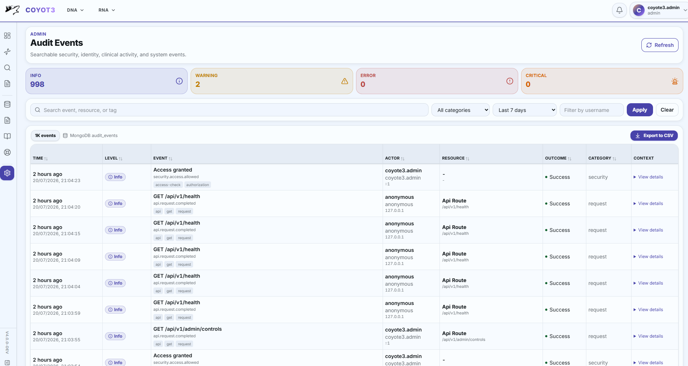
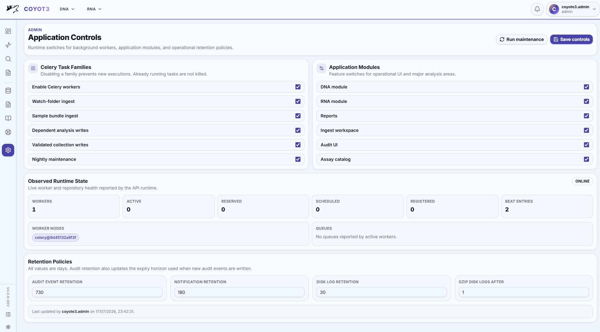

# Audit Events And JSON Logging

The administrative audit browser exposes actor, resource, outcome, and request
context without requiring operators to inspect raw database documents.



Coyote3 separates operational diagnostics from durable security and workflow audit events.

Runtime logs are JSON Lines written to stdout and, when enabled, rotating files under `/app/logs`.
Compose bind-mounts that fixed container location from `COYOTE3_LOGS_HOST_ROOT`, so API,
worker, and beat logs survive container replacement and use the center-selected host storage.
Files use `YYYY/MM/DD/<service>_YYYY-MM-DD.log`, for example
`/app/logs/2026/09/09/api_2026-09-09.log`. The date changes at midnight in
`LOCAL_TIME_ZONE` (UTC by default); the next record opens the new day's file.
API, worker, beat, UI, proxy, docs, and monitor have separate files. JSON event
timestamps remain UTC. Retention maintenance compresses old logs and deletes
them according to the configured retention periods. Older flat logs remain eligible
for retention; new logs no longer use the `dev`, `prod`, or `stage` subdirectories.

Compose wraps API, worker, and beat commands to capture startup failures as well
as application output. The development UI wrapper forwards Vite output. Vite and
production UI, proxy, and docs Nginx servers send internal UDP syslog to the monitor; 5xx access
responses also count as errors. Docker stdout remains available. Redis and external
MongoDB retain their own container logging configuration. Application Compose services,
including Redis, use Docker's `json-file` driver with `max-size: 10m` and `max-file: 5`.
Recreate existing containers to apply these limits; they do not limit daily application files.
Every API request binds a request context so log records can include `request_id`, client IP,
method, and path. The API returns the correlation id in the `X-Request-ID` response header.

Durable audit events are append-only MongoDB documents in the configured
`audit_events` collection in `IDENTITY_DB`. Events include:

- `occurred_at`, `retention_class`, and `immutable`
- `expires_at` for expiring operational events only
- `severity`, `category`, `event_type`, and `outcome`
- actor username/fullname/roles/provider
- resource type/id/name
- request source metadata
- bounded, redacted metadata

For sample resources, user-facing audit views use the clinical sample name as
`resource.name`. The MongoDB ObjectId remains available as `resource.id` and as
`metadata.sample_oid` in the expanded details. This keeps logs readable during
operations while preserving the stable database identifier needed for forensic
follow-up.

Metadata keys resembling passwords, secrets, tokens, cookies, authorization headers, sequences,
report bodies, or file contents are redacted before storage.
Credential-bearing URLs, bearer credentials and named secret assignments are also redacted
from diagnostic strings, including formatted exception traces. This is not patient-data
anonymization: avoid logging request bodies, clinical text or unlabelled secrets. Restrict
access to logs, audit records and error-email attachments.

## HTTP errors and support references

API errors use HTTP status codes, not HTML status codes. The JSON envelope contains
`status`, `error`, `details`, `category`, `code`, `hint`, and `request_id`. Existing
clients can continue reading `error` and `details`; `code` identifies the status class
in machine-readable form, while `category` retains a more specific application reason.
Validation details contain `field` and `message`, without rejected input values.

```json
{
  "status": 422,
  "error": "Validation failed",
  "details": [{"field": "asp_id", "message": "Field required"}],
  "category": null,
  "code": "validation_failed",
  "hint": "Correct the listed fields or conditions before retrying.",
  "request_id": "example-request-42"
}
```

The response repeats the reference in `X-Request-ID` and sends `Cache-Control: no-store`.
Incoming IDs are accepted only when they contain 1-128 ASCII letters, digits, dots,
hyphens or underscores; other values are replaced. References correlate requests, not
identities, and must not be used for authorization. Support can search the API logs and
audit events for this ID. Unexpected errors retain the authenticated actor where available.

| HTTP status | Meaning and action |
| --- | --- |
| 400 | Malformed request or invalid operation; review the supplied values. |
| 401 | Authentication required or expired; sign in again. |
| 403 | Permission, scope, CSRF or workflow restriction; read the specific explanation. |
| 404 | Resource or route not found; refresh the list or correct the URL. |
| 405 | Unsupported HTTP method; consult the preserved `Allow` header. |
| 406 / 415 | Unsupported response or request format. |
| 408 / 504 | Request or upstream timeout; check whether the operation completed. |
| 409 | Conflict, including stale revisions; reload and review before resubmission. |
| 410 | Resource no longer available. |
| 412 / 428 | Failed or missing precondition, where an endpoint requires one. |
| 413 | Upload too large; reduce its size or review the configured limit. |
| 422 | Field validation or an unsatisfied application condition. |
| 429 | Rate limit reached; respect `Retry-After` when supplied. |
| 500 | Unexpected server failure; contact support with the reference. |
| 502 / 503 | Failed dependency or unavailable service; check status before retrying. |

This table describes the common handler's supported statuses, not a promise that every
endpoint emits every code. Endpoint contracts determine which statuses apply. Authentication
and retry headers are preserved. The UI displays field names, safe details, hints and support
references; it does not display proxy HTML or internal 5xx exception messages. Cancelled
requests do not produce error notifications. Network failures have no HTTP status and tell
the user to check connectivity and operation status. Mutations are not automatically retried.

The envelope remains Coyote3's existing JSON contract, extended with diagnostic fields.
It is not an RFC 9457 `application/problem+json` response. Changing to that format would
require an explicit API contract change, not just renaming the content type.

## Transactional audit delivery

The following business writes stage a receipt in `audit_outbox` in the same
MongoDB transaction as their data changes:

- Clinical rule creation, content edits, lifecycle transitions, publication,
  baseline capture and draft deletion.
- Public catalog revisions and publication.
- Assay setup revisions and publication bundles.
- Assay, ASPC and gene-list creation, revision rotation and availability changes.
- Assay-group creation and availability changes; subpanel definitions and associations.
- Report saves, sample-bundle ingestion, collection-ingest transaction callbacks,
  and sample deletion.

If receipt insertion fails, the transaction aborts. A committed receipt survives a
process crash before the API responds or before the central audit service is reachable.
Clinical-rule lifecycle events are delivered from this queue, not emitted a second
time by the authoring service after commit. HTTP request/mutation events remain
separate operational records and are not duplicate clinical lifecycle events.

Each outbox document has `_id`, `route` and `event` fields. `event` contains the actor,
resource identity, action, timestamp, request reference and bounded metadata. It
does not contain full clinical documents. Rule receipts include the revision hash
that identifies the separately stored immutable snapshot. Outbox collections have
no expiry index; their built-in `_id` index supports ordered batch delivery.

The worker reads the configured app, identity and knowledgebase queues and writes
to the configured identity audit collection. Source and destination may be different
instances or replica sets. It never passes a source session to the destination.
Workers select only receipts for their environment and identity destination namespace.
The routing hash excludes credentials, so credential rotation does not strand receipts;
it includes identity hosts, replica-set name and database. A development worker cannot
drain production receipts from the shared knowledgebase. Before changing identity hosts
or database names, drain pending queues or plan an explicit, reviewed routing migration.
Do not relabel receipts automatically when a deployment destination changes.
Destination writes and source deletions use majority acknowledgement with journaling.
Delivery uses insert-only upserts with the original event ID. If the worker crashes
after delivery but before deleting the pending row, replay does not create a second
event or overwrite the first one. Delivery is at least once with idempotent storage,
not a distributed transaction or an exactly-once execution guarantee.
The central audit browser shows these events after worker delivery, not necessarily
immediately after saving. Their occurrence timestamps remain the original transaction times.

`api.tasks.maintenance.replay_audit_events` runs every 30 seconds and attempts at
most 100 events per configured queue, then the filesystem retry queue. Failed MongoDB
deliveries are logged and retained. Monitor errors and the size/age of `audit_outbox`;
it should drain after dependency recovery. API and worker database accounts need
insert/read/delete access to the owning outbox collections, plus read/write access
to the central audit collection. Read-only knowledgebase deployments do not produce
outbox writes unless a controlled importer is enabled with suitable credentials.

Deploy the API and worker together. No historical document rewrite is required;
queues are created by the first audited transaction. Include `audit_outbox` in
backups of every database that owns one, and restore it with the corresponding
business data. Do not clear a queue to resolve delivery errors. Existing revision
history is unchanged; this does not reconstruct missing historical central events.
Maintenance scripts that use these repositories must load `ENV_NAME`, `IDENTITY_DB`
and `IDENTITY_MONGO_URI` (or the shared `COYOTE3_MONGO_URI`) from the owning deployment's
environment file. Missing audit-routing configuration aborts the transaction rather
than creating an unassigned receipt.

The atomic guarantee applies to the operations listed above. Authentication attempts,
HTTP diagnostics, notification delivery and other events emitted outside these
transactions use the operational recorder described below. New business write paths
must explicitly stage their audit receipt before commit; middleware alone is not
a substitute for transactional auditing.

## Operational audit delivery during outages

If an audit insert fails, the API or worker saves the sanitized event under
`LOG_ROOT/audit-spool/<destination-namespace-hash>/`. Files use extended JSON to
preserve MongoDB identities and timestamps, are written atomically with filesystem sync,
and have owner-only permissions. API and worker must share the same persistent logs mount,
database configuration and filesystem UID. Protect and back up this directory as audit data.

An initialized worker attempts up to 100 files per batch, independently of optional maintenance gates.
The original `_id` and insert-only upserts make repeated delivery idempotent, including
recovery after an uncertain database acknowledgement. A file is removed only after an
acknowledged write. Original timestamps and operational expiry remain unchanged.

Malformed or identity-mismatched files are retained with an `.invalid` suffix and
produce a CRITICAL log; they do not block valid events. An operator must inspect and
repair these files rather than discard them. Recovered valid files can be restored
to their original `<event-id>.json` name for replay.

Queued events produce CRITICAL logs. Monitor these alerts and pending-file counts; a
growing queue needs investigation. If Redis, beat, the worker or worker initialization is
unavailable, replay waits until those dependencies recover. Pending files are not included
in ordinary `.log` retention and must not be deleted to free disk space. If both MongoDB
and the retry volume fail, the operation raises an error and emits a CRITICAL diagnostic.

This filesystem queue is an operational fallback, not a replacement for the database
outbox. It cannot make an event atomic with an earlier business commit. An HTTP error
after a business commit does not mean the change was rolled back. Inspect current state
before retrying; transaction-owned receipts remain queued even if later diagnostics fail.

API sessions are opaque random tokens. Only a SHA-256 hash is stored in the
configured `api_sessions` collection in `IDENTITY_DB`, together with `user_id`,
`csrf_token`, `created_at`, `last_seen_at`, and `expires_at`. Disabled or missing
users are rejected during session lookup.

Indexes are created at runtime for session expiry and audit retention/filtering:

- `ttl_api_session_expiry`
- `ttl_audit_expiry`
- audit indexes for time, retention class, severity, category, event type,
  actor, and tags

Relevant settings:

```text
API_SESSION_COOKIE_NAME
API_SESSION_COOKIE_SAMESITE
API_SESSION_TTL_SECONDS
AUDIT_RETENTION_DAYS
LOG_FILE_ENABLED
LOG_GZIP_AFTER_DAYS
LOG_RETENTION_DAYS
LOG_LEVEL
COYOTE3_LOGS_HOST_ROOT
LOG_ROOT
LOCAL_TIME_ZONE
ERROR_EMAIL_GROUP
NOTIFICATION_RETENTION_DAYS
```

## System error emails

The Compose `monitor` service scans daily logs for ERROR and CRITICAL records, plus
WARNING records with event type `ingest.expected_files_missing`. Missing optional
expected files allow ingestion to proceed and generate warning emails. It
runs independently of API initialization, Redis, worker, and beat. Each error batch
includes the error messages, recorded tracebacks, and a plain-text snapshot of the newly
scanned log batch (up to 10,000 complete lines), rather than the entire service log.
The email identifies the byte range included. Unchanged files already scanned to
the end are skipped before opening, avoiding repeated gzip decompression on idle
polls. After restart, persisted offsets are recovered and this cache is rebuilt.
The snapshot is retained under `/app/logs/.error-mail` until SMTP accepts the
message for each current recipient. Failed delivery and database outages are retried.
The scanner can also read logs already compressed by retention.

Log retention is scheduled once daily at midnight in `LOCAL_TIME_ZONE`
(`COYOTE3_MAINTENANCE_HOUR=0`). The default compression age is seven days
(`LOG_GZIP_AFTER_DAYS=7`). Existing saved App Controls retention settings take
precedence: set **Gzip disk logs after days** to **7** there as well if previously
saved as 1. Error scans continue frequently, but do not compress attachments;
previously queued compressed attachments remain deliverable.

Recipients are active users whose `roles` include `monitoring_group`, configurable
with `ERROR_EMAIL_GROUP`. This is a notification membership role with no application
permissions. Install the role through the existing RBAC catalog synchronization
command (`scripts/sync_rbac_catalog.py`) or create it in Admin → Roles, then assign
it to the intended users and check their email addresses. The bootstrap catalog
includes the role for new installations; existing user memberships are not changed.
Configure the existing `SMTP_*` settings, including `SMTP_HOST` and `SMTP_FROM_EMAIL`;
`SMTP_SECURITY_FROM_EMAIL` is used when supplied.

Recreate the Compose API, worker, beat, UI, proxy, docs, and monitor services to apply
the new commands and logging configuration. No database schema migration is needed.
`LOG_ROOT` defaults to `logs` outside Compose and is `/app/logs` inside Compose.

Authenticated browser crashes, unhandled errors, and promise rejections are posted
to `/api/v1/client-errors` with CSRF protection and logged as `ui`. Browser reporting
is capped at ten events per minute per page and cannot deliver while the API is
unreachable. UDP syslog is best effort. Host failures and a stopped monitor
require external infrastructure monitoring. SMTP attachment limits still apply;
rejected messages remain queued rather than being marked delivered. A crash after
SMTP acceptance but before state persistence can result in a duplicate email.

Session cookies are automatically marked `Secure` for HTTPS requests, including
requests received through a reverse proxy that supplies `X-Forwarded-Proto`.
An HTTP request is accepted only as a local-development fallback and emits a
runtime warning; production deployments must terminate TLS before the API.

## Recipient-scoped notifications

Durable notifications are stored in the configured `notifications` collection.
Each document contains an audience (`all` or `users`), optional recipient
usernames, category, severity, title, message, creation metadata, expiry time,
and per-user `read_by` and `dismissed_by` arrays. Expiry hides messages from the
inbox without removing their MongoDB records; the expiry index is not a TTL index.

Visibility is evaluated as:

1. the audience is `all`, or the authenticated username is in `recipients`;
2. the message is neither withdrawn nor expired;
3. for personal messages, the authenticated username is not in `dismissed_by`.

Read state is scoped to one username. Personal-message dismissal affects only
that recipient. Broadcasts cannot be dismissed by recipients; only their sender
can withdraw them for everyone. Administrative publication emits `notification.broadcast.created` in
the audit collection. A valid local password-reset request emits a security
notification to active admin/superuser accounts and a corresponding
`authentication.password_reset.requested` audit event.

Marking a notification read does not clear it. Read messages remain in the tray
until their visibility deadline, personal-message clearing, or sender withdrawal.
Closing a toast marks it read without clearing the inbox item. New administrative
broadcasts snapshot the selected active recipients, including the all-users option;
accounts created later do not inherit earlier broadcasts. Optional email delivery
uses recipient-specific leases in the same notification document. See
[email and notifications](email_and_notifications.md) for delivery and test setup.

Browser-generated API success and failure messages remain local workflow
feedback. They are stored under `coyote3.notifications:<username>` and are not
treated as durable operational broadcasts.

## Application Controls



Runtime operational controls are stored in the `app_controls` MongoDB collection. The API starts
from typed defaults derived from environment configuration and overlays the single active document
with `control_id: default`.

Use Admin -> Application Controls to manage:

- Celery task family gates:
  - global Celery execution
  - complete sample ingestion
  - validated collection writes
  - retention maintenance
- application-module availability enforced by the UI and API
- retention policy values for audit events, notifications, and on-disk logs

| Control | Enabled behavior | Disabled behavior |
| --- | --- | --- |
| Allow background task execution | Controlled task families may perform work when their individual gates also allow it. | Controlled tasks return before doing application work; worker processes remain running. |
| Complete sample ingestion | Watch-folder discovery and manually submitted bundles use the same validation, parsing, dependent-write, readiness, audit, and rollback workflow. | Watch scans and manual sample-ingest tasks return before changing clinical sample collections. An ingest already executing is not cancelled. |
| Validated collection writes | Registered generic collection insert and upsert tasks may persist validated documents. | These generic Celery write tasks return before persistence. |
| Retention maintenance | Scheduled and manual maintenance may apply audit and disk-log cleanup. | Maintenance tasks return without cleanup; MongoDB TTL behavior remains independent. |
| Application modules | Governed navigation, pages, and APIs are available. | Governed navigation is hidden, direct UI routes show an unavailable state, and governed APIs return HTTP `503` with `category: module_disabled`. Stored data is retained. |

The complete sample-ingestion gate controls one bundle workflow. Watch-folder
scanning and manual submission are two entry points, not different persistence
models. Every declared resource is parsed before its evidence and sample readiness
commit together in a required transaction. Async completion receipts join that
transaction; disabled task families retain accepted work for later execution.
Audit delivery and filesystem acknowledgements occur after commit and cannot undo
it. See [transactions and ingest recovery](../architecture/transactions_and_ingest_recovery.md).

Generic collection writes remain separate because they are administrative,
schema-registered inserts or upserts and do not implement sample-bundle
readiness. Retention maintenance remains separate because it deletes expired
operational records and logs rather than creating clinical data.

Application controls are for runtime behavior. Deployment secrets and infrastructure endpoints stay
in environment configuration, including MongoDB, Redis, LDAP, token secrets, SMTP credentials, and
mounted filesystem roots.

Disabling a Celery task family prevents new task executions from doing work. It does not kill tasks
that are already running, and it does not resize the worker process pool. Capacity is effectively
returned when disabled tasks stop being scheduled or return early.

The Application Controls page includes an observed runtime-state panel. It uses the API runtime to
inspect Celery and reports worker availability, active tasks, reserved tasks, scheduled tasks,
registered task names, queues, and startup index conflicts. If workers or Redis are unavailable, the
panel reports an offline or unavailable state instead of failing the whole page.

Each editable control includes contextual operational guidance. Hover over or select its information
icon to review the control's scope, enabled behavior, disabled behavior, and important dependencies.
The master background-task switch is an application execution gate: it does not start or stop Celery
processes, resize the worker pool, cancel running tasks, or release worker processes. Task-family
switches are evaluated when controlled tasks begin application work.

The observed runtime panel refreshes every 30 seconds and can also be refreshed manually. It reports:

| Runtime area | Meaning |
| --- | --- |
| Execution state | Relationship between the stored master task gate and workers that respond to live inspection. |
| Task-family gates | Effective complete-ingest, collection-write, and maintenance switches evaluated when controlled tasks start. |
| Application modules | Effective module states enforced by navigation, route boundaries, and API middleware. |
| Worker details | Node name, process identifier, uptime, pool concurrency, processed count, current task counts, registered count, and consumed queues. |
| Queue consumers | Queue names reported by workers and the workers currently consuming each queue. |
| Periodic schedules | Beat entries configured in the application image, including task name and schedule. Presence does not prove that the separate Beat process is running. |
| Task activity | Safe identity and state for active, reserved, and scheduled tasks. Arguments and keyword arguments are intentionally excluded. |
| Registered capabilities | Distinct task names registered by responding workers. |
| Repository state | MongoDB index-definition conflicts tolerated during startup and requiring operational review. |

### Application-module boundaries

| Module | Governed capability |
| --- | --- |
| DNA analysis | Small variants, CNVs, translocations, biomarkers, and coverage. |
| RNA analysis | Fusion and expression analysis. |
| Clinical reporting | Preview, rendering, saving, and retrieval of reports. |
| Tiered variant search | Cross-sample tier and annotation search. |
| Knowledgebases | Gene context and local or external evidence lookups. |
| Ingest workspace | Manual bundle upload, validation, and queue submission. |
| Assay catalog | Public catalog, matrix, ASP gene, and gene-list views. |

Authentication, health, samples, profiles, notifications, application controls,
and audit are not switchable modules. They are core access, recovery, or
oversight surfaces. In particular, audit visibility is controlled by RBAC and
cannot be disabled through application controls.

The public `GET /api/v1/public/modules` endpoint exposes only module labels,
descriptions, and effective availability. The frontend uses that endpoint to
remove disabled navigation before a user opens it. API middleware independently
checks every governed request, so a stale browser, bookmarked route, or direct
API caller cannot bypass a disabled module.

> **Tip: Operational interpretation**
>
>
> Use the editable switches to control whether work is allowed. Use the observed runtime state to
> confirm whether workers are actually connected and doing work. Use container orchestration,
> systemd, or Docker Compose settings to change process count, memory, and CPU allocation.
>

## Retention Maintenance

Audit events use explicit retention classes:

| Retention class | Intended content | Expiry behavior |
| --- | --- | --- |
| `operational` | Routine requests, access observations, runtime diagnostics, and other time-bounded operational records | Receives `expires_at`; eligible for MongoDB TTL expiry and manual/nightly cleanup |
| `traceability` | Clinical-configuration mutations and clinical rule-set lifecycle operations whose history is needed to explain configuration or reporting lineage | Stores `immutable: true`, omits `expires_at`, and is excluded from application cleanup |

Audit retention is enforced in two layers for `operational` events only:

- MongoDB TTL indexes delete documents after their `expires_at` timestamp.
- The nightly `api.tasks.maintenance.run_retention_maintenance` Celery task
  deletes operational events older than the current admin retention policy and
  reports the cleanup result.

Legacy audit documents without a retention class are retained conservatively.
The application does not provide a cleanup path for traceability events. This
protects them from routine retention changes, but it cannot prevent a
privileged database administrator from deleting collection data directly.
Production deployments must therefore restrict database write access and
include `audit_events` in protected backup and restore procedures.

Traceability audit events are event records, not automatic resource snapshots. Clinical
rule-set events contain the rule-set identity, content version, revision, status, actor, and
operation metadata, but not the complete rule document at that revision. Full, hash-chained rule
documents are stored separately in `clinical_rule_revisions` in the same transaction as each
rule mutation. The
[clinical reporting rules reference](../product/clinical_reporting_rules.md#immutable-revision-history)
defines the responsibilities and backup requirements of both records.

Disk log retention is handled by the same maintenance task when file logging is enabled. The task:

- scans the configured `LOGS` directory
- gzips plain log files older than `gzip_disk_logs_after_days`
- deletes log files older than `disk_log_days`

Container stdout remains the primary operational logging stream. On-disk logs are a local retention
aid and should still be paired with centralized log collection in production.
