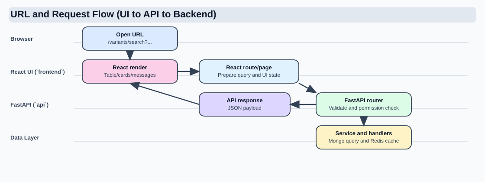
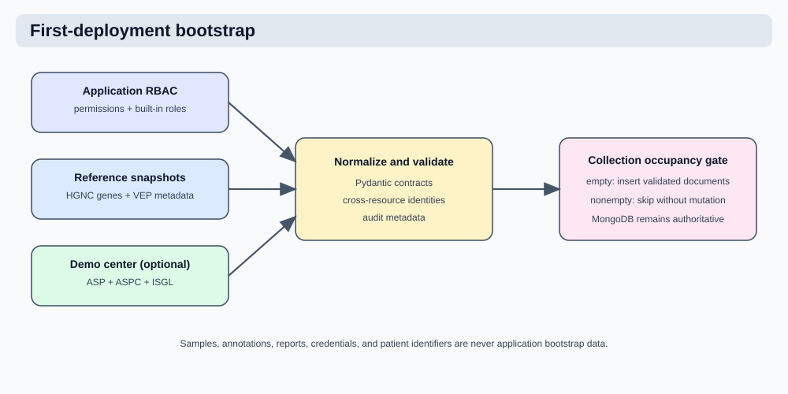

# Center Deployment Guide

**Last verified:** 6 August 2026

This page is the entry point for deployment.
Use the checklist for the full procedure.

## Deployment Flow





1. Provision or select MongoDB and create its application user.
2. Run the explicit database bootstrap command.
3. Start the API, worker, UI, proxy, and documentation services.
4. Verify UI/API and administrative access.
5. Import approved center configuration and ingest data when ready.

## Authoritative Procedure

Use this page as a map.
Use the checklist as the source of truth for the exact commands and execution order.

- [Initial Deployment Checklist](initial_deployment_checklist.md)

The checklist defines:

- exact commands and command order
- required collection order
- seed-source policy
- application verification
- deployment handoff

## Required Baseline Collections

Before first sample ingest, ensure these are seeded:

1. `permissions`
2. `roles`
3. `hgnc_genes`
4. `vep_metadata`
5. `assay_specific_panels`
6. `asp_configs`
7. `insilico_genelists` when the center uses in-silico gene-list filtering

The explicit database bootstrap installs the application-owned RBAC catalog,
creates one local superuser, and imports the bundled HGNC and VEP snapshot. It
runs only against empty governance collections.

## Seed Source Policy

- `api/config/bootstrap/rbac` is the application-owned permission and role catalog.
- Bundled permission documents are installed with `system_managed: true`; their
  definitions are immutable at runtime but remain assignable through roles.
- `api/config/bootstrap/demo_center` contains synthetic ASP, ASPC, and ISGL documents for installation checks.
- `api/config/bootstrap/reference` contains the release-bundled HGNC and VEP
  snapshots loaded by the direct bootstrap command when their collections are
  empty.
- Normal application startup does not seed or synchronize governance documents.

## Database bootstrap method

- Run `scripts/bootstrap_database.py` before application services are started.
- Pass the first local superuser identity explicitly:
  - `--username`
  - `--email`
  - `--password`
- The bootstrap command assigns `superuser`, not `admin`, by default.
- A complete existing installation is left unchanged. Partial governance data
  without a superuser is rejected for manual review.
- Additional superusers must be created by an existing authenticated superuser.

Standard command shape:

```bash
.venv/bin/python scripts/bootstrap_database.py \
  --mongo-uri "$MONGO_URI" \
  --db "$COYOTE3_DB" \
  --username "admin.coyote3" \
  --email "admin@your-center.org" \
  --password "<ADMIN_PASSWORD>"
```

Configure `MONGO_URI` for the independently operated database before this
command. If the supplied MongoDB Compose definition is used, its persistent
host resources are `COYOTE3_MONGO_DATA_HOST_ROOT`,
`COYOTE3_MONGO_BACKUP_HOST_ROOT`, and `COYOTE3_MONGO_KEYFILE_HOST_PATH`.
Set `COYOTE3_LOGS_HOST_ROOT` for every deployment; it is mounted at `/app/logs`
in the API, worker, and Beat containers.

!!! warning "Existing named-volume installations"

    A bind-mounted Mongo data directory does not automatically receive data
    from a Docker named volume used by an older deployment. Back up and restore
    that database, or copy it using an approved MongoDB maintenance procedure,
    before removing the old named volume. Start the new Mongo container only
    after the selected host data directory contains the intended database.

## Packaged configuration location

The API configuration package is `api/config` in the repository and
`/app/api/config` in the API image. It must be present because it contains typed
software settings, center configuration, and the first-deployment RBAC catalog.
Current Dockerfiles do not copy or mount a separate `/app/config` directory. If
that directory appears in a running container, the container was built from an
older image or an external deployment mount; rebuild and recreate the container
from the current Compose definition.

For a nonclinical local demonstration, add `--with-demo-center`. The flag
loads only the bundled synthetic ASP, ASPC, and ISGL documents; it does not
create samples or run ingest.

Start Coyote3 after database bootstrap:

```bash
./scripts/compose-with-version.sh \
  --env-file .coyote3_env \
  -f deploy/compose/docker-compose.yml \
  up -d --build
```

For environment-specific values and full verification gates, use:

- [Initial Deployment Checklist](initial_deployment_checklist.md)
- [Maintenance And Quality](maintenance_and_quality.md)

Operational defaults:

- Per-service container resource limits are enabled by default (`*_CONTAINER_MEM_LIMIT`, `*_CONTAINER_CPU_LIMIT`).
- API and web request throttling are enabled by default and configured from env templates.
- Internal Prometheus-style metrics are exposed at `GET /api/v1/internal/metrics` (requires `X-Internal-Token`).

Sample manifest reference:

- Use [API / Sample YAML Guide](../api/sample_yaml.md) for the required DNA/RNA YAML shape.
- Use [API / Sample Input Files](../api/sample_input_files.md) for the raw VCF and JSON payload formats consumed by the ingest parsers.
- Ensure the DNA pipeline writes the VEP version into each VCF `##VEP=` header
  and seed the matching `vep_metadata.vep_id` value before DNA interpretation
  or reporting. A YAML `database_versions.vep` override is supported only for
  an explicit correction or a pipeline that cannot emit the header value.

ASPC contract rule for first-load data:

- `asp_configs` entries include `filters` and `reporting` objects.
- DNA SNV base behavior is configured with `filters`.
- DNA SNV retrieval uses the `generic_germline` and `generic_somatic` base groups, and center-specific SNV clauses are added through `query.snv`.
- DNA assay-specific SNV operator rules are configured with `query.snv`.
- DNA CNV behavior is configured with `filters.cnv_*`.
- RNA fusion behavior is configured with `filters.fusion_*`.

## Related References

- [API / Ingestion API](../api/ingestion_api.md)
- [Operations / Deployment Guide](deployment_guide.md)
- [Operations / Minimum Production Baseline](minimum_production_baseline.md)
