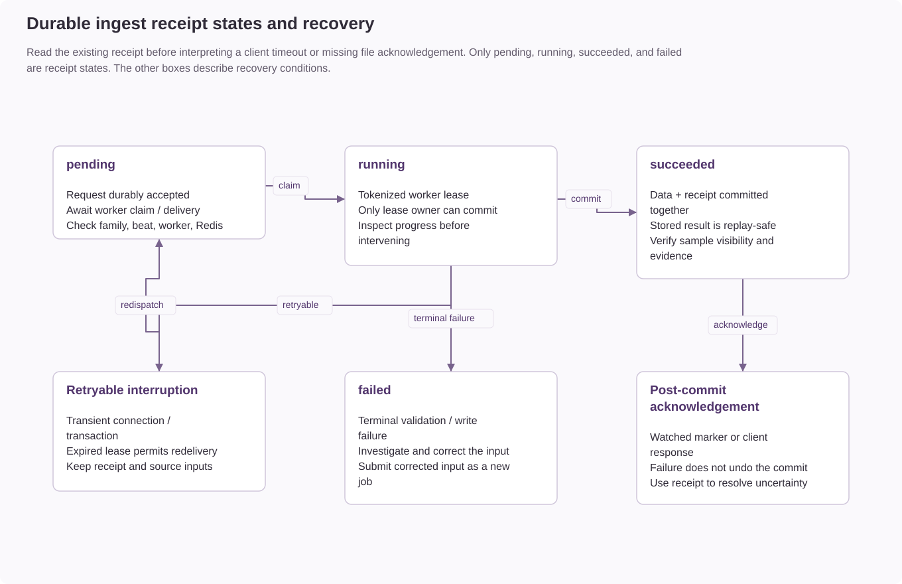

# Investigating and recovering ingest jobs

Accepted asynchronous ingest requests can be delayed, fail, or return an uncertain
outcome to the submitting client. The primary database's `ingest_jobs` receipt records
durable ingest status. A broker message or HTTP submission response alone does not
prove that clinical data committed.

## Inspect before resubmitting

Record the job identifier returned by submission. Inspect it through the supported
task-status workflow or Admin Ingest Workspace, using an authorized account. Durable
job status is restricted to the submitter or a superuser. Keep identifiers, source
payloads, staging paths, and logs in the center's controlled incident record.

See the [ingestion API](../api/sample-ingestion.md) for submission/status endpoints
and [audit and logging](audit-and-logging.md) for correlated operational evidence.

| Receipt state | Meaning | Operator action |
| --- | --- | --- |
| `pending` | Accepted but not currently claimed. | Check the relevant ingest family, beat dispatch, worker availability, and broker health. Pending work can be redispatched; do not delete its receipt or source. |
| `running` | A worker holds a tokenized execution lease. | Inspect worker progress and errors. An expired lease is eligible for redelivery; do not force state changes or clear lease fields manually. |
| `succeeded` | Clinical data and completion receipt committed together. | Use the stored result and verify sample visibility. Redelivery returns the committed result without repeating writes. |
| `failed` | A non-retryable validation or write failure was recorded. | Investigate the reported error, correct the input, and submit a new job. Beat does not automatically retry failed receipts. |

## Match the symptom to its consistency boundary

| Symptom | What to distinguish | Next check |
| --- | --- | --- |
| Submission accepted, broker unavailable | Durable acceptance versus Celery delivery. | Restore the configured broker/dispatcher; accepted pending work remains recorded. |
| Worker stopped during ingest | Worker execution versus committed clinical data. | Read the receipt and inspect lease/progress evidence; recovery uses lease ownership. |
| Transient database error | Retryable failure versus terminal validation failure. | The documented retry path returns work to pending; inspect the resulting receipt state. |
| Client timed out or lost an acknowledgement | Unknown client outcome versus stored success. | Query the existing receipt before deciding to submit again. |
| Watched file was not renamed after success | Database commit versus filesystem acknowledgement. | A later scan can use the receipt and retry the marker; a missing marker does not prove failed ingest. |
| Ready sample is not visible to a reviewer | Successful ingest versus user scope/worklist filters. | Follow [sample readiness and missing results](../user-guide/sample-readiness-and-missing-results.md). |

> **Important: Preserve replay protection and recovery inputs**
>
> Do not delete pending/running receipts or staging files. Receipts have no automatic
> TTL; deleting one removes its replay protection. Failed jobs retain their payload
> and staging for investigation. Successful jobs clear the payload after confirmed
> completion while retaining identity and result.

## Watched manifests and corrected submissions

Watched manifests derive their job identity from the absolute path, modification
time, and bytes. Producers must publish complete manifests atomically and leave
them unchanged until acknowledgement. Editing or replacing one represents a new
submission, not a harmless way to retry the original delivery.

Resolve validation failures before submitting corrected input. Confirm that the
intended operation is a new sample or an update of an existing sample, and verify
the assay, environment, modality, and required files. Use the supported ingest
workflow rather than direct collection edits.

## Close the incident only after verification

- The final receipt state and stored result explain the clinical outcome.
- The expected sample identity, recorded configuration, and declared analyses are present.
- The relevant reviewer can access the sample under their intended scope.
- Watched-manifest acknowledgement and staging cleanup agree with confirmed success,
  or a remaining filesystem issue is recorded separately.
- The incident record identifies the cause, correction, and applicable audit/log evidence.

For implementation boundaries and rollout requirements, see
[transactions and ingest recovery](../architecture/transactions-and-ingest-recovery.md).
For missing saved report files, use its report artifact reconciliation procedure;
rerunning sample ingest is not a report-artifact restore operation.
