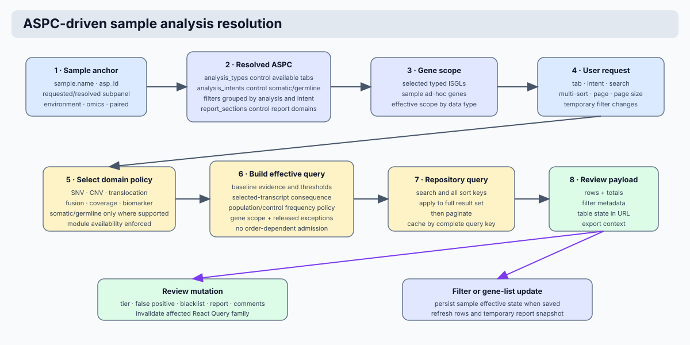

# Assay Configuration and Dynamic Query Orchestration

The platform's analytic engine is driven by the Assay-Specific Panel
Configuration (ASPC) system. An ASPC is the current operational strategy for
one assay, subpanel, and environment scope. It governs finding retrieval,
filtering logic, and clinical review behavior. Configuration mutations are
audited, while saved reports preserve immutable configuration, filter,
finding, and rule snapshots for reproducibility.



## Systematic Logic Hierarchy

The resolution of analytic strategies follows a deterministic inheritance model to ensure consistency across varying center requirements:

1. **ASPC Resolution**: The system resolves an active configuration from
   `assay`, `subpanel_id`, and `profile` (environment). A specific subpanel is
   preferred; `base` is the controlled fallback. The resolved ObjectId,
   business ID, and version are persisted on the sample.
2. **Initial Filter Seeding**: If a sample has no `filters` document, the resolved ASPC provides the initial threshold and reporting defaults.
3. **Sample-Level Truth**: Once persisted, `samples.filters` is the filter state used for findings and reports until explicitly reset.
4. **Query Execution**: Domain services convert the finalized typed filter set
   into repository queries for SNVs, CNVs, fusions, translocations, and quality
   data.

## Analysis Availability and Tab Dispatch

The sample workspace does not infer available analyses from a file name alone.
The active ASPC is the source of truth for which analytical workflows are
enabled. A tab is rendered only when all of the following are true:

1. The active ASPC `analysis_types` includes the relevant analysis type.
2. The sample has the matching declared and ingested resource, represented by a
   `files` entry or an analysis count.
3. The sample modality supports the workflow.
4. Where applicable, the sample has the required analysis intent.

| Workspace tab | ASPC analysis type | Sample modality and data requirement | Additional condition | Endpoint requested only after opening the tab |
| --- | --- | --- | --- | --- |
| Somatic SNVs | `SNV` | DNA sample with `files.vcf_files` or an SNV count | `analysis_intents` contains `somatic` | `GET /samples/{sample_name}/small-variants?intent=somatic` |
| Germline SNVs | `SNV` | DNA sample with `files.vcf_files` or an SNV count | `analysis_intents` contains `germline` | `GET /samples/{sample_name}/small-variants?intent=germline` |
| CNVs | `CNV` | DNA sample with `files.cnv` or a CNV count | Somatic CNV is the currently supported intent | `GET /samples/{sample_name}/cnvs` |
| Translocations | `TRANSLOCATION` | DNA sample with `files.transloc` or a translocation count | DNA structural-variant workflow | `GET /samples/{sample_name}/translocations` |
| Coverage | `COVERAGE` | DNA sample with `files.cov` or coverage state | Quality workflow, not a variant intent | `GET /samples/{sample_name}/coverage` |
| Fusions | `FUSION` | RNA sample with `files.fusion_files` or a fusion count | RNA fusion workflow | `GET /samples/{sample_name}/fusions` |

`Overview` and `Reports` are workspace tabs rather than analysis-type tabs.
They remain available as part of the sample workflow. A DNA sample never
exposes the RNA fusion tab. The RNA fusion API also validates the modality and
returns a client-visible configuration error if it is called for a non-RNA
sample; it does not attempt to interpret DNA filter profiles as RNA filters.

!!! important
    Hidden tabs are not mounted in the React tree. This prevents background
    requests for analyses that are unavailable for the sample. A sample page
    opened on the overview tab therefore does not query SNVs, CNVs,
    translocations, coverage, or fusions until the user opens the relevant
    available tab.

### Intent-specific SNV review

Somatic and germline SNVs use the same underlying VCF-derived collection but
are separate analytical views. Their filter profiles, result queries, table
state, comment suggestions, and report contexts are intent-specific:

```text
filters.somatic.snv  -> somatic SNV tab and report section
filters.germline.snv -> germline SNV tab and report section
```

Germline SNVs are displayed only after the ASPC enables germline intent and
the sample persists that intent. The application never manufactures a
germline profile from somatic thresholds. This prevents a UI label from
implying that germline interpretation was configured when it was not.

## Configuration Domain Interplay

Analytic execution relies on the synchronization of three core architectural pillars:

- **Assay-Specific Panels (ASP)**: Defines assay metadata and the physical set of covered genes or regions.
- **Assay-Specific Panel Configuration (ASPC)**: The
  assay/subpanel/environment-specific operational strategy governing filtered
  evidence and reporting constraints.
- **In-Silico Gene Lists (ISGL)**: Managed gene cohorts that dynamically restrict the interpretation scope during clinical review.

The **Effective Gene Scope** is target-specific:

- **SNV**: Active SNV genelists and ad-hoc genes define the optional SNV gene restriction. If no SNV genelist is selected, the SNV query is not gene-restricted.
- **CNV**: Active CNV genelists and ad-hoc genes define the CNV scope. If no CNV genelist is selected, CNV workflows fall back to ASP covered genes.
- **RNA fusion**: Fusion list selection and ad-hoc fusion genes govern RNA fusion scope.

## Clinical Query Policy

The application separates **configuration** from **clinical query policy**.
This is intentional. An ASPC gives a sample its approved thresholds, enabled
analysis sections, intent profiles, and default gene-list selections. It does
not accept arbitrary MongoDB query fragments. The domain query builder owns
the fixed predicate shape and the limited set of validated clinical exceptions.

| Layer | Source | Controls | Does not control |
| --- | --- | --- | --- |
| Assay identity | ASP and sample | `asp_id`, assay group, omics layer, covered scope | MongoDB operators or ad-hoc exceptions |
| Review configuration | Active ASPC | enabled analysis types, somatic/germline filter defaults, reporting sections | arbitrary data-store predicates |
| Per-sample review state | `samples.filters` | reviewer-selected ISGLs, ad-hoc genes, and permitted threshold changes | assay-group policy |
| Versioned annotation metadata | VEP metadata referenced by `sample.database_versions.vep` | expansion of UI consequence groups to VEP terms | query threshold values |
| Clinical query policy | `api/config/center/clinical_query_policy.toml` plus domain-core Python | released baseline evidence models, population-frequency sources, and typed clinical exceptions | raw MongoDB fields, operators, or arbitrary query fragments |

This design prevents an administrative form from broadening a clinical query by
storing raw operators in MongoDB. A change to query semantics requires code
review, unit tests, documented expected result changes, and a released
application version.

### SNV Query Inputs

For every small-variant request, the application first resolves the sample's
active ASPC and completes the persisted profile without overwriting a
reviewer's saved filters. The resulting inputs are shown below.

| Input | Source | Effect on the query |
| --- | --- | --- |
| `intent` | selected workspace tab | selects `somatic` or `germline` SNV profile; germline is accepted only if the sample declares it |
| `min_freq`, `max_freq` | `filters.<intent>.snv` | case allele-frequency bounds for somatic and case-only policies |
| `min_depth`, `min_alt_reads` | `filters.<intent>.snv` | minimum evidence for accepted case genotypes |
| `max_control_freq` | `filters.somatic.snv` | maximum paired-control allele frequency; absence of a control genotype is allowed |
| `max_popfreq` | `filters.somatic.snv` | maximum numeric value across each configured population-frequency source; string, null, and absent source values remain eligible because they are not safely comparable numeric values |
| `vep_consequences` | selected profile plus versioned VEP metadata | UI groups are expanded to stored VEP consequence terms |
| selected SNV ISGLs and ad-hoc genes | `filters.<intent>.snv` | optional gene or explicit-position scope |
| `fp`, `irrelevant` | request-level review controls | further restrict results to the requested review status |

### SNV Baseline Semantics

The somatic baseline requires all of the following:

1. A `case` genotype with allele frequency within the configured range,
   depth at or above `min_depth`, and alternate reads at or above
   `min_alt_reads`.
2. A paired control at or below `max_control_freq` with sufficient depth, or
   no control genotype in the document.
3. Every configured numeric population-frequency source is at or below
   `max_popfreq`. A source value that is absent, null, or non-numeric remains
   eligible because it cannot be safely compared numerically.
4. A selected consequence term on the selected transcript.
5. Any selected gene, selected coordinate, false-positive, or irrelevant
   constraint requested by the reviewer.

The SNV query reads only `INFO.selected_CSQ.Consequence`. Alternate transcript
annotations are held in the versioned VEP annotation collection and are used
for transcript inspection and explicit transcript selection, not as a hidden
second query source. This guarantees that a row is admitted for the same
transcript and consequence that are displayed to the reviewer.

### Released SNV Policies And Exceptions

`clinical_query_policy.toml` is a released clinical configuration asset. It is
reviewed and deployed with the application, but it is intentionally not stored
in ASPC and cannot contain arbitrary MongoDB syntax. The application supports
only the following baseline policies:

| Policy | Required evidence | Population frequencies | Control evidence | Intended use |
| --- | --- | --- | --- | --- |
| `paired` | labelled case genotype, configured VAF/depth/alternate-read thresholds, and selected-transcript consequence | every configured source must pass | required when a control exists; absent control is allowed | default somatic policy |
| `case_only` | labelled or untyped case evidence and selected-transcript consequence | every configured source must pass | deliberately not evaluated | validated assays without a matched control |
| `exception_only` | a released `admit` exception | not implied | not implied | current germline admission policy |

| Rule ID | Scope | Mode | Admission condition |
| --- | --- | --- | --- |
| `flt3_svtype` | somatic hematology or myeloid | `extend_consequence` | selected gene `FLT3` and `INFO.SVTYPE` exists |
| `flt3_large_insertion` | somatic hematology or myeloid | `extend_consequence` | selected gene `FLT3` and ALT matches the released large-insertion pattern |
| `solid_regulatory_tert_nfkbie` | somatic solid | `extend_consequence` | selected gene `TERT` or `NFKBIE` with selected regulatory/TF-binding consequence |
| `germline_myeloid_marker` | germline DNA | `admit` | `INFO.MYELOID_GERMLINE = 1` |
| `germline_cebpa_filter` | germline DNA | `admit` | selected gene `CEBPA` and `FILTER` contains `GERMLINE` |
| `germline_chr1_interval` | germline DNA | `admit` | chromosome 1 with position in the released interval |

`extend_consequence` retains the complete baseline evidence model and adds a
clinically approved alternative to the selected-consequence branch. `admit` is
used only by an `exception_only` policy. `exclude` uses the same typed match
conditions but removes the matching subset after baseline and admission rules
are applied. A scope with no matching `admit` rule produces an intentionally
empty result set; it never falls back to an unfiltered query.

#### Adding A Scoped Exception

An exception can be limited to one or more `assay_groups`, `asp_ids`, or
`subpanel_ids`, and can target a gene, selected consequence, VCF filter value,
chromosome/position interval, exact `simple_id`, declared `INFO` field, or ALT
pattern. All supplied match fields are combined with AND. The configuration
author selects `extend_consequence` only when the standard evidence gates must
remain in force; use `admit` only for an explicitly approved alternative
admission policy.

```toml
[[snv.exceptions]]
id = "endometrial_specific_variant"
mode = "extend_consequence"
intents = ["somatic"]
asp_ids = ["solid_gmsv3"]
subpanel_ids = ["endometrie"]
simple_ids = ["17_7674220_C_T"]
selected_consequences = ["missense_variant"]
```

The example does not bypass VAF, depth, control, or population-frequency
checks. It only adds the listed selected-consequence admission branch for the
released ASP/subpanel scope.

Exception entries are evaluated as additive query branches. Their order has no
effect on the returned findings, so query-policy exceptions intentionally do
not use a `priority` field. TOML order is only for human readability and
diagnostic output, not clinical or query behavior. This differs from
reporting-text rules, where priority determines which matching template is
rendered first.

The full field-by-field TOML authoring contract, allowed values, inclusion and
exclusion examples, and safe change protocol are in
[Center Configuration Reference](../operations/center_configuration_files.md#clinical_query_policytoml).

!!! caution "Clinical review requirement"

    An exception changes clinical finding visibility. Add a precise biological
    rationale, representative fixtures, before/after result counts, expected
    report impact, and unit tests. Do not encode query fragments in ASPC, ISGL,
    or the user interface.

### CNV, Translocation, and Fusion Queries

| Analysis | Filter source | Retrieval behavior | Post-query processing |
| --- | --- | --- | --- |
| CNV | `filters.somatic.cnv` plus selected CNV ISGLs | Requires non-normal status, ratio at or beyond configured loss/gain cutoff, configured size range, and optional gene scope. A selected list also retains panel-gene records, unlabelled panel records, and the `tumwgs` assay path. | configured gain/loss effect selection and gene organisation are applied before search, sort, and pagination |
| DNA translocation | sample identity; no configured structural thresholds currently | retrieves records for the sample only | text search, multi-column sorting, pagination, annotation and review-state enrichment |
| RNA fusion | `filters.somatic.fusion` plus selected fusion ISGLs | RNA-only. Applies configured supporting-read/pair thresholds, selected effects, selected callers, known/Mitelman list markers, and optional fusion-gene scope. The Arriba caller intentionally has no spanning-pair predicate. | global annotation enrichment, text search, multi-column sorting, pagination, and report summary preparation |

Translocation filtering has no hidden threshold configuration at present. If a
future policy needs one, it must be added as a typed filter field, with an
explicit domain query implementation and test coverage, rather than being
handled as a UI-only filter.

## Query Execution Protocol

Each table request follows the same ordered protocol. Sorting and pagination
operate on the complete filtered result set, not only on the rows already
visible in the browser.

1. Resolve the active ASPC from sample `asp_id`, `subpanel_id`, and
   `environment`; use `base` only through the documented subpanel fallback.
2. Confirm that the requested analysis is enabled by the ASPC, declared on the
   sample, and compatible with its omics layer.
3. Select the requested intent and canonical target filter section.
4. Complete the persisted sample profile from the ASPC without replacing
   reviewer changes.
5. Resolve selected ISGLs and ad-hoc genes into the target-specific effective
   gene scope.
6. For SNVs, expand selected VEP consequence groups using the exact VEP
   version stored on the sample.
7. Build the fixed query policy from the typed inputs and the assay-group
   branch documented above.
8. Retrieve matching findings and enrich them with annotation, classification,
   and review state.
9. Apply submitted text search and all requested sort columns to the complete
   filtered result set.
10. Paginate the sorted results and return the page, total count, query state,
    and filter state.

The client serializes the relevant query state into the URL: page, page size,
text search, ordered sort columns, and SNV intent. React Query caches results
by this state. Revisiting an unchanged query uses cached data; changing a
filter, classification, flag, or selected gene list invalidates the affected
sample-domain query keys and requests fresh MongoDB results.

## Administrative Configuration Protocol

The administrative interface controls query behavior through validated managed forms backed by Pydantic contracts:

- **Parameter Envelopes**: Core thresholds (depth, frequency, etc.) are managed through structured form interfaces synced to backend Pydantic models.
- **Typed Filter Sections**: SNV, CNV, fusion, coverage, and reporting behavior are expressed as typed ASPC fields instead of arbitrary MongoDB query JSON.
- **Versioned Clinical Configuration**: Changes to ASPC behavior are represented as versioned center configuration, making count changes and report behavior auditable.
- **Gene List Defaults**: ASPC may seed initial defaults when a sample is created or reset, but active sample-level list selection is stored on `samples.filters`.

The report query workflow produces a prepared report context containing only
already filtered and annotation-enriched findings. Report-text composition
consumes that context and does not reapply analytical filters. See
[Clinical data preparation and reporting flow](../architecture/clinical_data_and_reporting_flow.md).

## Analytic Threshold Specifications

### Baseline DNA Thresholds

The platform enforces strict numeric bounds for primary sequencing metrics including:

- `min_freq` / `max_freq`: Allele frequency boundaries.
- `min_depth` / `min_alt_reads`: Sequencing coverage and evidence reliability.
- `max_popfreq`: Population frequency gate.
- `min_cnv_size` / `cnv_cutoff`: Copy-number structural thresholds.

### RNA Fusion Thresholds

RNA-specific analytics prioritize evidence-based detection parameters:

- `min_spanning_reads` / `min_spanning_pairs`: Supporting evidence thresholds.
- `fusion_callers` / `fusion_effects`: Tool-specific and biological impact filter sets.

## Automated Clinical Context Matching

The platform provides sophisticated diagnosis-driven list allocation. When the `use_diagnosis_genelist` protocol is active, the system can resolve and attach ISGL gene cohorts where the genelist's clinical definition aligns with the sample's sub-panel context, ensuring immediate diagnostic relevance upon sample initialization or reset.
