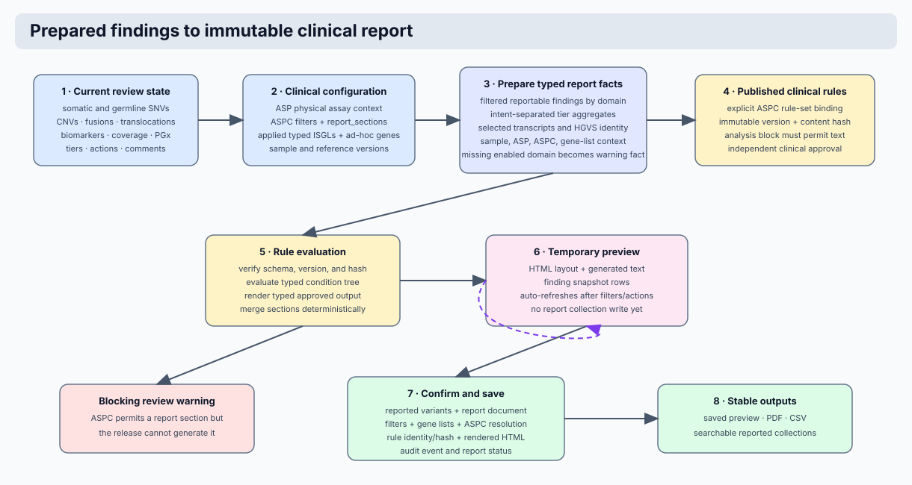

# Clinical Reporting Rules

## Purpose

Clinical reporting rules turn an already prepared reporting result into
approved narrative text. They do not filter findings, select transcripts,
assign tiers, or alter a finding. Those analytical decisions are completed
before the rules engine runs.

The evaluator receives the reportable SNVs and small indels, CNVs, fusions,
translocations, biomarkers, ASP, ASPC, and applied in-silico gene lists. It
uses the static YAML source for the assay and subpanel to decide which text is
included in the report.



!!! info
    The report text is clinical content. Changes to a rule file are reviewed
    and released with the application source. They are not edited in MongoDB
    and are not copied into ASPC documents.

## Scope Resolution

Rule sources live in the repository with one predictable layout:

```text
clinical_reporting_rules/
  <asp_id>/
    base.yaml
    <subpanel_id>.yaml
```

The source selection protocol is deterministic:

1. Read the effective ASP identifier from the report context.
2. Read the effective ASPC `subpanel_id`.
3. Load `clinical_reporting_rules/<asp_id>/<subpanel_id>.yaml` when it exists.
4. Otherwise load `clinical_reporting_rules/<asp_id>/base.yaml`.

`base.yaml` has two roles. It is the complete rule set for an ASP with no
subpanel, and it is the fallback rule set when a named subpanel has no
subpanel-specific clinical text. A subpanel-specific file is complete on its
own; it is not merged with `base.yaml`.

Rules are not environment-specific and do not use ASPC document versions.
The stable clinical identity is the ASP and subpanel scope. Development,
testing, validation, and production ASPCs may therefore use the same source
when their approved wording is identical.

The ASPC participates through its stable `asp_id` and `subpanel_id` fields.
Its generated `aspc_id` also contains the environment, so it is retained in
the report configuration snapshot but is not used as a YAML filename or rule
scope. This prevents identical clinical text from being duplicated solely for
different deployment environments.

## ASP, ASPC, And ISGL Inputs

The three configuration records have distinct responsibilities.

| Record | Information used for reporting | Purpose |
| --- | --- | --- |
| ASP | `asp_id`, analyte, assay name, accreditation, covered genes, germline genes | Identifies the clinical assay and provides assay-level wording context. |
| ASPC | `asp_id`, `subpanel_id`, `analysis_types`, `reporting.report_sections`, report header, method, description, and general summary | Selects the rule scope. `analysis_types` controls review availability; `report_sections` selects the subset that can contribute report text. |
| ISGL | Selected list type, display name, genes, and germline genes | Supplies the applied clinical gene scope in the introduction and report context. |

For a DNA introduction produced by `dna_report_intro`, the ASPC must provide
`reporting.general_report_summary`. A paired sample adds the control-material
sentence. The selected SNV ISGL adds its display name and gene count. Germline
genes shared by the applied scope and ASP add the germline statement. This
preserves the established report wording while deriving the current list and
gene count from the effective configuration.

## Analysis Gates

The YAML `analyses` mapping uses the same analysis identifiers as ASPC
`reporting.report_sections`. Every valid analysis is declared explicitly in a source
file, even when no wording is currently required.

### DNA analysis identifiers

| Identifier | Reporting domain |
| --- | --- |
| `SNV` | Small variants and small indels |
| `CNV` | Copy-number variants |
| `TRANSLOCATION` | Structural translocations |
| `BIOMARKER` | Biomarker results |
| `CNV_PROFILE` | Copy-number profile interpretation |
| `COVERAGE` | Coverage and quality context |
| `FUSION` | Fusion findings in DNA workflows |
| `TMB` | Tumour mutational burden |
| `PGX` | Pharmacogenomic findings |

### RNA analysis identifiers

| Identifier | Reporting domain |
| --- | --- |
| `FUSION` | Fusion findings |
| `EXPRESSION` | Expression result |
| `CLASSIFICATION` | RNA classification result |
| `QC` | RNA quality-control result |
| `PGX` | Pharmacogenomic findings |

Both the ASPC and YAML must allow an analysis before its YAML rules can render.

| ASPC `reporting.report_sections` | YAML `enabled` | Result |
| --- | --- | --- |
| Not selected | `true` | No text is rendered. |
| Not selected | `false` | No text is rendered. |
| Selected | `false` | No text is rendered; the source intentionally omits narrative wording for that domain. |
| Selected | `true` | The block rules are evaluated. |

If an ASPC selects an analysis that the selected YAML file does not declare,
report preparation stops with a validation error. This exposes an incomplete
clinical configuration rather than silently producing a partial report.

## YAML Structure

Each YAML file follows this exact schema.

```yaml
rule_set:
  analyte: dna
  asp_id: hema_gmsv1
  subpanel_id: base

document_rules:
  - rule_id: hema_GMSv1_accredited_conclusion
    family: summary_text
    section: Report conclusion
    priority: 200
    when:
      - fact: asp.accredited
        operator: eq
        value: true
    template: "För ytterligare information om utförd analys och beskrivning av somatiskt förvärvade mutationer, var god se bifogad rapport. "
    heading: false
    stop: true

analyses:
  SNV:
    enabled: true
    rules:
      - rule_id: hema_GMSv1_tiered_snv_summary
        family: result_text
        section: Kliniskt relevanta SNVs och små INDELs
        priority: 90
        when:
          - fact: aggregates.has_tiered_snvs
            operator: eq
            value: true
        template: "{{ aggregates.tier_summaries | tier_summary }}"
        heading: true
        stop: false
  CNV: { enabled: false }
  TRANSLOCATION: { enabled: false }
  BIOMARKER: { enabled: false }
  CNV_PROFILE: { enabled: false }
  COVERAGE: { enabled: false }
  FUSION: { enabled: false }
  TMB: { enabled: false }
  PGX: { enabled: false }
```

### Source fields

| Field | Required | Allowed values / format | Meaning |
| --- | --- | --- | --- |
| `rule_set.analyte` | Yes | `dna`, `rna` | Must match the sample/ASPC analyte. |
| `rule_set.asp_id` | Yes | Existing ASP identifier | Must match the source directory name. |
| `rule_set.subpanel_id` | Yes | `base` or existing subpanel identifier | Must match the YAML file name. |
| `document_rules` | Yes | List, possibly empty | Rules for report-level text such as introduction and conclusion. |
| `analyses` | Yes | Mapping of valid analysis identifiers | One explicit wording decision for every analysis domain. |
| `analyses.<name>.enabled` | Yes | `true` or `false` | Enables YAML wording for that analysis after ASPC permits it. |
| `analyses.<name>.rules` | Conditional | List of rules | Required only when executable wording is needed. Disabled blocks cannot contain rules. |

### Rule fields

| Field | Required | Allowed values / format | Meaning |
| --- | --- | --- | --- |
| `rule_id` | Yes | Unique stable identifier | Identifies the rendered rule in the report trace. |
| `family` | Yes | `finding_text`, `result_text`, `summary_text` | Evaluation phase. Finding rules run for each finding; the other families run once per report. |
| `section` | Yes | Report section label | Destination section for rendered text. |
| `priority` | Yes | Integer from `1` to `100000` | Evaluation order within a family. Lower values run first. |
| `when` | Yes | List of conditions; empty list allowed | All conditions must be true. |
| `template` | Yes | Restricted Jinja template | Approved text and fact interpolation. |
| `heading` | No | `true` by default | Whether the rendered section receives a Markdown heading. |
| `stop` | No | `true` by default | Stops further rules in the same family for the current report or finding after a match. |

### Conditions

Conditions are AND-combined. Each condition has the following form:

```yaml
- fact: finding.gene
  operator: eq
  value: TP53
```

| Key | Meaning |
| --- | --- |
| `fact` | Registered path in the prepared report context. Use only the exact paths in the following table. |
| `operator` | `eq`, `ne`, `in`, `not_in`, `contains`, `overlaps`, `exists`, `gt`, `gte`, `lt`, or `lte`. |
| `value` | Comparison value. `in`, `not_in`, and `overlaps` require a list; `exists` requires `true` or `false`. |

The template context is intentionally restricted to `sample`, `asp`, `aspc`,
`applied_gene_lists`, `finding`, `biomarkers`, and `aggregates`. The generic
Python formatter provides shared clinical grammar such as tier-summary
sentence construction. Assay-specific wording remains in YAML.

### Allowed `when.fact` paths

| Context | Allowed paths |
| --- | --- |
| Sample | `sample.name`, `sample.asp_id`, `sample.subpanel_id`, `sample.environment`, `sample.omics_layer`, `sample.paired`, `sample.genome_build`, `sample.analysis_intent` |
| ASP | `asp.asp_id`, `asp.asp_group`, `asp.asp_category`, `asp.accredited`, `asp.germline_genes` |
| ASPC | `aspc.aspc_id`, `aspc.asp_id`, `aspc.asp_group`, `aspc.asp_category`, `aspc.subpanel_id`, `aspc.environment`, `aspc.reporting.report_sections`, `aspc.reporting.general_report_summary` |
| Applied lists | `applied_gene_lists` |
| Finding | `finding.kind`, `finding.gene`, `finding.genes`, `finding.tier`, `finding.exon`, `finding.intron`, `finding.case_vaf`, `finding.case_vaf_percent`, `finding.control_vaf`, `finding.control_vaf_percent`, `finding.consequence`, `finding.hgvsc`, `finding.hgvsp`, `finding.variant_type`, `finding.cnv_effect`, `finding.fusion_gene_1`, `finding.fusion_gene_2` |
| Biomarkers | `biomarkers` |
| Aggregates | `aggregates.finding_count`, `aggregates.snv_count`, `aggregates.cnv_count`, `aggregates.fusion_count`, `aggregates.translocation_count`, `aggregates.biomarker_count`, `aggregates.tier_1_count`, `aggregates.tier_2_count`, `aggregates.tier_3_count`, `aggregates.tier_summaries`, `aggregates.has_tiered_snvs`, `aggregates.has_reportable_findings` |

## Template Authoring Reference

`template` is evaluated in a sandboxed Jinja environment with strict missing
value handling. A template can only use the root objects and filters listed in
this section. It cannot import Python modules, query MongoDB, call web
services, access the filesystem, or use arbitrary Jinja globals.

!!! warning
    A value that is not present in the prepared context produces a rendering
    error. Do not use informal worksheet labels or raw database keys in a
    template. Add a typed prepared fact, registry entry, and test first when a
    new clinical datum is required.

### Available template roots

| Root | Available fields | Typical use |
| --- | --- | --- |
| `sample` | `name`, `asp_id`, `subpanel_id`, `environment`, `omics_layer`, `paired`, `genome_build`, `analysis_intent` | Sample-level wording and paired-control context. `analysis_intent` is `somatic` or `germline`. |
| `asp` | `asp_id`, `asp_group`, `asp_category`, `accredited`, `germline_genes` | Assay identity, accreditation, and germline scope. |
| `aspc` | `aspc_id`, `asp_id`, `asp_group`, `asp_category`, `subpanel_id`, `environment`, `reporting` | Effective assay-configuration wording context. |
| `aspc.reporting` | `report_sections`, `general_report_summary` | Selected report domains and the approved DNA introduction baseline. |
| `applied_gene_lists` | List entries with `isgl_id`, `version`, `list_type`, `selected_for`, `genes`, `germline_genes`, `adhoc` | Exact ISGL scope applied to this report. |
| `finding` | `kind`, `gene`, `genes`, `tier`, `exon`, `intron`, `case_vaf`, `case_vaf_percent`, `control_vaf`, `control_vaf_percent`, `consequence`, `hgvsc`, `hgvsp`, `variant_type`, `cnv_effect`, `fusion_gene_1`, `fusion_gene_2`, `fusion_breakpoint_1`, `fusion_breakpoint_2`, `fusion_effect`, `fusion_spanning_pairs`, `fusion_spanning_reads`, `fusion_annotation` | One finding; populated only for `finding_text` rules. Fusion fields come from the selected caller record and latest visible reviewed annotation. |
| `findings` | List of the same prepared finding objects described above | The complete reportable finding set supplied to a report-wide rule. The RNA fusion summary helper consumes this list; it never reloads or broadens the set. |
| `biomarkers` | List of prepared biomarker result mappings | Biomarker text where a typed result is already prepared. Use only fields confirmed by a corresponding test. |
| `aggregates` | `finding_count`, `snv_count`, `cnv_count`, `fusion_count`, `translocation_count`, `biomarker_count`, `tier_1_count`, `tier_2_count`, `tier_3_count`, `tier_summaries`, `has_tiered_snvs`, `has_reportable_findings` | Report-wide counts, positive/negative states, and tier summary text. |

The `when.fact` field is stricter than template access. It accepts only the
registered paths documented in the **Conditions** table above and validated by
the application. `biomarkers` can be rendered as a prepared value, but no
individual nested biomarker path is currently registered for a `when`
condition.

### Available filters and helpers

| Syntax | Purpose | Example |
| --- | --- | --- |
| <code>{{ value &#124; default('not available') }}</code> | Provides a fallback for an undefined or empty value. | <code>{{ finding.hgvsp &#124; default('-') }}</code> |
| <code>{{ values &#124; join(', ') }}</code> | Joins a list into text. | <code>{{ finding.consequence &#124; join(', ') }}</code> |
| <code>{{ values &#124; length }}</code> | Returns a collection length. | <code>{{ applied_gene_lists &#124; length }}</code> |
| <code>{{ value &#124; lower }}</code> | Lowercases text. | <code>{{ sample.environment &#124; lower }}</code> |
| <code>{{ value &#124; upper }}</code> | Uppercases text. | <code>{{ finding.gene &#124; upper }}</code> |
| <code>{{ value &#124; round(1) }}</code> | Rounds a numeric value. | <code>{{ finding.case_vaf_percent &#124; round(1) }}</code> |
| <code>{{ aspc.reporting.general_report_summary &#124; dna_report_intro(sample, asp, applied_gene_lists) }}</code> | Builds the standard DNA introduction from the configured baseline, paired status, applied SNV ISGLs, and germline scope. | Used in DNA <code>document_rules</code>. |
| <code>{{ aggregates.tier_summaries &#124; tier_summary }}</code> | Builds the standard Swedish tiered mutation summary from prepared tier groups. | Used for positive SNV result text. |
| <code>{{ findings &#124; fusion_summary }}</code> | Builds the reviewed RNA fusion finding paragraphs from Tier I-III fusion facts, selected breakpoints, read support, and the latest visible global annotation. | Used between the assay-specific RNA introduction and closing text. |

`dna_report_intro`, `tier_summary`, and `fusion_summary` are the only
domain-specific helpers.
Their grammar is shared Python behavior because it is common across rule
sources; the decision to include them and every assay-specific sentence remain
in YAML. They accept no optional phrase dictionaries or other author-defined
arguments.

`tier_summary` applies one shared Swedish clinical grammar from the reporting
domain. The YAML rule decides whether and where the summary is emitted; Python
supplies only the invariant sentence construction and tier labels used by every
assay. The annotation-suggestion service imports the same labels, so report
summaries and suggested annotation wording cannot drift into independent
vocabularies. English tier labels in the React interface are presentation
metadata and do not replace the Swedish report wording.

### Working examples

**Report-wide introduction**

```yaml
template: "{{ aspc.reporting.general_report_summary | dna_report_intro(sample, asp, applied_gene_lists) }}"
```

The baseline text comes from `ASPC.reporting.general_report_summary`. The
helper appends the established paired-control sentence, selected SNV gene-list
name and gene scope, and the germline note where applicable.

**Positive tiered small-variant result**

```yaml
template: "{{ aggregates.tier_summaries | tier_summary }}"
```

The helper consumes only the prepared `aggregates.tier_summaries` structure and
renders the approved Swedish mutation wording for Tiers I, II, and III. It does
not query variants and it does not choose which variants are tiered.

**Reviewed RNA fusion result**

```yaml
template: |-
  RNA har extraherats ...{{ findings | fusion_summary }}För ytterligare information ...
```

The introduction and closing sentences remain authored verbatim in the
assay/subpanel YAML. `fusion_summary` inserts one report paragraph for each
reportable Tier I-III fusion. It uses the two genes, selected caller
breakpoints, spanning-pair and spanning-read support, and the latest visible
reviewed global annotation. Findings marked false positive, irrelevant, or
blacklisted, and Tier IV or unclassified findings, are removed by report
preparation before the helper receives them. The helper does not query MongoDB,
select a caller, change classification, or invent missing values.

The helper owns the paragraph boundaries around its generated content. When no
fusion is reportable, it emits one blank-line separator between the approved
introduction and closing text. Rule authors must therefore place the helper
directly between those sentences, as shown above, without adding blank lines
around the expression.

**Germline-only wording**

```yaml
when:
  - fact: sample.analysis_intent
    operator: eq
    value: germline
template: "Germline-specific approved text goes here."
```

Germline report preparation never falls through to a somatic rule. Every
germline sentence must include the explicit intent predicate shown above. If
the ASPC enables germline SNV review and the selected static rule source has
no matching germline text, Coyote3 emits a visible report-preview warning so
the configuration gap is reviewed before sign-out.

**Specific finding statement**

```yaml
when:
  - fact: finding.gene
    operator: eq
    value: TP53
template: "Varianter i {{ finding.gene }} är klassificerande samt riskstratifierande vid endometriecancer (WHO 5th ed./NVP 2026)."
```

The condition determines applicability; the template interpolates the same
prepared finding fact. For a `finding_text` rule, evaluation repeats once per
prepared finding. For `result_text` and `summary_text`, `finding` is empty and
must not be used.

### Adding a new template capability

Adding a new root, field, filter, or helper is an application change, not a
YAML-only change. The implementation protocol is:

1. Define the typed field in `PreparedReportContext` or one of its nested
   fact models.
2. Populate it during report preparation from a defined source collection or
   report result.
3. Add the permitted condition path to the fact registry when it must be used
   in `when`.
4. Add a narrow, deterministic sandbox filter only when a reusable formatter
   is necessary; do not place assay-specific prose in the formatter.
5. Add positive, negative, and missing-value tests before adding the YAML
   rule that consumes the capability.

This keeps the YAML vocabulary predictable and prevents a new report sentence
from depending on hidden runtime queries or untyped data.

## Priority Protocol

Priority is not a clinical severity value. It resolves rule precedence when
more than one rule in the same family could match the same report or finding.
Each `(family, priority)` pair must be unique within a YAML file.

Use these ranges consistently:

| Range | Intended use | Example |
| --- | --- | --- |
| `10-49` | Highly specific finding or molecular-state rule | A gene plus codon/exon or biomarker-state statement. |
| `50-79` | Gene-, subpanel-, or clinically grouped rule | A gene-specific report sentence. |
| `80-99` | Generic positive result rule | The tiered SNV summary. |
| `100-149` | Generic negative result or default conclusion | No reportable mutation found. |
| `200-249` | Alternative conclusion | Accredited versus non-accredited conclusion. |

Authors select the lowest unused value in the appropriate range for the same
family. A more specific rule must have a lower number than its generic
fallback. Use `stop: true` when the first match is the only allowed wording;
use `stop: false` only when multiple sentences are intended to accumulate.

Example: a TP53-specific `finding_text` rule at priority `20` runs before a
general `finding_text` rule at priority `70`. A `result_text` rule may also use
priority `20`, because it belongs to another family.

## Authoring And Review Protocol

1. Confirm the ASP identifier and subpanel identifier from the active ASP and
   ASPC. Do not invent human worksheet labels as database fields.
2. Decide whether `base.yaml` is sufficient. Create a subpanel file only when
   the wording differs from the ASP baseline.
3. Confirm the ASPC's enabled and reportable analysis domains. Declare each
   corresponding analysis block in YAML.
4. Add text to `document_rules` for report-wide wording, or to the appropriate
   analysis block for analysis-specific wording.
5. Use only registered prepared facts and the priority protocol above.
6. Preserve approved wording exactly unless the clinical owner has approved a
   content change.
7. Add or update exact-output tests for positive, negative, precedence, and
   missing-data cases.
8. Run compilation and tests before review. The file path, scope metadata,
   facts, template roots, analysis identifiers, rule identifiers, and priority
   uniqueness are validated automatically.

## Report Provenance And Historical Review

When a report is saved, its collection document records the rendered report,
the ASPC snapshot, filter snapshot, static rule-set identity, source path,
canonical content hash, and matched rule IDs. Historical reports therefore
remain explainable after a later application release changes a YAML file.

The YAML file is not stored in MongoDB. The report snapshot captures the
clinical result that was issued, while application source control remains the
authoritative history of clinical wording.

## Validation Commands

```bash
.venv/bin/pytest tests/unit/reporting/test_clinical_rules.py -q
.venv/bin/python -c "from api.application.reporting.clinical_rules.compiler import ClinicalRuleCompiler; from api.config.paths import CLINICAL_REPORTING_RULES_DIR; [ClinicalRuleCompiler().load(path) for path in ClinicalRuleCompiler().discover(CLINICAL_REPORTING_RULES_DIR)]"
```

These checks compile every static source and validate the exact-report
regressions that protect established clinical wording.
