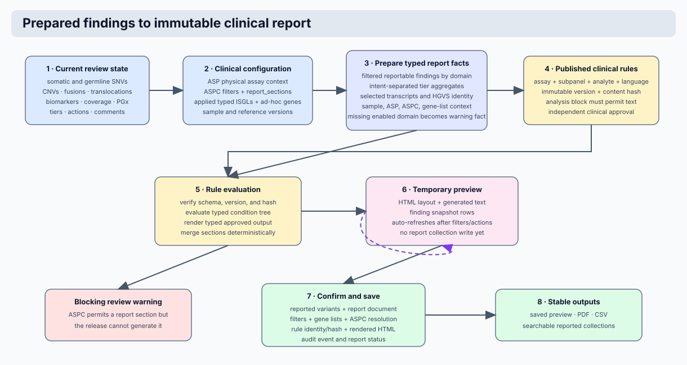

# Clinical Reporting Rules

## Purpose

Clinical reporting rules convert a prepared clinical result into governed report
wording. They do not select transcripts, filter findings, assign tiers, or modify
findings. Those decisions are complete before rule evaluation begins.

The authoritative rule source is the `clinical_rule_sets` collection in the primary
application database. Report generation selects the active published rules by sample
assay, subpanel, analyte and ASPC `reporting.language`. Runtime report generation
does not load rule files or evaluate arbitrary templates.



> **Important: classification annotations are separate**
>
> Rule sets produce report narrative only. The optional automatic text used during
> bulk Tier III classification remains finding annotation behavior and is not read
> from an ASPC or clinical rule set.

## Report metadata outputs

Sections have one of three destinations. In the visual builder, choose **Output
destination** before adding conditions and output text.

| Destination | Section key | Report behavior |
| --- | --- | --- |
| Report summary | Author-defined name | Narrative, with optional section heading. |
| Header suffix | `report_header_suffix` | Appended verbatim to the ASPC report header. Include any leading space or punctuation in the rule text. |
| Clinical question | `clinical_question` | Populates the clinical-question row in DNA and RNA reports. |

Metadata blocks evaluate **once per report**, use **Whole report** rather than an
analysis, and have no section heading. Their conditions and text use the same fact
catalog, operators, output nodes, review process and revision history as narrative
rules. The builder initially selects **At most one** match for these destinations.
Each destination may produce zero or one nonblank output across the entire rule
set. More than one output fails evaluation, including testing, rather than choosing
an arbitrary result. With no matching output the suffix is empty or the question
row is omitted. Neither output is repeated in the narrative.

Metadata text is HTML-escaped; it is not an HTML template. Rule traces retain the
selected rule and text. Saved report artifacts retain their original wording.
Metadata destinations are part of the current rule schema, as are conflict groups.
There is no separate reporting-engine version counter.

Finding eligibility is configured in the ASPC, not in these output rules. See
[annotation scope and report eligibility](reporting_workflow_and_variant_snapshots.md#annotation-scope-and-report-eligibility).

### Deploying report policy configuration

`scripts/migrate_reporting_policy.py` reads the configured application database.
Supply `COYOTE3_MONGO_URI` and `COYOTE3_DB` through the deployment environment; it
does not load a private environment file implicitly or print credentials.

```bash
# Read-only plan. Use an operator identity for the resulting revisions.
.venv/bin/python scripts/migrate_reporting_policy.py --actor "$USER"

# Explicitly create ASPC revisions and rule drafts in a MongoDB transaction.
.venv/bin/python scripts/migrate_reporting_policy.py --actor "$USER" --apply
```

The migration creates new versions of active ASPCs missing a tier policy. SNVs
retain tiers 1 and 2 for the former `gmsonco` policy, otherwise 1 through 3; RNA
fusions retain tiers 1 through 3. Explicit policies, including empty selections,
are not overwritten. Superseded ASPCs remain as inactive history.

For each applicable published rule set, the script creates a draft with the
existing content and ordinary metadata blocks reproducing the former question and
header decisions. It uses canonical `sample.paired` and `sample.subpanel_id` facts.
Solid Base has no named clinical question. Existing embedded test assertions are
retained and extended with metadata expectations. Drafts receive immutable revision
snapshots; published source documents are unchanged.

An existing open draft/review version is counted as `open_rule_drafts` and is not
overwritten. Resolve those versions in the builder, adding the required metadata
blocks there or closing the draft before rerunning the script. Reruns do not
duplicate open migration drafts. The script does not approve or publish content.

Before enabling report generation after deployment, review tier selections, test
each draft with paired/unpaired and Base/named-subpanel cases where applicable,
then obtain independent approval and publish. Keep report generation paused during
this rollout: the renderer has no hardcoded text fallback, and unconverted releases
produce no metadata text. Scope identities do not need to change.
Annotations, samples and saved reports are not modified by the migration.

## Rule-Set Identity And Selection

The stable identity is:

```text
<asp_id>__<subpanel_id>__<language>
```

For example, `hema_gmsv1__base__sv` identifies Swedish reporting rules for the base
subpanel of `hema_gmsv1`. Environment and ASPC version are not part of the identity.
Production, validation, and development ASPCs resolve the same published scope within
their application database. There is no cross-database or cross-assay lookup.

An active ASPC with reporting enabled is valid only when all of the following are true:

- Its scope resolves an active published rule set for `reporting.language` (default `sv`).
- The rule-set analyte matches the ASPC category.
- Every entry in `reporting.report_sections` has an explicit analysis declaration.
- A declaration is either `enabled`, meaning rule blocks may produce wording, or
  `none`, meaning no narrative is intentionally produced for that analysis.

Selection follows this order for the same assay, analyte and language:

| Priority | Scope | Result |
| --- | --- | --- |
| 1 | Exact sample subpanel | Use its sole active published release |
| 2 | Assay `base` | Use Base only when no exact active published release exists |
| 3 | Neither | Stop report generation with a configuration error |

Missing subpanel means `base`. Other named subpanels, languages, analytes and assays
are never substituted. Ambiguous matches fail; an invalid exact release does not
trigger Base fallback. Content hashes, engine support and analysis declarations
are checked before rendering. A partial unique index enforces one active published
release per exact scope. Draft, review and approved-but-unpublished versions are
not eligible.

ASPC readiness and assay setup review use the same content-hash and minimum-engine
checks as report generation. An unusable release blocks readiness rather than
being accepted for configuration and rejected only when a report is opened.

In **Admin > Assay Configurations**, select **Reporting Language**, not a ruleset.
Publishing a subpanel release makes it apply to subsequent report generation
without editing ASPCs. Publishing Base affects scopes without a published exact
release. Retiring an exact release returns those scopes to Base if available;
retiring Base can block scopes that depend on it. Review these effects before
publication or retirement.

The preview identifies the resolved rule identity, content version, language and
Base selection. Saved reports retain the selected identity, hash, version, requested
and resolved subpanel, matched rules and rendered text. They are not re-evaluated
when a release changes. A fresh report generation can use a different release from
an earlier preview; review the current preview before saving.

### Deploying Scope-Based Selection

Pause application/configuration writers, back up the application database, and run
the migration before starting the updated application. Export its
`COYOTE3_MONGO_URI` and `COYOTE3_DB` without placing credentials on the command line:

```bash
.venv/bin/python scripts/migrate_reporting_rule_resolution.py
.venv/bin/python scripts/migrate_reporting_rule_resolution.py --apply
```

The first command is read-only. The second replaces obsolete
`reporting.clinical_rule_set_id` fields with languages derived from their referenced
rules, across ASPC revisions and editable assay setup drafts, then installs the scope
uniqueness index. Unknown references, conflicting languages and duplicate published
scopes stop preflight. Return pending assay setups to draft first. Configuration
updates use a transaction and optimistic checks; index creation follows the commit,
so keep writers stopped until the command completes successfully.
Center overrides of `required_aspc_fields` must replace `clinical_rule_set_id` with
`language`; the application template already uses the current key.

Samples and saved reports are never rewritten. Embedded test facts no longer accept
`clinical_rule_set_id`. The migration removes that field from rule documents and
revision snapshots, derives the reporting language, and rebuilds affected content
hashes and revision chains together. It verifies the original revision checksums
and chains first and refuses to rewrite history referenced by saved reports.
Checksum failures require investigation; rerunning is not a way to repair them.

Preflight also checks active ASPCs with report sections against the selected
published release, its content hash and declared analyses. It reports configurations
whose selected rule identity changes. Review those changes before applying:
an exact subpanel release takes precedence even when the old binding selected Base.
The command is idempotent after a successful migration.

### Repairing Draft Revision Checksums

`scripts/repair_clinical_rule_revision_hashes.py` repairs one specific serialization
failure: a draft update hashed `content_hash: null` before omitting that null field
from its stored snapshot. The repair reconstructs that exact input and requires
its digest to match the original. Unknown checksum failures, broken chains and
references from saved reports stop the operation without writes.

With `COYOTE3_MONGO_URI` and `COYOTE3_DB` set explicitly, first run:

```bash
.venv/bin/python scripts/repair_clinical_rule_revision_hashes.py
```

Before applying, stop rule writers and back up the application database. Supply a
new file in a protected backup directory:

```bash
.venv/bin/python scripts/repair_clinical_rule_revision_hashes.py \
  --apply --backup-file /secure-backups/clinical-rule-revisions.bson
```

The command writes original affected revisions to an exclusive BSON file with
owner-only permissions before replacing snapshots transactionally. It rebuilds
downstream links without changing rule text or lifecycle metadata. Keep the backup
outside Git and public storage. Rerun the dry run to confirm zero replacements,
then run the scope-selection migration above and restart writers with the corrected
application code. The runtime verifier does not accept the faulty serialization.

## Document Model

Each collection document is one independently versioned draft or immutable release.

| Area | Purpose |
| --- | --- |
| `rule_set_id`, `scope` | Stable ASP, subpanel, analyte, and language identity. |
| `content_version` | Monotonic clinical content version within the stable identity. |
| `revision` | Optimistic-lock revision incremented by edits and lifecycle changes. |
| `status`, `active` | Workflow state; only one published version can be active. |
| `analysis_declarations` | Explicit narrative decision for each report analysis. |
| `blocks` | Ordered report sections, evaluation scope, match policy, and rules. |
| `terminology` | Approved phrase sets consumed by named deterministic renderers. |
| `test_cases` | Prepared facts and exact expected rules/text evaluated before release. |
| `review`, `lifecycle` | Assignment, submission, review, publication, retirement, actors, and reasons. |
| `provenance` | UI/template/API/import origin and immutable source-version reference for copied content. |
| `content_hash` | SHA-256 hash of immutable clinical content recorded at publication. |

MongoDB enforces unique `(rule_set_id, content_version)` values and at most one active
published version for each `rule_set_id`. Publication deactivates the previous release
in one transaction. Released documents are never edited in place; create a new draft
revision from the release.

### Rule-set identity, content version, and revision

These values identify different layers of the rule-set history and must not be used
interchangeably.

| Value | Scope | Changes when | Clinical meaning |
| --- | --- | --- | --- |
| `rule_set_id` | One assay, subpanel, and language combination | Never for that scope | Stable identity, for example `hema_gmsv1__base__sv`. |
| `content_version` | One independently governed clinical content candidate or release | A new draft is created for the same `rule_set_id` | Clinical release sequence. This is the version shown as `v1`, `v2`, and so forth. |
| `revision` | One MongoDB document for one content version | The draft is saved or the document changes workflow state | Technical concurrency and mutation counter, not a clinical release number. |
| `schema_version` | The rule-document contract | The application adopts a new incompatible document format | Technical format version, not authored content history. |

A newly created scope starts with content version `1`, revision `1`. Creating a draft from
a published or rejected version allocates the next content version for the same stable
identity and resets revision to `1`. The content version remains unchanged as that document
moves through submission, clinical review, approval, publication, and retirement.

Draft auto-save sends the revision currently displayed by the editor. MongoDB updates the
draft only if that revision is still current and increments it atomically. If another editor
has already saved, the update matches no document and the API returns a conflict instead of
overwriting the newer draft. Workflow transitions also increment revision. Consequently,
revision numbers can rise frequently and can contain both content saves and status changes.
They must not appear in a report as the identity of the approved clinical content.

For example:

```text
hema_gmsv1__base__sv · content version 2 · revision 7 · draft
```

This identifies the seventh persisted state of the version 2 document. After independent
review and publication, it remains content version 2 even though publication increments its
revision. A later clinical wording change starts a separate version 3 document at revision 1.
Content-version gaps are valid because a rejected or otherwise unused draft still consumed its
version number; identifiers are never reused.

### Immutable revision history

The application preserves the following history:

| History | Preserved | Stored information |
| --- | --- | --- |
| Published, rejected, and retired content versions | Yes | The complete rule-set document remains in `clinical_rule_sets`; a later publication does not replace or delete it. |
| Current draft state | Yes | The latest complete draft document and its current revision in `clinical_rule_sets`. |
| Workflow history within a version | Yes | Append-only lifecycle entries record transition, actor, time, and reason. |
| Central rule-operation audit | Yes, when audit persistence succeeds | A non-expiring `traceability` event records action, actor, rule-set identity, content version, revision, and status. It contains metadata, not the full rule content. |
| Exact content of every persisted revision | Yes | `clinical_rule_revisions` stores the complete canonical rule-set document after creation, each draft save, every workflow transition, publication-driven deactivation, publication, and retirement. |
| Sample-backed test executions | **No** | Testing is deliberately non-persisting and currently creates no clinical test-result record. |

Each immutable snapshot contains the rule-set ObjectId, stable identity, content version,
revision, action, actor, timestamp, reason, complete document, SHA-256 revision hash, and the
previous revision hash. The unique `(rule_set_oid, revision)` index prevents duplicate revision
numbers. The previous hash forms a per-version chain, making missing, reordered, or changed
snapshots detectable during an integrity review.

The current document update and its revision snapshot are committed in the same MongoDB
transaction. If either write fails, neither state is committed. Publishing also snapshots the
automatic deactivation of the previously active release. Clinical-rule writes therefore require
a MongoDB deployment that supports transactions: a replica set or sharded cluster. A standalone
`mongod` is not supported for draft creation, editing, deletion, review transitions, or
publication. A one-member replica set is a supported local or single-host deployment: it enables
the required transaction semantics, but it does not provide failover. See the
[MongoDB deployment guide](../operations/mongodb_deployment_and_recovery.md) for the supported
single-member setup and URI requirements.

> **Important: preserve both stores**
>
> `clinical_rule_revisions` is the authoritative full-content revision archive. Lifecycle entries
> describe state changes inside a version, while `audit_events` supports cross-application event
> review and remains metadata-only. Back up `clinical_rule_sets`, `clinical_rule_revisions`,
> `reports`, `reported_variants`, and traceability audit events together. Application immutability
> does not prevent a privileged database administrator from changing MongoDB directly.

Issued-report traceability has a stronger boundary. A saved report retains the rendered text,
rule-set object identifier, stable identity, content version, schema version, content hash,
effective date, and matched rule identifiers. The corresponding published rule-set document
is retained after replacement or retirement. These values identify and integrity-check the
approved rule content used for the report.

In the admin authoring workspace, **Revision history** opens the preserved revisions for the
selected content version. An operator can select any revision and inspect its status, actor,
time, reason, hash chain, sections, rendered output composition, conditions, and exact rule
definition. History is read-only; restoring old content requires creating or editing a draft
through normal governance.

## Blocks And Rules

### Version fields and development data

`schema_version` identifies the document format; the current contract accepts `1`.
`content_version` identifies an authored release for an assay/subpanel/language scope.
`revision` identifies successive edits and workflow changes within that release.
The Coyote3 application version identifies the software deployment. There is no
separate engine-version setting to configure or increment for individual features.

Development definitions created before this cleanup may contain the removed
`minimum_engine_version` field. Strict import validation rejects that field; remove it
from exported authoring JSON before importing. For a database containing such records,
do not simply unset the field: it contributes to content and revision hashes.

Before starting the updated application, stop application writers, back up the
development database, and run the dedicated migration using an explicitly configured
`COYOTE3_MONGO_URI` and `COYOTE3_DB`:

```bash
.venv/bin/python scripts/remove_clinical_engine_version.py
.venv/bin/python scripts/remove_clinical_engine_version.py --apply
```

The first command only plans changes. The second atomically removes the obsolete field
and rebuilds affected content hashes and revision chains after checking their original
integrity. It preserves rule identities, content versions, revisions and workflow state.
The migration refuses to change any database containing saved reports; it is only for
unreleased development data, not a way to rewrite issued-report provenance. Revalidate
development rules and restart any pending review that relied on the previous hashes.

A block controls where and how a group of rules is evaluated.

| Field | Meaning |
| --- | --- |
| `section` | Destination report section. |
| `section_order`, `block_order` | Stable report ordering; lower values render first. |
| `analysis` | Optional report analysis gate such as `SNV`, `CNV`, or `FUSION`. |
| `evaluation.mode` | `once`, `each_finding`, or `each_item`. |
| `evaluation.collection` | Required for `each_item`; selects a prepared collection. |
| `show_heading` | Whether the flattened Markdown contains a section heading. |
| `match_strategy` | `all_matches`, `first_match`, `exactly_one`, or `at_most_one`. |
| `conflict_group` | Optional shared identifier preventing competing conditions across blocks for the same evaluated candidate. |

Rules within a block have a stable `rule_id`, display name, order, optional condition,
typed output sequence, rationale, and references. Rules with no condition always match.
`first_match` provides ordered fallback behavior. `exactly_one` and `at_most_one` make
ambiguous rule sets fail visibly instead of silently combining unintended wording.

### Choosing match behavior

| UI choice | Result for one evaluated candidate |
| --- | --- |
| At most one | Zero or one true condition is allowed. Two true conditions reject evaluation, even if one renders blank text. |
| Exactly one | Exactly one condition must be true, and its output must be nonblank. Zero or multiple matches reject evaluation. |
| All matches | Append every nonblank matching output in rule order. Use only for independent, additive statements. |
| First match | Use the first true condition that produces nonblank text, in rule order. Later rules are not evaluated or included in the trace. |

New sections created in the builder and the API starter block default to **At most one**. Existing rules keep
their configured behavior. A block's rule order is explicit and cannot contain
duplicate order values. Matching is sequential, not a contest between worker completion
times. First-match output is deterministic for the same facts, rule content and engine,
but it can hide overlapping conditions; deterministic does not mean clinically correct.

Strict cardinality counts conditions, not rendered outputs. Older definitions that
relied on blank output to avoid a conflict must be corrected and reviewed. No published
document is rewritten automatically. Previously saved report text is not regenerated
by this change.

### Cross-section conflict groups

In a draft, select a section and enter **Conflict group (optional)**, for example
`molecular_classification`. Enter that same identifier on alternative sections.
Identifiers start with a lowercase letter and contain lowercase letters, digits,
underscores or hyphens, up to 64 characters. The builder switches non-strict match
behavior to **At most one**. Conflict groups use the same current schema as other
reporting features, including definitions imported as JSON.

All blocks in a group must use **Exactly one** or **At most one**, and the same
evaluation mode and collection. Validation rejects incompatible definitions; runtime
checks also reject mixed scopes or non-strict strategies. A second true condition in
the group rejects evaluation with the group and both rule identifiers. Blank output
does not suppress the conflict. Blocks excluded by the enabled report analyses do not
participate.

Use **At most one** on alternative blocks: selecting **Exactly one** on each of two
alternative blocks requires both to match locally, but their shared conflict group
forbids that combination. To require exactly one conclusion from several alternatives,
place them in a single **Exactly one** block instead.

For **Once per report**, a group permits at most one true condition across its blocks
for the report. For **For each finding**, the restriction applies separately to each
prepared finding; different findings may select different conclusions. For **For each
collection item**, it applies separately to each item of the selected collection.
Groups do not span rule sets, and do not compare different findings or collections.

### Building and testing conditions in the UI

1. Open **Administration > Clinical Report Rules** and create or open a draft for the
   intended assay, subpanel and language. Check those scope values before authoring.
2. Add a section, select its analysis and evaluation mode, then choose match behavior.
   Use **For each finding** for finding-level predicates; use **Once per report** for
   report-level conclusions and collection queries.
3. Add rules with meaningful names and stable identifiers. Under **When this text
   applies**, use **Match all** for AND and **Match any** for OR. Nest a group when
   combining them; visual indentation determines which conditions belong together.
4. Select facts from the registered catalog and use the offered operators and typed
   values. Do not use report-rule conditions to compensate for incorrect upstream
   filtering or an incorrectly selected assay configuration.
5. Compose the output, record the clinical rationale and references, and inspect the
   preview. Use conflict groups only for explicitly competing conclusions.
6. Validate the draft. Resolve errors and review overlap warnings. Use the clinical
   rule testing workspace with authorized samples and inspect the condition trace,
   not only the final paragraph. Preserve repeatable cases as embedded test cases
   through the supported rule definition/import format.
7. Test boundary, missing-data, negative and overlapping cases before submitting for
   independent review. Publication does not prove that all possible facts were tested.

### Worked condition patterns

The following are synthetic authoring examples, not approved clinical interpretation
criteria. A center must approve its thresholds and report wording.

**Disjoint numeric ranges.** Suppose alternative statements distinguish Case VAF of
5% to below 10%, and 10% or above. In one **Exactly one** block use separate rules:

| Rule | Conditions combined with Match all | Example output |
| --- | --- | --- |
| `vaf_below_5` | Case VAF less than `5` | Observed case VAF is below 5%. |
| `vaf_5_to_10` | Case VAF greater than or equal to `5`; less than `10` | Observed case VAF is 5% to below 10%. |
| `vaf_at_least_10` | Case VAF greater than or equal to `10` | Observed case VAF is at least 10%. |
| `vaf_unknown` | Case VAF is unknown | Case VAF is unavailable. |

The rule fact `finding.case_vaf_percent` uses percentage points: `5` means 5%, not
`0.05`. Test `4.99`, `5`, `9.99`, `10`, `10.01` and null. `between` includes both
endpoints, so ranges `[5, 10]` and `[10, 20]` overlap at 10. An unknown rule handles
a present null value; a missing path is a separate case described below.

**AND containing OR.** To select an SNV in either TP53 or KRAS, use an outer
**Match all** with Finding type equal to `snv` and a nested **Match any** containing
Gene equal to `TP53` and Gene equal to `KRAS`. Putting all three predicates under
**Match any** would also select every SNV in other genes. Putting both gene
equalities under **Match all** would never match a scalar gene value.

**List membership.** Exon is a list-valued fact. To match any exon from 9 through
14, use **overlaps** with the string values `9, 10, 11, 12, 13, 14`. It is not a
numeric interval comparison. For a single gene use the scalar Gene fact; for a
multi-gene finding use Genes with **contains** or **overlaps**. Verify that the
prepared facts have the expected representation in the testing workspace.

**Same finding versus two different findings.** A whole-report rule that asks for
any TP53 finding and any tier-1 finding can match TP53 at tier 2 plus KRAS at tier 1.
To require TP53 itself to be tier 1, put both predicates inside one collection
condition with quantifier **any**, combined with AND for the same `item`. Alternatively,
use **For each finding** and combine Gene and Tier predicates there.

**Positive and negative report statements.** For alternative statements that an
eligible finding is present or absent, use one once-per-report strict block with
collection quantifiers **any** and **none** over the same predicate. An empty prepared
collection makes **any** false and **none** true. It does not establish that testing
was performed successfully or that every biological variant is absent: check the
analysis gate and the meaning of the prepared collection first.

**Intentional fallback wording.** A first-match block can contain a specific
condition followed by an unconditional general statement. Put the fallback last.
Do not copy that unconditional fallback into an exactly-one block: it overlaps
with every specific condition that matches. Under strict matching, express the
fallback as explicit complementary conditions and handle unknown values separately.

### Missing data and limits

- Missing and null are different. `exists` tests whether a path is present, including
  a present null. `is_unknown` matches a present null or the string `unknown`; it does
  not match an absent path. To handle absence, use `exists` with false. Typed prepared
  facts commonly expose optional values as null.
- NOT is not a substitute for a missing-data branch. Negation with a reported missing
  path does not match. An OR group can match a known true branch while retaining
  missing paths from another branch in its trace; inspect both the result and trace.
- Collection conditions fail closed when a child reports missing paths, including
  `any`, `none` and count queries. **All** over an empty collection is false; **none**
  over an empty collection is true. Write explicit tests for empty and incomplete data.
- Exactly-one is checked per evaluated candidate. An empty collection gives an
  each-finding or each-item block no candidates, so it emits nothing; it does not raise
  a zero-match error. Add a once-per-report rule if an empty-results statement is required.
- Grouping does not detect contradictory prose automatically. Independent blocks
  without a shared conflict group may both emit text. Review wording and assign groups
  deliberately; do not group independent supporting statements.
- Validation warns about identical or unconditional conditions in strict blocks and
  multiple rules in permissive blocks. It does not solve arbitrary numeric, nested or
  collection predicates to prove non-overlap. Embedded cases that encounter a conflict
  fail validation; passing a finite test set is not a proof for every future sample.
- Strict runtime checks reject ambiguous evaluation rather than returning a selected
  conclusion. They cannot establish biological correctness, rescue absent input facts,
  or replace clinical review. A changed engine, rule release or prepared context may
  change a new preview; saved report provenance and text remain the reference for an
  already issued report.

## Conditions

The visual condition builder creates a typed expression tree. It supports:

- `all`: every child condition must match.
- `any`: at least one child condition must match.
- `not`: the child condition must not match.
- `predicate`: compare one registered fact with a typed value.
- `collection_match`: apply a nested condition to `any`, `none`, `all`, or a specified
  count of items in a prepared collection.

Available comparison operators depend on the fact type. They include equality,
membership, list containment/overlap, numeric comparisons, inclusive ranges, existence,
empty values, and explicit unknown values. Missing values are not converted to zero,
`false`, or an empty string. Missing data fails a condition closed and is recorded in
the evaluation trace.

The complete fact catalog is returned by `GET /api/v1/admin/clinical-rule-sets/facts` and is
the source for the UI controls. Current groups cover sample, ASP, ASPC, finding,
aggregate-result, and current collection-item facts. A new fact requires a typed
prepared-context field, registry entry, validation, UI support, and tests; rule authors
cannot address arbitrary MongoDB fields.

### Condition fields

| Field | Values | Meaning |
| --- | --- | --- |
| `type` | `predicate`, `all`, `any`, `not`, `collection_match` | Selects the typed condition node. |
| `fact` | Registered fact path | Value read from the prepared context by a predicate. |
| `operator` | Operator allowed for the selected fact type | Defines the comparison without executable expressions. |
| `value` | Typed scalar or list | Expected value; omitted only for `is_empty` and `is_unknown`. |
| `children` | One or more conditions | Child conditions for `all` and `any`. |
| `child` | One condition | Negated condition for `not`. |
| `collection` | `findings`, `biomarkers`, `applied_gene_lists`, `tier_summaries` | Prepared list inspected by `collection_match`. |
| `quantifier` | `any`, `none`, `all`, `count` | Required collection cardinality. `all` does not match an empty collection. |
| `where` | One nested condition | Condition evaluated with the current collection member exposed under `item`. |
| `count.operator` | `eq`, `ne`, `gt`, `gte`, `lt`, `lte` | Comparison used only by the `count` quantifier. |
| `count.value` | Non-negative integer | Expected number of matching collection members. |

### Operator matrix

| Operator | String/boolean | Number/integer | List | Behavior |
| --- | --- | --- | --- | --- |
| `eq`, `ne` | Yes | Yes | No | Exact typed equality or inequality. |
| `in`, `not_in` | Yes | Yes | No | Actual scalar is, or is not, a member of the configured list. |
| `gt`, `gte`, `lt`, `lte` | No | Yes | No | Numeric comparison. Type mismatch fails closed. |
| `between` | No | Yes | No | Inclusive lower and upper bounds supplied as a two-value list. |
| `contains` | No | No | Yes | Actual list contains the configured scalar. |
| `overlaps` | No | No | Yes | Actual list and configured list share at least one value. |
| `exists` | Yes | Yes | Yes | Tests path presence. A present `null` value still exists. |
| `is_unknown` | Yes | Yes | Yes | Matches explicit `null` or the canonical string `unknown`; it does not match a missing path. |
| `is_empty` | No | No | Yes | Matches an empty string, list, tuple, mapping, or set. |

### Registered variables

| Variable | Type | Evaluation scope | Meaning |
| --- | --- | --- | --- |
| `sample.asp_id` | string | all | Assay identity resolved for the sample. |
| `sample.subpanel_id` | string | all | Effective subpanel identity. |
| `sample.environment` | string | all | Effective ASPC environment. |
| `sample.omics_layer` | string | all | `dna` or `rna`. |
| `sample.analysis_intent` | string | all | `somatic` or `germline`. |
| `sample.paired` | boolean | all | Whether a control sample participates in analysis. |
| `sample.genome_build` | string | all | Prepared reference genome build; may be unknown. |
| `asp.asp_group` | string | all | Center-defined assay group. |
| `asp.asp_category` | string | all | Assay analyte category. |
| `asp.accredited` | boolean | all | ASP accreditation state. |
| `asp.germline_genes` | string list | all | Germline-capable genes declared by the ASP. |
| `aspc.reporting.report_sections` | string list | all | Analyses selected for report composition. |
| `finding.kind` | string | each finding | `snv`, `cnv`, `fusion`, or `translocation`. |
| `finding.gene` | string | each finding | Single primary gene when available. |
| `finding.genes` | string list | each finding | All prepared genes for the finding. |
| `finding.tier` | integer | each finding | Current clinical tier or unknown. |
| `finding.exon`, `finding.intron` | string list | each finding | Prepared transcript coordinates. |
| `finding.case_vaf_percent` | number (%) | each finding | Case VAF converted to percent without substituting missing values. |
| `finding.control_vaf_percent` | number (%) | each finding | Control VAF percent when available. |
| `finding.consequence` | string list | each finding | Selected transcript consequence terms. |
| `finding.hgvsc`, `finding.hgvsp` | string | each finding | Selected transcript HGVS descriptions. |
| `finding.cnv_effect` | string | each finding | Prepared gain/loss effect. |
| `finding.fusion_gene_1`, `finding.fusion_gene_2` | string | each finding | Prepared structural-event partners. |
| `aggregates.finding_count` | integer | all | Number of prepared findings. |
| `aggregates.snv_count`, `cnv_count`, `fusion_count`, `translocation_count` | integer | all | Prepared finding counts by analysis. |
| `aggregates.biomarker_count` | integer | all | Number of prepared biomarker result documents. |
| `aggregates.has_tiered_snvs` | boolean | all | Whether a reportable Tier I-IV SNV summary exists. |
| `aggregates.tier_4_count` | integer | all | Reportable Tier IV SNVs; normally zero unless the ASPC explicitly includes tier 4. |
| `aggregates.has_reportable_findings` | boolean | all | Whether any prepared finding or biomarker exists. |
| `item.kind`, `item.gene`, `item.genes`, `item.tier` | typed by field | each item | Current member during `collection_match` or `each_item` evaluation. |

The API fact catalog is authoritative if this table and a deployed service differ. Fields
present in internal MongoDB documents but absent from the catalog cannot be used by rules.

## Output

Rule output is an ordered sequence of typed nodes rather than executable template code.

| Node | Purpose |
| --- | --- |
| `text` | Approved literal clinical wording. |
| `fact` | A registered scalar fact with an explicit missing-value policy. |
| `list` | A registered list with controlled formatting and conjunction. |
| `number` | A registered numeric fact with precision and optional `%` or `x` unit. |
| `message` | Singular or plural text selected by a registered count. |
| `paragraph_break` | An explicit Markdown paragraph boundary. |
| `renderer` | A named, deterministic domain renderer with governed terminology. |

Named renderers are limited to the registered set (`dna_report_intro`, `tier_summary`,
and `fusion_summary`). They cannot query MongoDB, call external services, execute code,
or invent missing data. Assay-specific prose belongs in literal output or the rule-set
terminology payload, not in Python branches.

## Authoring Workspace

Users with rule permissions open **Admin > Clinical Report Rules**. The workspace keeps
scope/version selection, rule editing, and output review visible together:

1. Search or filter rule sets by workflow state.
2. Select a creation method: build in the UI, copy an assay-specific published template, import
   a canonical JSON export, or create a new content version from a published/rejected one. The
   template selector is restricted to the selected assay. A copy always creates an independent
   draft, never a link to the source document. The
   analyte is derived from the ASP and cannot be entered independently. Starting creation
   clears the open release from the editor so existing content cannot be mistaken for the new
   draft. The suggested rule-set name follows the assay and subpanel until the author edits it.
3. Add report sections and ordered rules.
4. Build nested conditions using labelled facts and only compatible operators.
5. Compose report text from literal text, facts, paragraph breaks, and named summaries.
6. Review save state, validation results, clinical rationale, and change summary.
7. Submit, clinically review, publish, or retire according to assigned permissions.

### Condition Value Editors

The builder chooses the value editor from the registered fact contract. Boolean and controlled
facts use selectors. This includes finding type, omics layer, analysis intent, genome build,
assay category, and copy-number effect. Numeric facts use numeric parsing; list and range
operators use comma-separated value lists; gene facts are checked as HGNC-symbol-shaped values.
The editor marks an invalid value with an error border and an explanation before save. This is
an authoring aid only: the API validates the complete typed document on import, draft save,
submission, and publication.

Assay and subpanel scope are selected when the rule set is created. The ASPC supplies
the reporting language. Report-time resolution uses the scope precedence above, not
an ad hoc rule selection on the sample page. The rule-testing workspace can explicitly
evaluate a draft without changing production resolution or the sample.

### Templates, Import, And Export

`GET /api/v1/admin/clinical-rule-sets/versions/{document_id}/export` returns the canonical JSON
for a governed version. The builder downloads that representation as a `.json` file. It is an
interchange format, not an editable runtime source.

`POST /api/v1/admin/clinical-rule-sets/imports` accepts that canonical JSON plus the new target
scope and name. The API parses the complete document, assigns a new document ID, content version,
revision, workflow state, timestamps, and owner, then validates it exactly as it validates a UI
draft. Imported JSON cannot carry a published state, approval, active flag, or source identity
into the new draft.

Copied and imported drafts retain provenance: creation source (`ui`, `template`, `api`, or
`import`), source rule-set identity, source content version and revision, and imported schema
version. This is visible in the preserved document and revision archive. The source version is
never changed by the copy or import.

Draft updates use optimistic locking. If another editor saves first, the API rejects the
stale revision so the newer content must be reloaded and reconciled. The editor cannot
modify submitted, approved, published, or retired content.

New sections and rules receive readable, collision-free names and identifiers based on their
section and order. These are starting values, not locked values: authors can edit the rule-set
name, section name and identifier, and clinical rule name and identifier while the document is
a draft. Validation still requires identifiers to be non-empty and unique across the rule set.

On wide screens, the rule-set list, report-section list, rule builder, and live text preview are
separated by keyboard-accessible draggable dividers. The browser retains adjusted widths. The
workspace fills the available viewport height and scrolls each pane independently. The rule-set
list can collapse to a narrow vertical rail. The report-section list collapses to a vertical tab
rail that retains every section as a selectable entry. Collapsed panes are removed from the grid
calculation so the builder and preview immediately use the released width.

Workflow badges use distinct semantic status tokens. Section colors are positional navigation
cues rather than clinical classifications; the selected section, its editor, and its preview use
the same cue. Condition groups use separate token-based surfaces for predicates, all/any groups,
negation, and collection matching so nested logic remains visually legible.

All authoring and lifecycle endpoints are administrative endpoints under
`/api/v1/admin/clinical-rule-sets`. They are implemented in the admin HTTP package and
remain independently protected by the operation-specific permissions below.

### Sample-backed testing

**Admin > Clinical Rule Testing** evaluates any non-retired rule-set version against an
existing sample before publication. The rule-set selector fixes the required assay and offers
two search scopes: exact assay plus subpanel, or any sample from the assay. Search results are
restricted to the operator's assigned assays and environments. Before a search is entered, the
list contains the ten most recently added compatible samples; a search returns the ten newest
matching samples using the same server-side identifier search as the sample list. Selecting a
sample does not change its filters, classifications, comments, ASPC binding, reporting state, or
files.

The preview uses the same DNA or RNA finding filters, annotations, classifications, and fact
preparation as a normal report preview. A rule-testing mode omits work that cannot affect rule
facts: report header and template assembly, display-only finding conversion, sample and finding comments,
VEP display translations, finding snapshots, and CNV profile file reads. This avoids building an
entire printable report for an interactive rule test while preserving clinical evaluation parity.
It substitutes only the explicitly selected rule-set version, evaluates the prepared live facts,
and returns the rendered report summary and rule trace. Preview segments retain their report
section color. The initial preview evaluates conditions through the normal report path and returns
the summary plus the compact matched/unmatched rule trace. Opening the execution trace makes a
second, explicit diagnostic request that adds collection-item identity, missing facts, and the
complete nested predicate/all/any/not/collection decision tree. Deferring that recursive trace
keeps the initial preview responsive for rule sets evaluated once per finding or collection item.
Detailed condition traces are not added to routine report-preview or saved-report payloads.
The operation always uses preview mode, disables finding snapshots, and never calls report
persistence. It requires
`clinical_rules:test`; ordinary rule visibility does not grant access to sample-backed testing.

## Validation And Embedded Cases

Validation checks the complete rule set before submission and again before publication:

- current document-schema compatibility;
- non-empty blocks and unique block/rule identifiers and ordering;
- analysis declarations and enabled block consistency;
- condition depth, registered fact scope, and type-compatible operators;
- output fact availability and formatter contracts;
- consistent heading behavior per report section;
- every embedded test case against exact matched rule identifiers and rendered sections.

Incomplete drafts can be saved and inspected. The builder's **Validate** action checks
submission readiness, including the presence of embedded cases. Submission and publication
require at least one embedded case and rerun every case. Missing cases, structural errors
and exact-output failures block those transitions. Enabled analyses without blocks remain
review warnings. Lower-level content validation used outside these readiness gates treats
missing cases as a warning.

Embedded cases travel in the rule-set JSON `test_cases` list; use the JSON import
workflow to supply synthetic facts, ordered `expected_rule_ids` and exact
`expected_sections`. The visual builder preserves those cases when saving, but does
not currently provide a dedicated case editor. Live sample-backed previews are
read-only and do not create embedded cases or satisfy this publication requirement.
Do not copy patient identifiers or other sensitive sample data into reusable fixtures.
One passing case is a minimum gate, not complete coverage: reviewers must include
negative, boundary, overlap and missing-data cases relevant to the rule set.

Lifecycle writes compare the current revision with the revision that was validated
and authorized. An intervening edit causes HTTP 409 instead of submitting or publishing
different content. Reload and revalidate after a conflict; the application does not
silently retry approval against changed rules.

Embedded cases use the same `PreparedReportContext` contract as production evaluation.
Include positive, negative, boundary, missing-value, precedence, and multi-finding cases
for each clinical behavior changed.

## Lifecycle And Permissions

The controlled lifecycle is:

```text
draft -> submitted -> in_clinical_review -> approved -> published -> retired
                                  |-> rejected
```

Rejected and published versions can seed a new draft. Authors with `clinical_rules:draft`
may permanently discard a version only while it remains in `draft`; this removes the draft
and its private revision snapshots and records a central audit event. Once a version is
submitted, it cannot be deleted. Published versions are immutable: they can only be
superseded by a new version or retired. The latest content editor cannot approve that
version. Publication requires an independent recorded clinical reviewer.
Every transition records the actor, time, reason, rule-set identity, version, and
revision in the rule document and central audit log.

| Permission | Operations |
| --- | --- |
| `clinical_rules:view` | Read rule sets, versions, facts, provenance, and queues. |
| `clinical_rules:draft` | Create, edit, delete, validate, and preview drafts. |
| `clinical_rules:test` | Search authorized compatible samples and run read-only sample-backed previews. |
| `clinical_rules:submit` | Submit a validated draft. |
| `clinical_rules:clinical_review` | Start review and approve or reject content. |
| `clinical_rules:publish` | Publish an independently approved version. |
| `clinical_rules:retire` | Retire an active release with a reason. |

Bundled roles separate these duties: `clinical_rule_author`,
`clinical_rule_reviewer`, and `clinical_rule_publisher`. Centers may compose equivalent
roles, but approval separation remains enforced by the service.

| Role | Intended operator | Grants |
| --- | --- | --- |
| `clinical_rule_viewer` | Geneticist or auditor inspecting governed wording | View rule sets, provenance, revision history, and canonical JSON export. |
| `clinical_rule_tester` | Validator checking report behavior against authorized samples | Viewer rights plus read-only sample-backed rule testing. |
| `clinical_rule_author` | Author preparing clinical wording | Viewer/tester rights plus draft creation, editing, validation, import, export, deletion, and submission. |
| `clinical_rule_reviewer` | Independent clinical reviewer | Viewer/tester rights plus start-review, approval, and rejection actions. |
| `clinical_rule_publisher` | Release owner | Viewer rights plus publication and retirement actions. |

Assign these roles in combination only when one person is deliberately expected to perform more
than one duty. The service still prevents a latest content editor from approving their own
content, even when that person holds multiple roles.

Submission requires the author to assign an active user holding `clinical_rules:clinical_review`.
Only that assigned reviewer may start and complete clinical review. On approval, the reviewer
assigns an active user holding `clinical_rules:publish`; only that assigned publisher may publish.
The service checks eligibility when assigning and again through the protected action route. It
also prevents the latest editor from clinically approving their own content.

Each assignment and outcome is recorded in the rule-set revision/lifecycle chain and central
audit trail. The assigned reviewer receives a recipient-scoped in-app notification with a direct
rule-set URI. Rejection notifies the author, and publication notifies the author when another
user publishes the release. Notifications are delivery signals; the revision archive and audit
events remain the traceability records.

Publication deactivates sibling releases, updates the approved candidate, and appends
revision snapshots in one MongoDB transaction. The returned candidate belongs to the
committed callback attempt. If a retry finds no approved candidate, the repository
returns `None`, not a candidate retained from an aborted attempt. See
[transaction boundaries](../architecture/transactions_and_ingest_recovery.md).

For [load validation](../testing/load_testing.md), use synthetic rules and read-only
evaluation or preview operations supported by the workload. Publication, retirement,
approval, and report finalization are not load-generator actions. Validate governance
and retry behavior with focused correctness tests, separately from HTTP timing.

## Runtime Evaluation And Provenance

Report preparation creates facts only from the exact filtered findings, biomarkers,
applied gene lists, ASP, and ASPC used for that report. The service then:

1. resolves the exact sample scope, or assay Base, for the ASPC reporting language;
2. requires the active published release and matching analyte;
3. verifies the release content hash and document schema;
4. checks all selected report sections are declared;
5. evaluates blocks in deterministic order;
6. returns rendered sections and a per-rule trace.

Saved reports retain the rendered result, rule-set object identifier, stable identity,
schema and content versions, content hash, language, effective date, and ordered matched
rule identifiers. A later rule release does not alter an issued report.

The sample-comment suggestion endpoints use this same evaluator. Suggested text and
final report text therefore have one source and one interpretation path.

## Deployment And Initial Population

Application startup verifies the `clinical_rule_sets` and `clinical_rule_revisions` indexes but does not create or
publish clinical content. Demo bootstrap loads synthetic published rules before ASPCs.
Existing deployments install the rule permissions and bundled duty-separated roles with:

```bash
PYTHONPATH=. .venv/bin/python scripts/sync_rbac_catalog.py \
  --mongo-uri "${IDENTITY_MONGO_URI}" \
  --identity-db "${IDENTITY_DB}"
```

Before the first clinical-rule edit, capture one immutable baseline of every current version:

```bash
PYTHONPATH=. .venv/bin/python scripts/backfill_clinical_rule_revisions.py \
  --mongo-uri "${COYOTE3_MONGO_URI}" \
  --db coyote3_new \
  --actor reporting.migration \
  --dry-run
```

Review the count, remove `--dry-run`, and run the same command. It is idempotent and never changes
`clinical_rule_sets`. A baseline preserves the complete state that exists at execution time;
earlier overwritten draft revisions cannot be reconstructed and the command reports this limit.
New database bootstrap creates baselines for bundled demo rule sets automatically.

The previous generator also contained CNV, DNA translocation, HRD, and MSI text branches.
They are deliberately declared with `narrative: none` in the initial canonical releases.
Those branches coupled wording to legacy record shapes and embedded interpretation
thresholds, including HRD and MSI cutoffs, that are not approved clinical-rule facts in the
current contracts. Do not copy or activate them as part of migration. Introduce each one as
a reviewed new content version after its result fields, units, thresholds, exact wording,
and regression cases are approved. The underlying CNV, translocation, and biomarker report
tables remain unaffected by this narrative decision.

Apply the repository index contract before application startup:

```bash
PYTHONPATH=. .venv/bin/python scripts/manage_mongo_indexes.py apply
```

## Verification

```bash
PYTHONPATH=. .venv/bin/pytest -q tests/unit/reporting/test_clinical_rules.py
PYTHONPATH=. .venv/bin/pytest -q tests/unit/test_aspc_contract_flow.py
PYTHONPATH=. .venv/bin/pytest -q tests/api/test_api_route_security.py
PYTHONPATH=. .venv/bin/pytest -q \
  tests/unit/reporting \
  tests/unit/test_report_summary.py \
  tests/unit/test_report_summary_extended.py \
  --cov=api.application.reporting.clinical_rules \
  --cov-config=.coveragerc \
  --cov-report=term-missing \
  --cov-fail-under=100
```

The clinical reporting package has a mandatory 100% statement and branch coverage gate in
`scripts/run_family_coverage_gates.sh`. Tests cover every operator, nested condition,
collection quantifier, output node, renderer branch, lifecycle transition, authorization
boundary, malformed or missing fact behavior, integrity failure, and exact embedded case.
