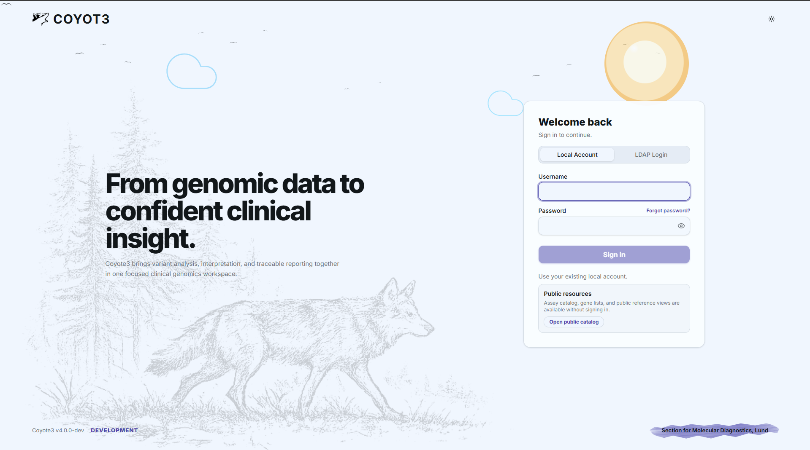
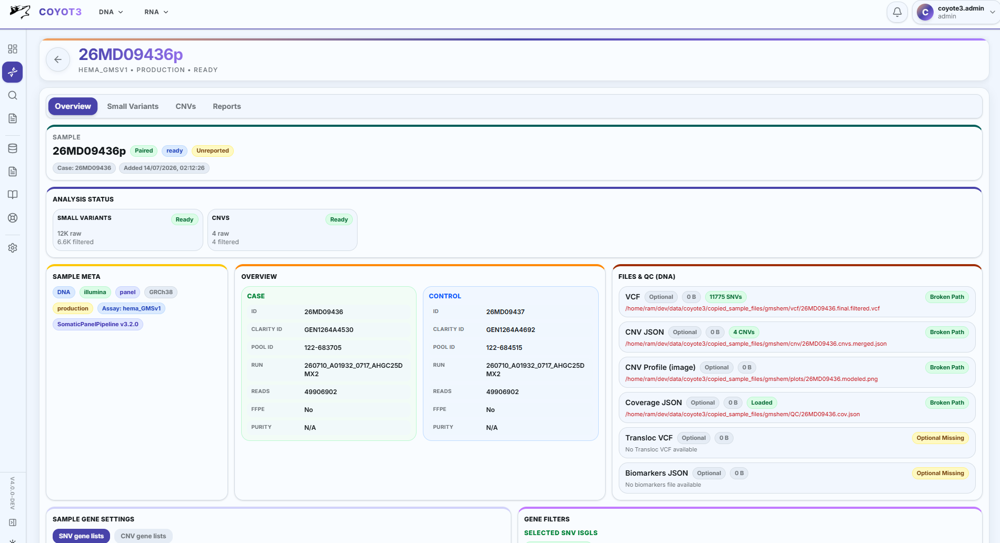
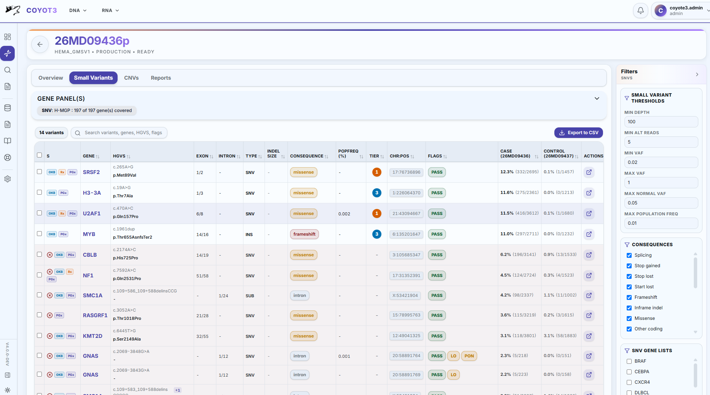
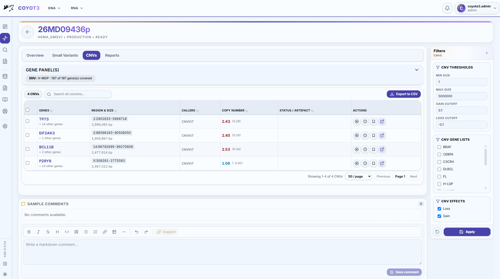
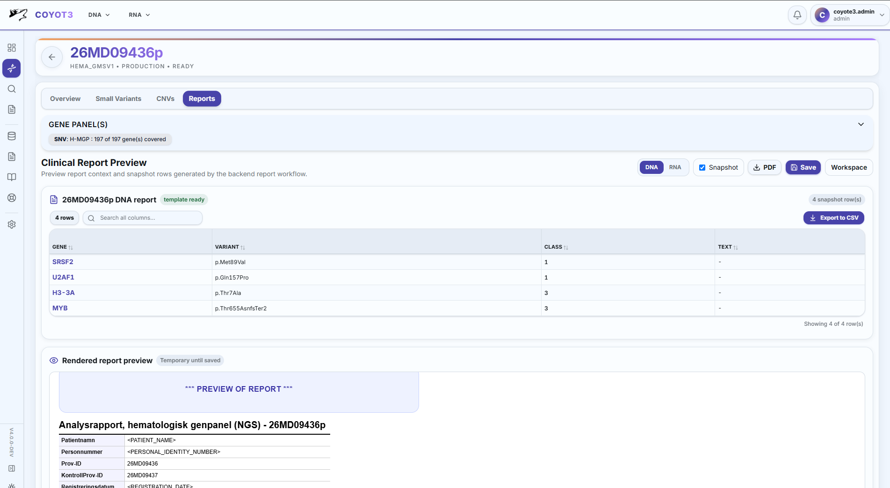
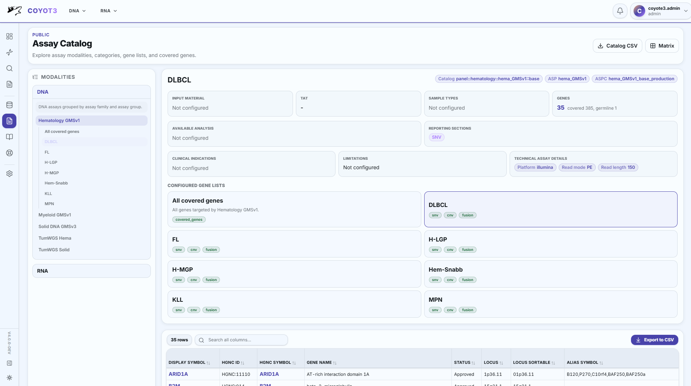
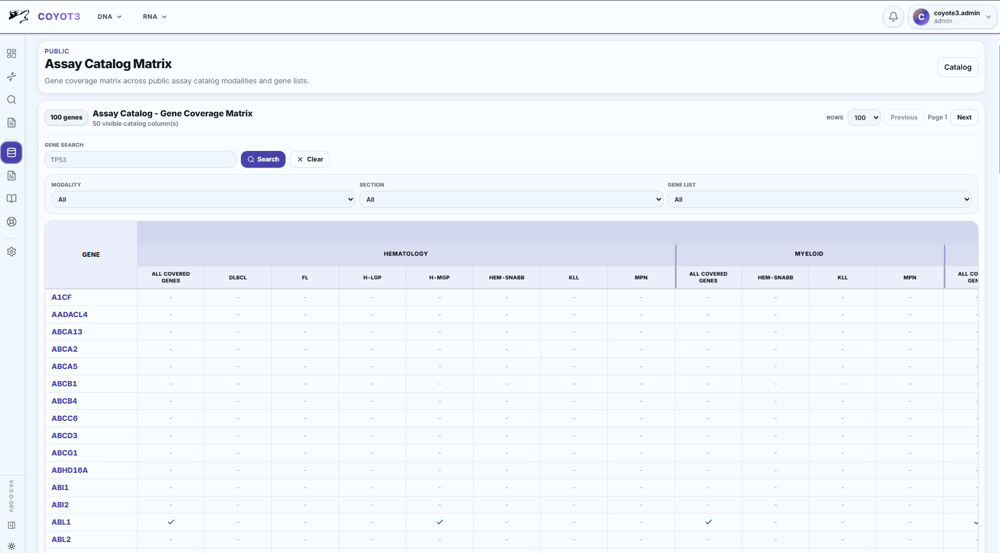
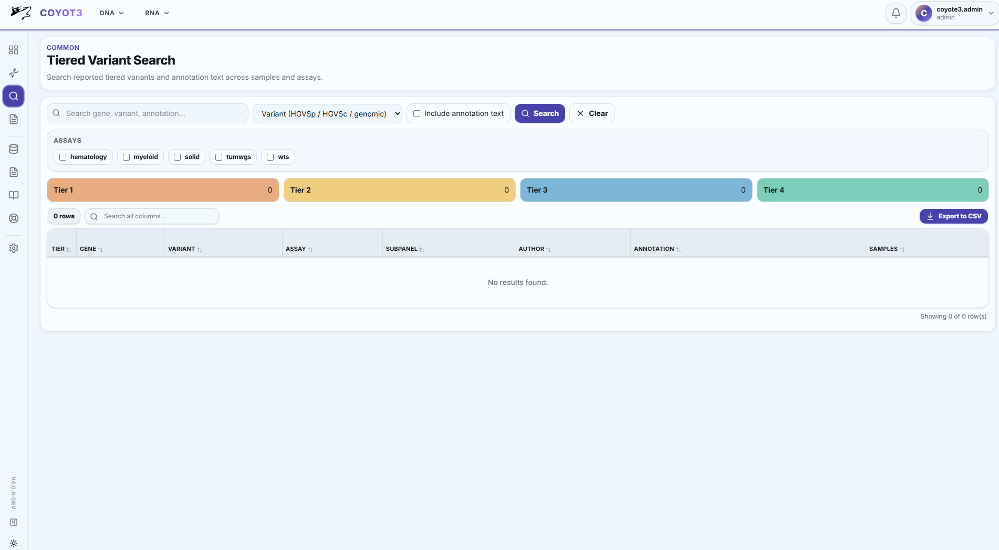
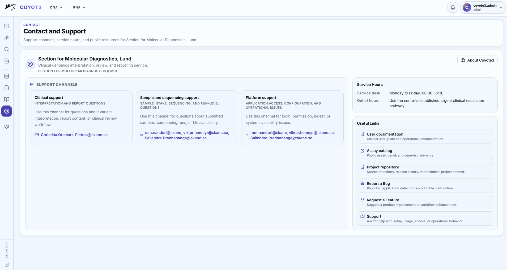

# Interface Visual Reference

This page collects current Coyote3 interface screenshots used across training,
deployment validation, and product documentation. The images show the current
React application style: glass surfaces, bordered clinical tables, compact
badges, contextual navigation, and the public information pages.

> **Info: Sample-neutral screenshots**
>
>
> The screenshots are documentation fixtures. They are intended to explain the
> interface layout and should not contain real clinical identifiers.
>

## Login And Public Entry

The login page provides local and LDAP sign-in, a public catalog entry point,
and center-owned organization text from the configured contact metadata.

## Operational Dashboard

The dashboard summarizes sample throughput, review state, finding availability,
assay workload, and operational capacity using compact cards and shared plotting
components.

## Sample List

The sample list is the primary triage table. It separates live and reported
samples, shows profile and report badges, and uses short count badges for
available analysis domains.

## Sample Overview

The sample overview presents case/control metadata, files and QC state,
biomarkers, selected gene panels, and the high-level report state for the
clinical case.

## Small Variant Review

The small-variant view combines active gene-panel context, tab-specific filters,
knowledgebase badges, compact evidence columns, and bulk review controls.

## CNV Review

The CNV view uses the same sample workspace conventions while presenting
copy-number calls, filter state, and action controls for structural dosage
events.

## Report Preview

The report preview renders the current temporary clinical report context before
the reviewer saves a finalized report snapshot.

## Assay Catalog

The assay catalog combines center-owned catalog metadata with configured ASP,
ASPC, and ISGL records.

## Assay Catalog Matrix

The matrix shows gene coverage across assay sections, groups, assays, and
subpanels. The header hierarchy mirrors the clinical catalog grouping.

## Tiered Variant Search

The tiered variant search page supports targeted annotation lookup, assay-level
summary counts, and compact evidence text display.

## Administration Workspace

Administration pages use the same card and table system as clinical pages, with
typed forms for configuration and explicit permissions for mutation workflows.

## Contact Page

The contact page is generated from center configuration and provides operational
support information without requiring an authenticated session.

