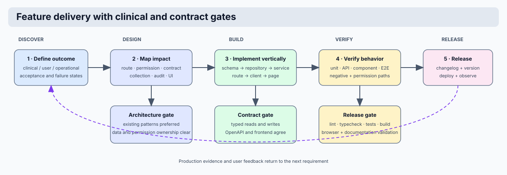

# Contributing

This page summarizes how to contribute safely and efficiently.

## Basic contribution flow



1. Sync your branch with latest mainline.
2. Implement focused change(s) with tests.
3. Run local quality gates.
4. Update docs for behavior/config changes.
5. Open PR with clear scope and risk notes.

## Required checks before PR

```bash
PYTHONPATH=. ruff check api coyote tests scripts
PYTHONPATH=. black --check --line-length 100 api coyote tests scripts
PYTHONPATH=. pytest -q
```

## Shared editor settings

The tracked `.vscode/settings.json` file contains only
shared, non-personal defaults: Python formatting, trailing-whitespace cleanup,
test discovery, and the frontend Vitest/Playwright roots. It does not select an
interpreter, contain credentials, or encode a local path. Personal editor
settings remain untracked.

## Documentation requirement

If you change behavior, configuration, deployment, or API contracts, update corresponding docs in `docs/` in the same PR.

## Canonical file

The authoritative contribution policy is in `CONTRIBUTING.md` at repository root.
