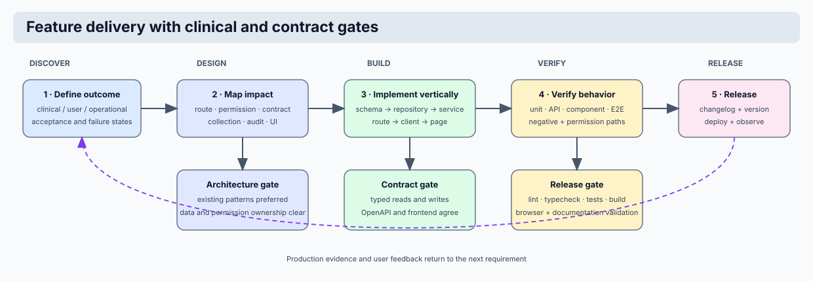

# Contributing

This page summarizes how to contribute safely and efficiently.

## Basic contribution flow



1. Sync your branch with latest mainline.
2. Implement focused change(s) with tests.
3. Run local quality gates.
4. Update docs for behavior/config changes.
5. Open PR with clear scope and risk notes.

## Required checks before PR

```bash
PYTHONPATH=. .venv/bin/ruff check api tests scripts
PYTHONPATH=. .venv/bin/ruff format --check api tests scripts
scripts/run_quality_suite.sh
```

## Shared editor settings

The tracked `.vscode/settings.json` file contains only
shared, non-personal defaults: Python formatting, trailing-whitespace cleanup,
test discovery, and the frontend Vitest/Playwright roots. It does not select an
interpreter, contain credentials, or encode a local path. Personal editor
settings remain untracked.

## Documentation requirement

If you change behavior, configuration, deployment, or API contracts, update corresponding docs in `docs/` in the same PR.

Write documentation from the reader's perspective. Describe the supported
behaviour, configuration, and limits. Keep change notes in release notes and
keep data-transition instructions in a dedicated migration procedure.

Reference pages describe current behavior, ownership, prerequisites, inputs, outputs,
errors, and limitations. Verify technical claims against the implementation. Do not
include task status, completed-work summaries, cleanup notes, speculative features,
or claims of quality unsupported by tests or operational evidence. Keep internal
planning outside the published documentation. Deployment and recovery procedures
may use ordered steps and checklists when they describe actions an operator must take.
Generated contract pages must be updated through their source schemas and generators.

Use standard Markdown callouts so they render in both GitHub and MkDocs:

> **Important**
>
> Keep the callout short and place it directly beside the rule it qualifies.

## Canonical file

The authoritative contribution policy is in `CONTRIBUTING.md` at repository root.
