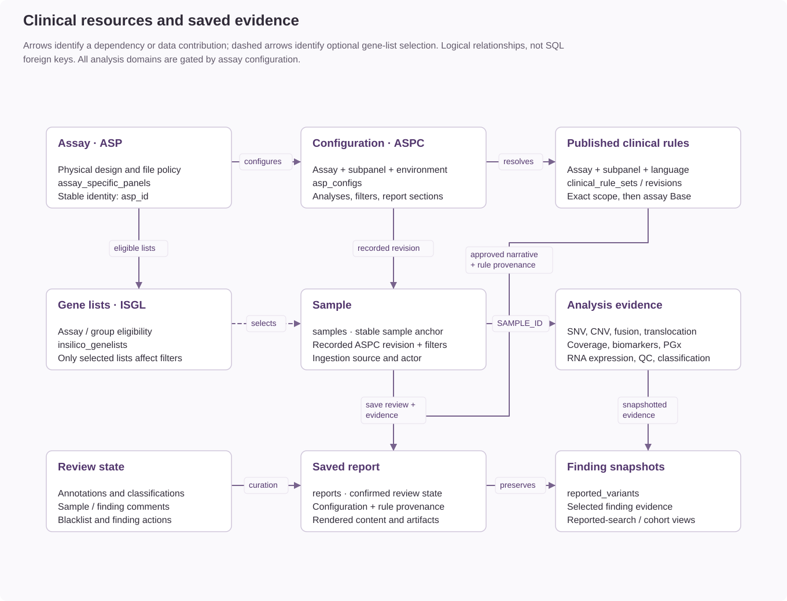

# Clinical concepts and resource identities

Coyote3 organizes clinical genomics data around a small set of stable domain
objects. Understanding their ownership and relationships makes the ingest,
review, reporting, and administration workflows easier to follow.

## Samples and Cases

A **sample** is the application record for one analyzed DNA or RNA specimen. It
contains the identifiers and metadata needed to resolve the assay configuration,
available analyses, files, filters, and report context.

A **case** is the clinical or laboratory context represented by that sample. A
paired DNA analysis can include a case specimen and a normal control. Their
identifiers and sequencing metadata remain distinct, while the sample record
describes their relationship.

Findings such as SNVs, CNVs, translocations, and fusions are stored in separate
collections and linked to the sample. The sample name is the public routing and
display identifier; MongoDB object IDs remain internal persistence identifiers.

## ASP, ASPC, and ISGL

Three configuration resources determine how an analysis is presented and
interpreted.

| Resource | Defines | Examples of owned information |
| --- | --- | --- |
| **ASP** | The assay design and sequencing context. | Omics layer, assay group, assay family, platform, panel gene scope, accreditation metadata. |
| **ASPC** | The software behavior for an ASP, subpanel, and environment. | Available analysis types, intent-specific filters, report sections, default gene lists, reporting metadata. |
| **ISGL** | A versioned in-silico gene list. | SNV, CNV, or fusion gene membership; compatible ASPs and assay groups; public and active state. |

An ASP describes what was designed and sequenced. An ASPC describes how Coyote3
must analyze and report that design in a particular operating context. An ISGL
can narrow the effective gene scope without changing the physical assay design.

At ingest, the active ASPC is resolved from `asp_id`, normalized `subpanel_id`, and
`environment`. If no subpanel-specific configuration exists, the application
may use the ASP's `base` configuration and displays that decision to the user.

## Analysis Types and Intents

Analysis types identify the data domain, such as SNV, CNV, fusion, coverage,
HRD, MSI, or TMB. The ASPC controls which implemented analysis types are
available for a sample and which of them contribute report sections.

Analysis intent is separate from analysis type. SNV review can expose somatic
and germline intents when the ASPC permits them. Each intent has its own filter
configuration and result set. Other analysis types remain somatic-only unless
the released application contract explicitly supports another intent.

## Findings, Annotations, and Reports

Ingested findings are analysis results. Clinical interpretation is stored
separately so that source findings remain stable while classifications,
comments, and report decisions acquire their own history.

The review lifecycle is:

1. Ingest validates the manifest, requires ASP-mandatory files, and parses readable evidence. Unavailable optional expected files are recorded separately.
2. The API stores the sample and dependent findings only after the complete
   required bundle succeeds.
3. The reviewer applies ASPC filters and optional approved gene lists.
4. The reviewer adds classifications, comments, and finding actions.
5. Reporting prepares a temporary preview from the effective review state.
6. Saving creates an immutable report record and finding snapshots.

The saved report preserves the filter snapshot, configuration context, selected
findings, generated text, and rendered artifacts needed for later review. It
does not depend on recomputing the current mutable sample view.

## Contracts and Authorization

Pydantic contracts define accepted request, response, and stored-document
shapes. Application services validate writes before repositories persist them.
Malformed or incomplete clinical data is rejected instead of being stored as a
partially usable record.

Authorization uses named permissions such as `sample:view` or `snv:manage`.
Roles group those permissions, and user scope limits where they apply. The API
enforces every access decision; UI visibility is a convenience and never the
security boundary.

## Related Reading

- [Clinical Data and Reporting Flow](../architecture/clinical-data-and-reporting.md)
- [DNA and RNA Workflow](dna-rna-data-model.md)
- [Query and Filter Strategy](assay-filtering.md)
- [Reporting and Variant Snapshots](report-snapshots.md)
