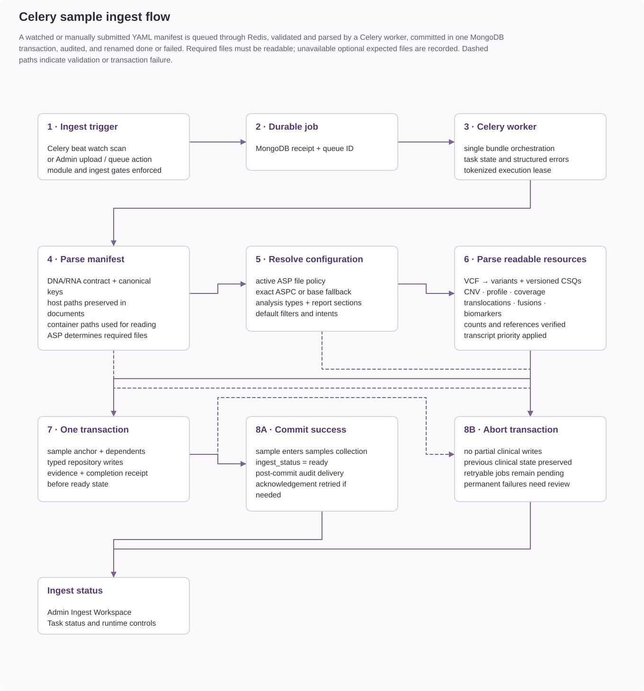

# Raw ingest file formats

Sample ingestion accepts a YAML manifest and the analysis files declared by that
manifest. These are pipeline outputs, not MongoDB exports. The manifest identifies
the sample and assay; each file supplies one analysis domain's evidence.

## File contracts

Each file reference includes its accepted root structure, required fields, synthetic
example, normalization behavior, and constraints to check before submission.

| File | Manifest key | Required structure |
| --- | --- | --- |
| [Small variants: VEP-annotated VCF](small-variants-vcf.md) | `vcf_files` | VEP-annotated VCF |
| [Copy-number variants: JSON](copy-number-json.md) | `cnv` | JSON array or object keyed by interval |
| [Panel coverage: JSON](coverage-json.md) | `cov` | JSON object keyed by gene under `genes` |
| [HRD JSON](hrd-json.md) | `hrd` | JSON object with sample label and HRD measurements |
| [MSI JSON](msi-json.md) | `msi` | JSON object with sample label and MSI measurements |
| [TMB JSON](tmb-json.md) | `tmb` | JSON object with sample label and TMB measurements |
| [DNA translocations: SnpEff-annotated VCF](translocations-vcf.md) | `transloc` | SnpEff-annotated breakend VCF |
| [RNA fusions: caller evidence JSON](fusions-json.md) | `fusion_files` | JSON array of fusions with caller observations |
| [RNA expression: sample and reference JSON](expression-json.md) | `expression_path` | JSON object with sample and reference arrays |
| [RNA classification: score JSON](classification-json.md) | `classification_path` | JSON object with classifier result array |
| [RNA quality control: metrics JSON](quality-control-json.md) | `qc` | JSON object with all required metrics |
| [Pharmacogenomics: JSON payload](pharmacogenomics-json.md) | `pgx` | JSON object or array of objects |
| [Images and alignment resources](images-and-alignments.md) | `cnvprofile`, `case_bam`, `control_bam`, `case_bai`, `control_bai` | Image path or alignment/index filenames |

## Prepare a sample bundle

1. Identify the assay, subpanel, environment, and DNA or RNA omics layer in the
   [sample manifest](../sample-manifest.md). File keys are case-sensitive; the names
   above are the center vocabulary defaults. Even keys ending in `_files` accept
   one path string, not an array.
2. Confirm the ASP's required and expected file policy. ASPC configuration controls
   analysis availability and review defaults; it does not define required input files.
3. Export UTF-8 JSON objects/arrays or valid tab-separated VCF, as specified for each
   input. JSONL, CSV, and database-export wrappers are not interchangeable with these formats.
4. Preserve measurement units, coordinate conventions, reference build, and pipeline
   versions. Missing measurements are not measured zeros. Gene and contig identifiers
   must be consistent with the assay and upstream reference data.
5. Finish writing all files before submitting the manifest. Paths must be accessible
   in the API/worker runtime or supplied through the supported bundle upload workflow.
   A producer's local filesystem path alone does not make a file available to ingest.
6. Verify required keys, types, sample-column identities, and declared file readability.
   Then submit through the [ingestion API](../../api/sample-ingestion.md) and check the
   final job status. HTTP acceptance is not confirmation that the sample is ready.

## Missing, empty, and invalid inputs

| Condition | Meaning and handling |
| --- | --- |
| Required file omitted | Bundle cannot satisfy the ASP file policy. |
| Optional expected file omitted, absent, or unreadable | Ingest skips it, records its key in `missing_expected_files`, and proceeds if required files pass. |
| Readable evidence file has invalid content | Parsing or contract validation fails the bundle, even when the file key is optional. |
| Valid empty row array | No findings in that file; this is distinct from a missing file. It does not establish that all analyses are available. |
| Incomplete singleton object | Required object fields still apply; `{}` is not a universal no-results representation. |
| Unexpected key in YAML bundle upload | Upload warns and ignores keys outside the ASP's expected files. Direct canonical payload ingestion rejects unexpected declarations. |

## From raw evidence to stored records

The parser decodes and normalizes source evidence. Collection contracts validate the
result before the clinical bundle commits. Ingest supplies parent sample linkage and
records the resolved clinical configuration; producers do not need MongoDB IDs.
Pipeline-authored `filters` and `analysis_intents` do not override the resolved ASPC.

VCF exclusions and some normalizations can reduce or reshape the source rows. A
successful ingest is therefore not a promise of one stored document per source line.
The individual file references describe these differences.

The downloadable examples illustrate input contracts. Their synthetic genes and
coordinates are not biological test cases, and they do not provision an assay or
provide clinical validation. Parser and schema checks do not replace an end-to-end
ingest in an approved synthetic environment.

- [Sample visibility and missing results](../../user-guide/sample-readiness-and-missing-results.md)
- [Ingest job recovery](../../operations/ingest-job-recovery.md)
- [Collection contracts](../mongodb-collections.md)
