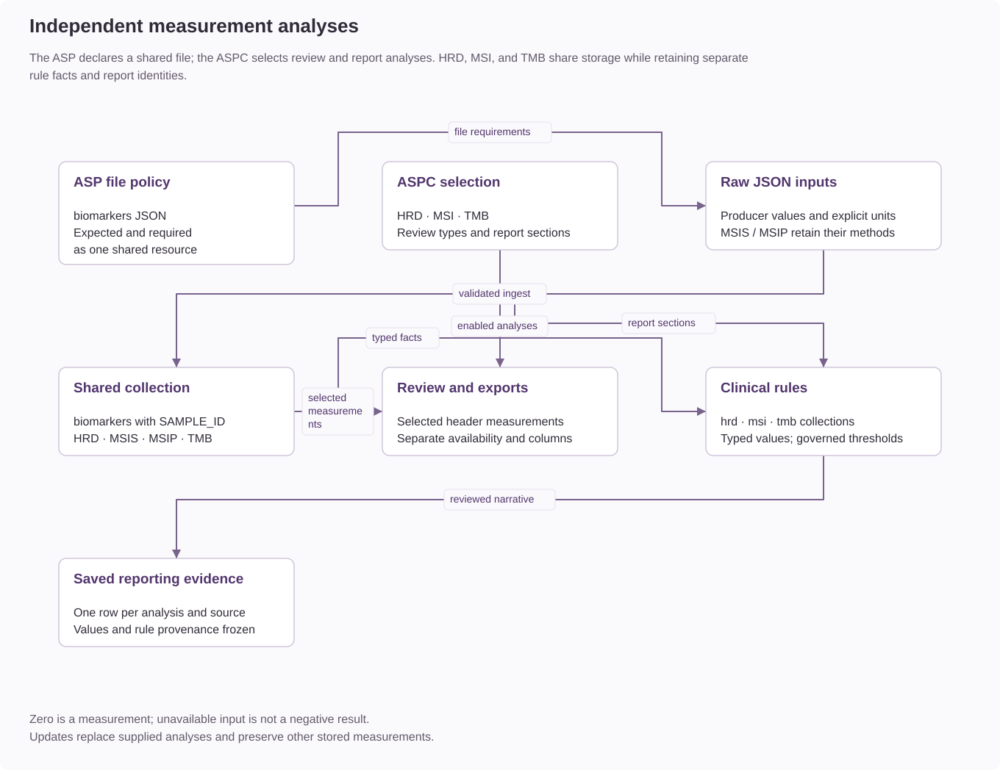

# HRD, MSI, and TMB

HRD, MSI, and TMB are independent DNA analysis types. Each has its own input
file, availability state, report selection, clinical-rule collection, and saved
finding identity. Their measurements share the `biomarkers` MongoDB collection.

## Configuration and data ownership

| Analysis | Manifest key | Stored fields | Rule collection | Measurement unit |
| --- | --- | --- | --- | --- |
| HRD | `hrd` | `HRD` | `hrd` | Producer score; components `tai`, `hrd`, and `lst` |
| MSI | `msi` | `MSIS`, `MSIP` | `msi` | Percentage; single and paired methods remain distinct |
| TMB | `tmb` | `TMB` | `tmb` | Mutations per megabase (`mut/Mb`) |

The ASP's `expected_files` determines which analyses can be enabled in the ASPC.
`required_files` independently determines which missing inputs block ingestion.
The ASPC's `analysis_types` selects measurements available for review;
`reporting.report_sections` selects those eligible for reporting. A report section
must also be an enabled analysis. Enabling TMB does not enable HRD or MSI.

TAI and LST are HRD components. The stored `HRD.hrd` component is preserved under
its producer field name. TAI and LST are not separate analysis types.
No threshold, clinical classification, or cross-analysis score is inferred at ingest.

## Ingestion and availability

Each file is a JSON object with `name` and its measurement fields. Files submitted
together must use the same source name. A file may contain additional measurement
fields, but its manifest key selects only its own analysis. This permits a producer
to reference one combined JSON file under several explicitly declared keys.

See the raw contracts for [HRD](ingest-files/hrd-json.md), [MSI](ingest-files/msi-json.md),
and [TMB](ingest-files/tmb-json.md).

An absent or unreadable optional expected file is recorded in
`missing_expected_files`. A readable file without its selected measurement fails
validation. A valid numeric zero is a measured result, not missing data.

An update replaces only the supplied analyses within the shared collection.
Updating MSI replaces its single/paired measurement set; an omitted MSI method
does not retain the previous method's result. Other analyses remain unchanged.
Updates must retain the stored source name. Conflicting source names or multiple
source documents must be reconciled before an update.

## Review and API

The sample header shows measured values for analyses enabled in its stored ASPC.
The overview and Files & QC show independent availability, and sample-list exports
retain separate measurement columns. Disabling an analysis suppresses its current
review values and export measurements without deleting the stored evidence.

Each analysis has a sample-scoped endpoint:

| Analysis | Route | Response records |
| --- | --- | --- |
| HRD | `GET /api/v1/samples/{sample_id}/hrd` | `hrd` |
| MSI | `GET /api/v1/samples/{sample_id}/msi` | `msi` |
| TMB | `GET /api/v1/samples/{sample_id}/tmb` | `tmb` |

Each response includes `sample` and `meta.count`. Sample access and the DNA
analysis module are required. The sample's stored ASPC must enable the requested
analysis; otherwise the request returns HTTP 400. An enabled analysis without
measurements returns an empty record list. There is no aggregate biomarker endpoint.

## Clinical rules and reports

Associate a rule block with the individual `analysis`, such as `TMB`. For
`each_item` evaluation or `collection_match`, select `hrd`, `msi`, `tmb`.
Only selected report sections populate these collections.

| Fact | Meaning |
| --- | --- |
| `item.analysis_type` | HRD, MSI, or TMB |
| `item.method` | HRD, MSIS, MSIP, or TMB |
| `item.value` | Producer numeric value: HRD sum, MSI percentage, TMB value |
| `item.unit` | `score`, `%`, or `mut/Mb` |
| `item.tai`, `item.hrd`, `item.lst` | HRD components; absent on other analyses |
| `item.total`, `item.unstable` | MSI evaluated and unstable counts; absent on other analyses |

MSI can produce two items. Rules that distinguish single and paired measurements
must check `item.method`. Missing measurements produce an empty collection. A
rule using a component absent from an item receives a missing-fact result.

Clinical thresholds and narrative require reviewed rule definitions and embedded
test cases. The application does not supply universal high/low cutoffs.

Each selected analysis has a report table and its own saved finding row. Snapshot
identities include the analysis and source name, so a source's HRD and TMB results
remain distinct. Saved reports preserve their original evidence and wording when
configuration or measurements change later.

For existing installations, see the
[configuration migration](../operations/migrations/independent-biomarker-analyses.md).
