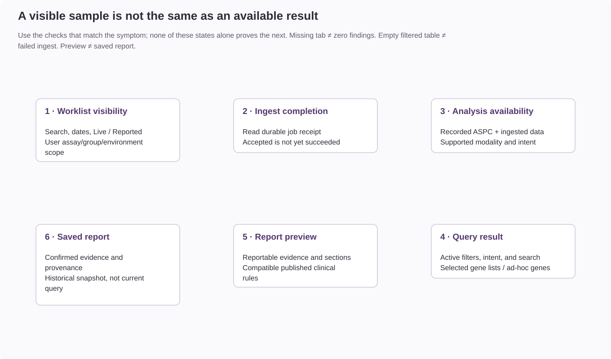

# Sample readiness and missing results

> [!NOTE]
> Sample visibility, analysis availability, and query results depend on different
> conditions. A successful ingest does not by itself establish that an analysis is
> available, a query contains results, or a report has been saved.

## Start with the symptom

| Symptom | Check first | Next reference |
| --- | --- | --- |
| Sample is absent from the worklist | Search, date range, Live/Reported selection, environment, and assigned access scope. | [Sample management](sample-management.md) |
| Submission was accepted but no ready sample appears | Check the durable ingest job's final state; acceptance is not completion. | [Ingest job recovery](../operations/ingest-job-recovery.md) |
| A resource is marked **Not available** | Check the missing-file warning and the ASP's expected files. A ready sample can lack optional inputs; this does not mean there were zero findings. | [Assay file availability](../administration/assay-analysis-availability.md) |
| Sample opens but an analysis tab is missing | Check the recorded ASPC's analysis types, sample modality, matching ingested data, and supported intent. | [Analysis availability](../reference/assay-filtering.md#analysis-availability-and-tab-dispatch) |
| An available analysis table has no rows | Inspect active filters, selected gene lists, ad-hoc genes, search, and intent. Compare with loaded counts where available. | [Gene-list selection](../reference/assay-filtering.md#configuration-domain-interplay) |
| Expected gene list is not offered | Check active state, assay/group eligibility, compatible list type, and diagnosis/subpanel context. | [Resource relationships](../architecture/resource-relationships.md) |
| A button is missing or an action is denied | Check the required action permission and the user's clinical scope. An available page does not grant every action. | [Permissions and access](../administration/permissions-and-access.md) |
| Review works but report preview has warnings | Check enabled report sections, available evidence, and the compatible published rule release. | [Clinical reporting rules](../reference/clinical-reporting-rules.md) |
| A saved report differs from today's sample view | Compare its saved finding, filter, configuration, and rule snapshots with current review state. | [Report snapshots](../reference/report-snapshots.md) |

## Distinguish the states

| State | What it establishes | What it does not establish |
| --- | --- | --- |
| Job accepted | The asynchronous request has a durable job receipt. | That its clinical records have committed. |
| Sample ready | The required ingest transaction completed. | That every possible analysis exists or is enabled. |
| Analysis available | The configured workflow and matching sample data support the analysis. | That its current filtered result contains findings. |
| Empty filtered result | No rows match the current query. | That the pipeline produced no raw findings or that ingest failed. |
| Report preview | Current review evidence can be rendered for inspection. | That a report has been confirmed and saved. |
| Saved report | Confirmed reporting evidence and provenance have been preserved. | That later filter or configuration changes rewrite that report. |

> **Important: Do not infer clinical absence from a missing interface element**
>
> A missing tab can reflect configuration, data availability, modality, or access.
> An empty table reflects its current query. Resolve the application state before
> interpreting either as an absence of biological findings.

## Before changing filters or configuration

Missing or unreadable required files block ingestion. Optional expected files may
be unavailable while the sample reaches `ready`; their keys are recorded in
`missing_expected_files` for the latest ingest input. Readable evidence files must
still pass parsing and validation. On an update, missing optional input does not
by itself remove previously stored evidence for that domain.

Record the active sample context and visible error or warning in the center's
controlled support system. Inspect the recorded ASPC revision and selected intent;
do not assume that the newest configuration is the one attached to the sample.
Review the current filter values before using an explicit reset, because a reset
changes persisted review state. Configuration changes require their own validation;
see [planning configuration changes](../administration/planning-configuration-changes.md).

When escalating, include the application version, environment, affected page,
approximate time, job or error reference if shown, and the symptom above. Keep real
sample identifiers, screenshots, and clinical data in approved internal systems;
use synthetic examples in repository issues.
