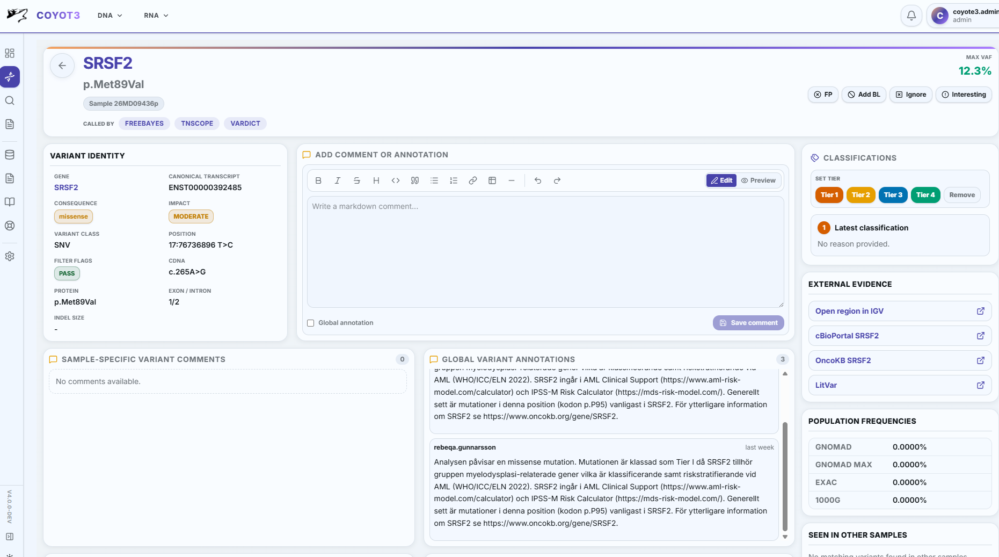
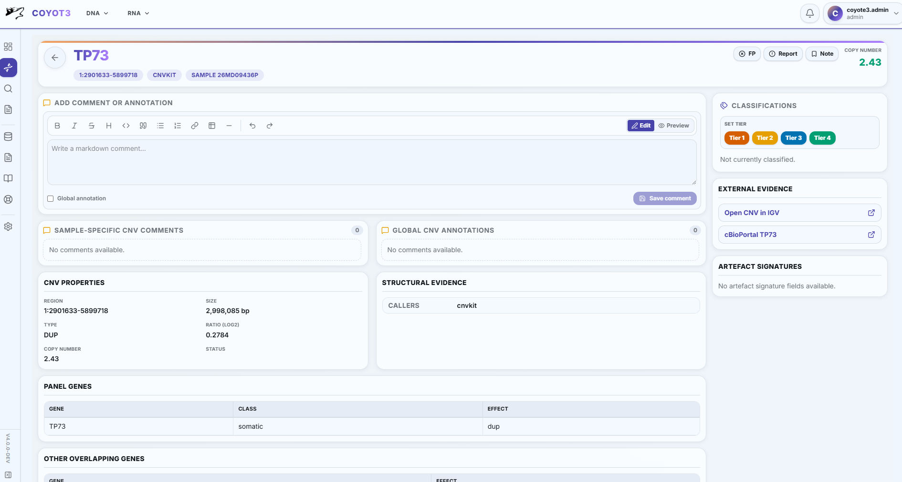

# User Guide: DNA Clinical Review

The DNA review workspace is the main clinical area for reviewing sample findings, assigning tiers, writing comments, and preparing report previews. The page is driven by the sample ASPC, so only analyses enabled for that sample's assay, subpanel, and environment are shown.

!!! info "Detailed UI reference"

    This guide explains the DNA review workflow. For a complete page-by-page table and badge dictionary, see the [UI Page and Table Reference](../product/ui_page_table_reference.md).

## Review Workspace

The sample detail page is organized around a persistent sample header and a selectable analysis layout. **Classic** places the enabled finding tables on one Findings page so SNVs, CNVs, and structural findings can be compared without changing tabs. **Modern** gives each enabled analysis its own tab. The choice applies to both DNA and RNA samples and is retained with the user's account.

| Area | Purpose |
| --- | --- |
| Sample header | Shows sample name, assay, profile, ingest status, and available biomarker badges. |
| Overview | Shows sample settings, case/control context, files/QC, biomarkers, and gene settings. |
| Findings | Combined presentation of enabled clinical finding sections when Classic is selected. |
| Small Variants | SNV/indel table with filtering, tiering, bulk actions, and detail links. Shown as a separate tab in Modern. |
| CNVs | Copy-number event table and CNV detail workflow. |
| Fusions | Fusion finding table and fusion detail workflow. |
| Translocations | Structural rearrangement table and detail workflow. |
| Coverage | Gene, exon, and probe coverage context. |
| Reports | Temporary report preview and save/export workflow. |

In Classic, use the **Filters** button beside a finding section to open the right filter panel and connect it to that section. Select the same button again to collapse that section's filter panel. When collapsed, the right rail keeps a separate vertical tab visible for every filterable finding section; selecting one opens that section's controls. Filter choices and table state remain analysis-specific; selecting the CNV filter panel does not apply SNV filters to CNVs.

!!! caution "Raw payloads"

    Clinical users should not need raw JSON payloads. Raw inspection belongs in explicit diagnostic/admin views only.

## Small Variants

The Small Variants table is the primary DNA review table for SNVs and indels.

| Column | Meaning |
| --- | --- |
| Select | Checkbox used for bulk actions. |
| `S` | Review and evidence status. This can include false-positive, blacklist, irrelevant, interesting, comment, `OKB`, `Rx`, and `PGx` markers. |
| Gene | The displayed gene symbol from the selected consequence. HGNC normalization can add an info marker when a previous symbol or alias resolved to the approved HGNC record. |
| HGVS | HGVSc and HGVSp for the selected transcript. Long values are expandable. |
| Exon/Intron | Selected transcript exon and intron values. |
| Type | Compact variant class such as `SNV`, `DEL`, `INS`, `INDEL`, or `SUB`. |
| Consequence | VEP consequence badges. Hover shows VEP metadata and impact. |
| PopFreq (%) | Public population frequency as a percentage, displayed with up to six decimal places. A recorded zero is shown as `0`; unavailable values are shown as `-`. |
| Hotspot | Indicates existing hotspot metadata attached to the variant. Hover shows the available source and identifiers. When several COSMIC identifiers occur for one source, the latest identifier is shown. The same marker appears on the variant detail page. The future hotspot-list contract and filtering behavior are not defined yet. |
| Tier | Current clinical tier. Clicking an assigned tier opens reported-variant context when available. |
| Chr:Pos | Neutral chromosome coordinate link for IGV. |
| Flags | Configured filter flag badges from the VCF `FILTER` field. |
| Case | Case VAF and depth as `VAF% (VD/DP)`. |
| Control | Control VAF and depth. Hidden for unpaired samples. |
| Actions | Opens the variant detail page. |

### Status And Knowledgebase Markers

| Marker | Meaning |
| --- | --- |
| False-positive icon | Finding is marked as false positive and the row is visually de-emphasized. |
| Blacklist icon | Finding matches a known technical artifact unless overridden. |
| Irrelevant icon | Finding is marked irrelevant for this review. |
| Interesting icon | Finding is marked for additional attention. |
| Comment icon | Comments or annotations exist. |
| `OKB` | Gene exists in the local public OncoKB cancer gene cache. |
| `Rx` | Historical local OncoKB actionable evidence exists. |
| `PGx` | Gene exists in the ClinPGx public gene cache. |

!!! warning "Knowledgebase evidence"

    Public OncoKB access excludes therapeutic data. The `Rx` badge is based on historical local actionable evidence, while the public OncoKB API card can be fetched from the detail page for current public summaries.

### Bulk Actions

Bulk actions operate on selected rows and are sent as one request.

| Action family | Examples |
| --- | --- |
| Classification | Set Tier 1, 2, 3, or 4; remove a tier. |
| Review state | Mark/unmark false positive, irrelevant, or interesting. |
| Blacklist state | Add blacklist, override blacklist, or clear blacklist override. |

Successful actions update the table in place and create audit/notification context. Failure notifications should explain the clinical resource and action that failed.

!!! warning "Automatic classification text is limited to Tier 3"

    Bulk assignment of Tier 3 to a small variant creates both the classification
    record and the approved automatic Tier III annotation text. Tier 1, Tier 2,
    and Tier 4 assignments create classification records only. They do not
    generate narrative text because no center-approved templates have been
    defined for those tiers. Reviewers must add any required narrative manually.
    Additional automatic templates require clinical review and approval by the
    responsible genetics team before implementation.

Every bulk action opens a confirmation dialog that identifies the selected
operation and the number of affected findings. The mutation is sent only after
explicit confirmation.

## Variant Detail

The variant detail page arranges decision-making cards around the finding.

| Card/table | Information |
| --- | --- |
| Header | Gene, HGVS, sample link, caller badges, coordinate, and high-level status. |
| Classification | Current tier and tier-changing controls. |
| Add comment or annotation | Markdown editor with explicit preview. |
| Sample comments | Comments attached to this sample/finding context. |
| Global annotations | Reusable annotations for the same finding across samples. Clicking an annotation can use it as a draft. |
| Variant identity | Coordinate, class, transcript, HGVS, gene/HGNC context, and selected consequence. |
| Genotype/evidence | Case/control VAF, depth, and caller evidence. |
| Transcript consequences | Selected and alternate transcript rows with consequence and impact badges. |
| Prediction and clinical signals | SIFT, PolyPhen, population frequency, germline risk, or other configured signals. |
| PON evidence | Separate panel-of-normals rows per tool/source. |
| Knowledgebase | A single collapsible evidence card for CIViC, BRCA Exchange, IARC TP53, local/public OncoKB, and ClinPGx local/API context. |
| Seen in other samples | Prior sample/report contexts for the same finding. |

## CNVs, Fusions, And Translocations

These tabs use the same review model as small variants: status/evidence badges, core biological identity, supporting evidence, tier, and detail link.

| Tab | Primary review information |
| --- | --- |
| CNVs | Genes, region, gain/loss/effect, size, copy-number metrics, tier, and CNV detail context. |
| Fusions | Fusion partners, breakpoints, read support, callers, tier, and fusion detail context. |
| Translocations | Partner genes, breakpoints, structural type, HGVS/notation, panel context, tier, and translocation detail context. |

## Coverage

Coverage review shows whether the sample has adequate coverage for the configured assay and gene lists.

| Area | Information |
| --- | --- |
| Summary | Warning/error cutoffs and aggregate coverage state. |
| Gene coverage | Gene-level coverage, low-coverage intervals, exon/probe context, and pass/warning/error state. |
| Gene links | Gene rows link to richer gene/probe/exon views when available. |

## Reports

The Reports tab previews clinical report output from the current filter state and reportable findings.

| Step | Meaning |
| --- | --- |
| Build preview | Uses current filters and configured report sections to create a temporary report preview. |
| Review rendered report | Shows the formatted report body before saving. |
| Save report | Stores the report, filter snapshot, ASPC identifier, and reported finding snapshots. |
| Export/PDF | Produces report output for downstream clinical use when enabled. |

!!! tip "Why report snapshots matter"

    Saved report snapshots let Coyote3 reproduce exactly what was reported, search reported variants across samples, and connect later evidence back to a stable clinical decision.
