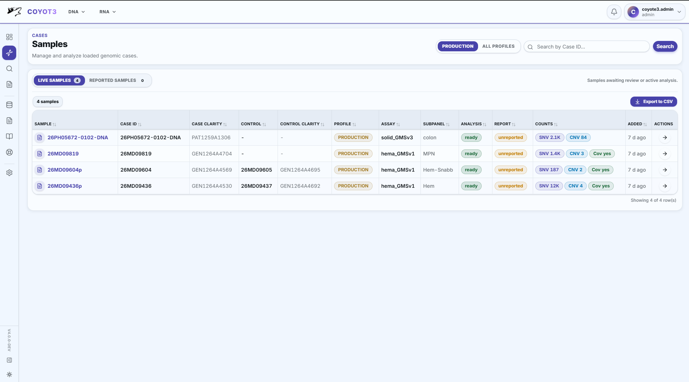

# Clinical Interpretation Workflow Guide

This guide provides a step-by-step walkthrough of the clinical analysis process in Coyote3—from the initial sample triage to variant classification and reporting.

---

## 1. Entering the Analysis Workspace

Every clinical analysis starts at the **Sample List**.

1.  **Locate Your Sample**: Use the search bar or filters to find the target patient or case.
2.  **Access the View**: Click on the **Sample ID** (blue link).
    *   **DNA Samples**: Opens the SNV/Indel and CNV interpretation view.
    *   **RNA Samples**: Opens the Fusion and Expression analysis view.

---

## 2. Navigating the Interpretation Interface

The analysis page is divided into three functional zones:

*   **Central Workspace**: Displays clinical metadata, active gene panels, comments, report preview, and interactive review tables.
*   **Global Navigation Sidebar (Left)**: Vertical application navigation grouped by clinical, public, operational, and administrative areas.
*   **Filter Sidebar (Right)**: Domain-specific filters for the active analysis tab. The sidebar starts collapsed and can be expanded when filter editing is needed.

---

## 3. Mastering Analytical Filters

The **Right Sidebar** contains tab-specific filters that allow you to narrow down thousands of sequencing artifacts to a smaller clinical review set. Applying filters re-queries the backend and refreshes the table and temporary report preview context.

### SNV Filters

*   **Min Depth & Alt Count**: Set minimum sequencing sensitivity (e.g., Depth ≥ 500x).
*   **Frequency Control (VAF)**: Adjust the minimum and maximum Allelic Fraction (e.g., 0.05 to 1.0).
*   **Population Frequency (PopFreq)**: Filter out common polymorphisms using GnomAD frequency thresholds (e.g., ≤ 0.01).
*   **Consequence & Gene Lists**: Use the dropdowns to focus only on specific variant types (e.g., Missense, Nonsense) or specific virtual panels (ISGL).

### CNV Filters

*   **Ratio Thresholds**: Adjust Gain/Loss ratios to detect large genomic events.
*   **Size Filtering**: Limit the view to large chromosomal shifts or focal gene-level events.

---

## 4. Variant Classification (Tiering)

Coyote3 supports a standardized classification workflow based on ACMG/AMP and Comper guidelines.

### Individual Tiering

1.  Click the **View** button next to any variant to see the detailed evidence page.
2.  Use the classification card on the detail page to assign or remove tiers.
3.  Assign the **Tier (I-IV)** and select the specific evidence criteria (e.g., PM1, BA1).
4.  **Save**: The classification persists across all clinical views and propagates to the final report.

### Bulk Operations (Batch Actions)

For high-efficiency triage, use the **Bulk Action Bar**:

1.  Select multiple variants using the checkboxes in the SNV table.
2.  Open the bulk action menu above the table.
3.  Select the desired action, confirm it, and let the table refresh from persisted backend state.

### Sorting and Cached Table Views

Large review tables may return one page at a time. When you sort a paged table,
Coyote3 sorts the complete filtered result set on the backend before returning
the visible page. For example, sorting by case VAF ranks all matching variants,
not only the 50 variants currently visible. Click additional sortable headers
to add secondary and tertiary sort keys.

Repeated visits to the same table state can reuse a short-lived cache. The cache
key includes sample, page, page size, search text, sort columns, and sort
directions. The current table state is kept in the URL for small variants, CNVs,
fusions, and translocations, so opening a finding detail page and returning to
the sample restores the same table view. Applying filters or changing persisted
finding state, including false-positive, blacklist, irrelevant, interesting, or
tier changes, refreshes the affected table data.

Smaller tables that load their complete row set in the browser use the same
multi-column sorting controls. Where the page controls table state, the sort
order is kept in the URL; otherwise only search text and sort order are stored
for the current browser session. The application does not duplicate table row
data in session storage.

---

## 5. Clinical Dialogue and Reporting

### Adding Comments

*   **Sample Comments**: Sample-level comments appear below review tables where the tab supports comments.
*   **Finding Comments**: Detail pages show sample-specific and global annotations. Existing comments can be used as a draft by selecting them.
*   **Markdown**: Comment fields support Markdown rendering and preview.

### Final Summary

The **Reports** tab builds a temporary report preview from the current filter state and ASPC reporting configuration. Saving the report persists the report document, rendered artifacts, filter snapshot, ASPC context, and reported finding snapshots.

---

## 6. Visual Evidence Tools

*   **CNV Profile Plot**: View the interactive chromosome profile. Use the **90° Rotate** toggle in the CNV header for closer inspection of focal events.
*   **IGV (Integrative Genomics Viewer)**: Click any **Chr:Pos** link to trigger the web-based IGV. This loads the raw alignment data (BAM) for per-base evidence verification.
*   **Gens Integration**: Deep links are available to open cases in the Gens visualize tool for advanced copy-number and BAF assessment.
