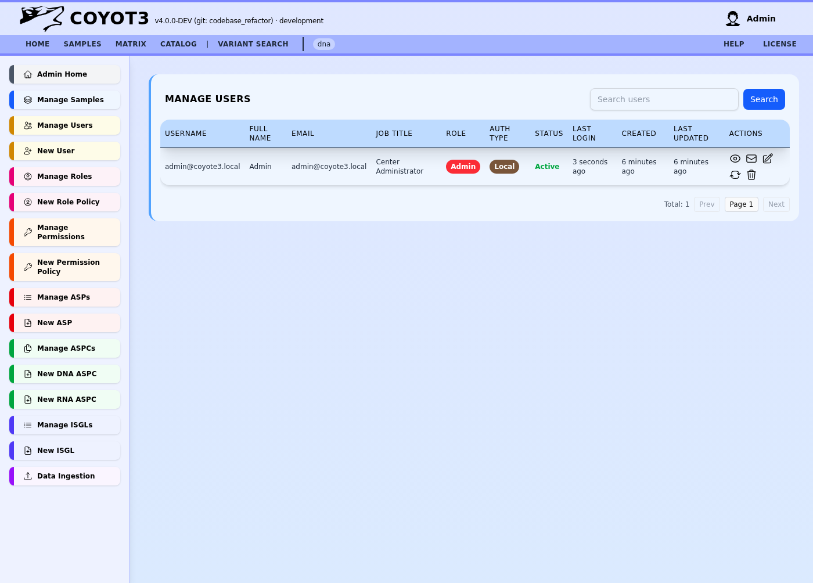
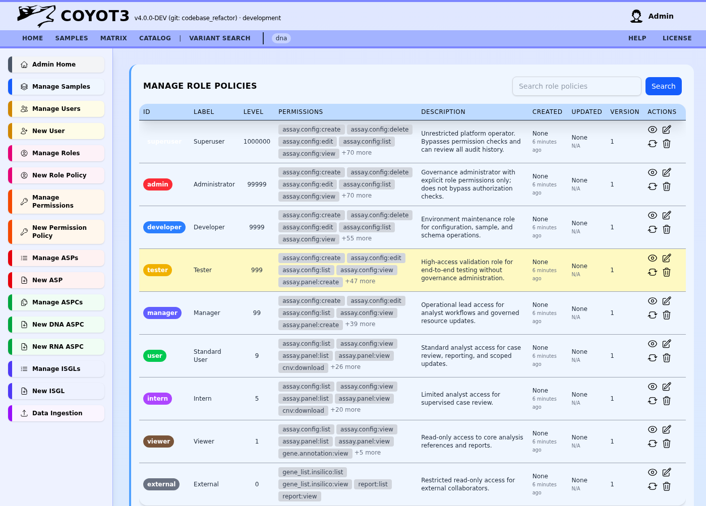
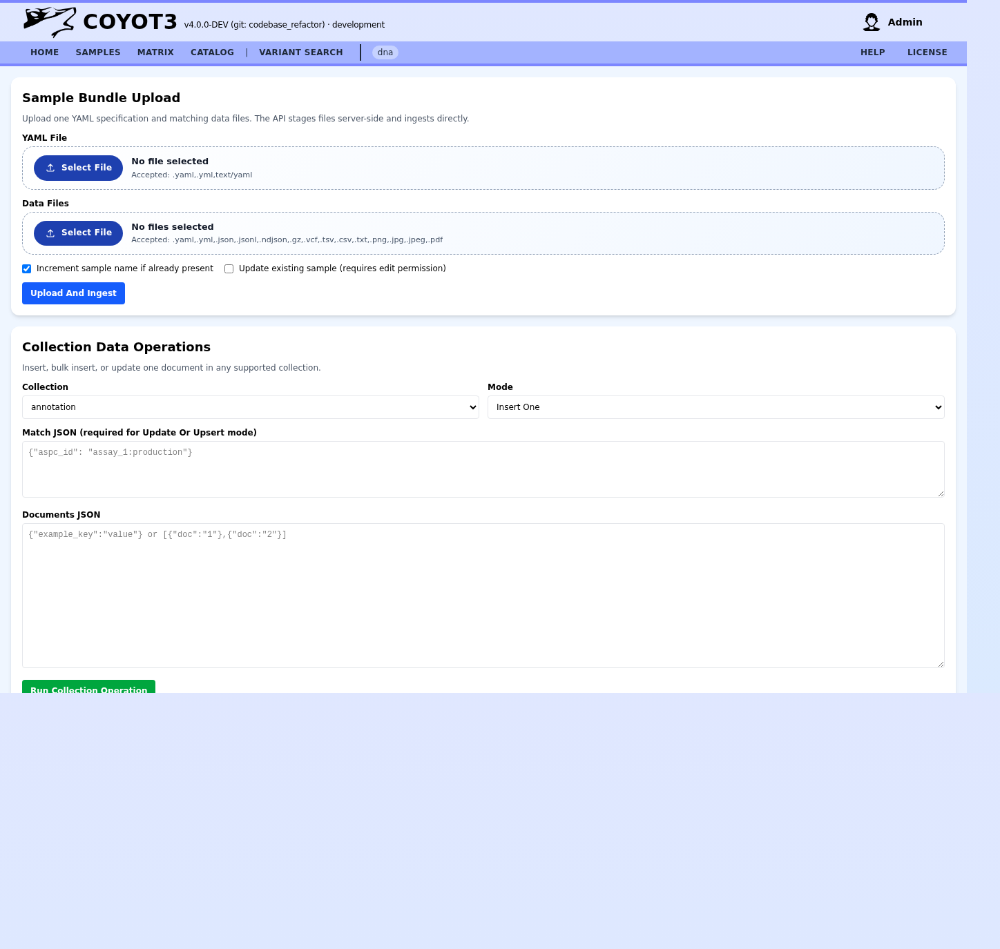

# Management Guide (Administrators)

The Management suite is designed for platform administrators, laboratory leads, and data managers to govern the Coyote3 environment. It covers identity management, clinical resource configuration, and system-wide audit oversight.

## 1. User and Role Administration

Manage the identities of clinical and technical staff authorized to access the platform.

### User Management
*   **Creating Users**: Add staff by providing their official credentials and clinical profession.
*   **Professional Profiles**: Assign roles such as "Clinician," "Bioinformatician," or "Quality Manager" to ensure audit trails reflect the correct clinical responsibility.
*   **Account Status**: Enable or disable access instantly to maintain laboratory security.

### Role-Based Access Control (RBAC)
Coyote3 uses a granular role system where specific permissions are grouped into manageable roles.

*   **Standard Roles**: "Admin," "User," and "Guest" provide predefined access buckets.
*   **Custom Roles**: Administrators can define library-specific roles (e.g., "Lead Clinical Reviewer") to match the laboratory's operational hierarchy.

---

## 2. Resource Configuration (ASP / ASPC)

The platform's analytical logic is driven by Assay Service Profiles (ASP).

### Assay Service Profiles (ASP)
An ASP is the "Scientific Definition" of an assay. It defines:
*   The targeted gene panel (ISGL).
*   The genomic build (GRCh37/38).
*   Quality thresholds and analytical pipelines.

### Assay Service Performance Configurations (ASPC)
ASPCs are the "Software Profiles" that determine how a physical assay is handled in the UI.
*   **Interpretation Pipelines**: Configure which filters (Allelic Fraction, Depth, Population Frequency) are applied by default during clinical review.
*   **Reporting Templates**: Link specific assays to their finalized PDF report designs.

---

## 3. Permissions Registry

For fine-grained security, Coyote3 utilizes a `resource:action[:scope]` permission string.

*   **Resource**: The entity being accessed (e.g., `sample`, `report`, `user`).
*   **Action**: The intent (e.g., `view`, `edit`, `download`).
*   **Scope**: (Optional) Limits the action to specific datasets (e.g., `own`, `all`).

*Example*: A user with `sample:edit:own` can only modify clinical metadata for samples they are explicitly assigned to.

---

## 4. System Ingestion and Audit

The **Ingest** workspace allows administrators to manually bridge data from external laboratory information systems (LIMS) or trigger re-analysis of existing clinical cases.
*   **Bulk Ingestion**: Monitor the status of high-throughput sequencer data arrivals.
*   **System Logs**: Accessible via the Admin Home, these logs provide a tamper-proof record of every sign-in and clinical action taken on the platform.
