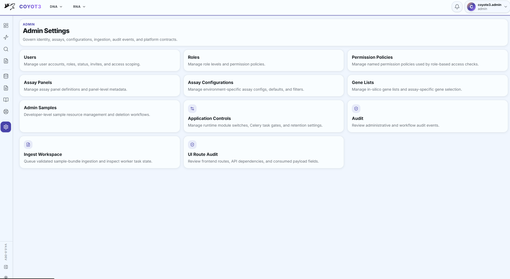
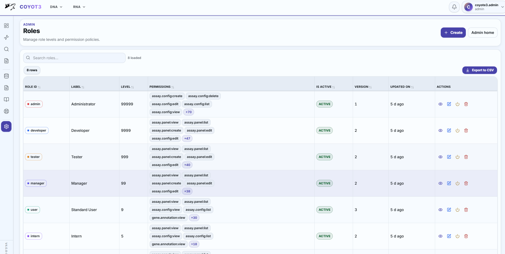
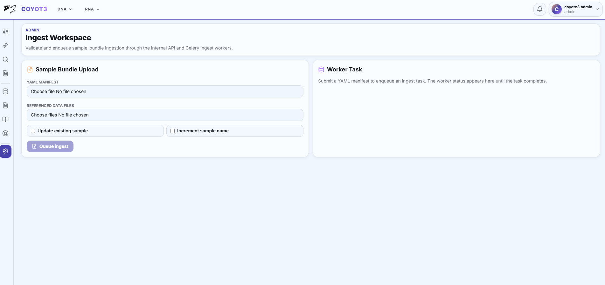
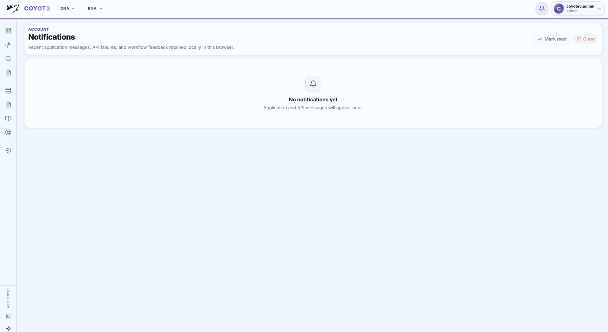

# Management Guide

The Management suite is designed for platform administrators, laboratory leads, and data managers to govern the Coyote3 environment. It covers identity management, clinical resource configuration, and system-wide audit oversight for users granted `audit_log:view`.

## 1. User and Role Administration

Manage the identities of clinical and technical staff authorized to access the platform.

### User Management

*   **Creating Users**: Add staff by providing their official credentials and clinical profession.
*   **Professional Profiles**: Assign roles such as "Clinician," "Bioinformatician," or "Quality Manager" to ensure audit trails reflect the correct clinical responsibility.
*   **Account Status**: Enable or disable access instantly to maintain laboratory security.
*   **Authentication Providers**: User accounts show one badge for each enabled provider. `LDAP` indicates center directory authentication by email. `Local` indicates Coyote3-managed password authentication by username. Accounts can carry both providers when a center needs a transition or fallback path.
*   **Email Links**: Email addresses in user tables and read-only user views open the configured mail client through a `mailto:` link.

### Role-Based Access Control (RBAC)

Coyote3 uses a granular role system where specific permissions are grouped into manageable roles.

*   **Standard Roles**: Bundled roles provide initial permission sets for common clinical, review, testing, development, and administration responsibilities.
*   **Custom Roles**: Administrators can define library-specific roles (e.g., "Lead Clinical Reviewer") to match the laboratory's operational hierarchy.
*   **Role Badges**: Roles are rendered as compact color chips with readable foreground and background colors in light and dark mode.
*   **Highest Role Display**: Summary surfaces show the highest effective role. Profile and user-management screens show all assigned roles so account scope can be audited directly.

Default role palette:

| Role | Accent color | Purpose |
| --- | --- | --- |
| `admin` | Red | Administrative control and high-impact system configuration. |
| `developer` | Blue | Engineering and integration-level access. |
| `tester` | Amber | Validation and test workflow access. |
| `manager` | Indigo | Operational oversight and review coordination. |
| `user` | Green | Standard clinical or laboratory user access. |
| `intern` | Purple | Restricted training or supervised access. |
| `viewer` | Slate | Read-only access. |
| `external` | Slate gray | External or limited collaborator access. |

Role colors should be stored as six-digit hex values in the role document. The role editor provides a color picker and an editable hex field. After the role is saved, role badges use the stored color immediately across user and administration views. Runtime role colors are applied through a CSS color value rather than a generated Tailwind utility, so changing a role color does not require rebuilding the frontend or changing the Tailwind theme. Existing named colors remain readable for compatibility, but new and edited roles should use explicit hex colors for consistent rendering.

### Delegated administration

Access to an administration page is based on permissions assigned through
roles, rather than the role name. This allows a center to create focused roles
such as `Assay configuration manager`, `User account manager`, or `Audit
reviewer` without granting full administration access.

1. Create or select a role.
2. Assign only the permissions required for that responsibility.
3. Assign the role to the user.
4. Limit the user's assay, assay-group, and environment scope where the
   workflow supports scoped resources.
5. Sign in as a representative account and verify the visible navigation,
   permitted actions, and denied direct URLs.

The UI hides routes and actions that are not granted. The API checks the same
permission for every protected request and remains authoritative.

| Resource | Read access | Mutation access |
| --- | --- | --- |
| Users | `user:list`, `user:view` | `user:create`, `user:edit`, `user:delete` |
| Roles | `role:list`, `role:view` | `role:create`, `role:edit`, `role:delete` |
| Permission policies | `permission.policy:list`, `permission.policy:view` | `permission.policy:create`, `permission.policy:edit`, `permission.policy:delete` |
| Assay panels | `assay.panel:list`, `assay.panel:view` | `assay.panel:create`, `assay.panel:edit`, `assay.panel:delete` |
| Assay configurations | `assay.config:list`, `assay.config:view` | `assay.config:create`, `assay.config:edit`, `assay.config:delete` |
| Gene lists | `gene_list.insilico:list`, `gene_list.insilico:view` | `gene_list.insilico:create`, `gene_list.insilico:edit`, `gene_list.insilico:delete` |
| Admin Samples | `sample:list:global`, `sample:view:global` | `sample:edit:global`, `sample:delete:global` |

Application controls are also separated by responsibility:
`app.controls:view` reads controls and observed runtime state,
`app.controls:edit` changes switches, and `app.maintenance:run` starts an
immediate maintenance run.

The same `app.maintenance:run` permission queues the explicit public OncoKB
reference refresh from Application Controls. That task is gated by the
maintenance family and Knowledgebases module, and refreshes the shared public
gene cache from the full local HGNC catalogue rather than from an ASP or sample.

### Runtime controls

| Area | Control | Operational effect when disabled |
| --- | --- | --- |
| Background execution | Master Celery gate | New controlled tasks return before application work; worker processes continue running. |
| Sample ingestion | Complete sample ingestion | Both watched manifests and manually submitted bundles stop before changing sample collections. Dependent analysis writes are part of this same atomic workflow. |
| Administrative data | Validated collection writes | Generic schema-registered background inserts and upserts stop. Normal resource APIs retain their own permissions and behavior. |
| Retention | Retention maintenance | Explicit audit and disk-log cleanup stops; MongoDB TTL expiry remains independent. |
| User-facing capabilities | Application modules | Navigation is hidden and governed APIs return HTTP `503`; stored data is retained. |

Switchable modules are DNA analysis, RNA analysis, reports, tiered variant
search, knowledgebases, ingest workspace, and assay catalog. Audit is not a
module switch. It remains available to users with `audit_log:view`, including
during operational incidents when another module has been disabled.

The observed runtime section refreshes every 30 seconds and reports effective
task-family and module states alongside worker nodes, pool concurrency, queues,
active/reserved/scheduled tasks, registered task names, Beat schedules, and
startup index conflicts. A configured switch does not prove that a Celery
worker or Beat process is running; use the observed state for that distinction.

!!! caution
    Role and permission-policy editing can change what every user is allowed to
    do. Keep `role:edit` and `permission.policy:edit` within the security
    administration team. User-management delegates generally need `user:*`
    permissions only.

!!! info
    `user:edit` permits account administration without exposing password
    mutation. Password creation, reset, and change remain dedicated security
    workflows. A delegated account manager may edit ordinary account fields,
    roles, scopes, providers, and active state, but only a signed-in superuser
    may grant or remove `superuser`, disable a superuser, or delete one.

Every authenticated user can edit their own safe profile fields without
receiving user-administration permissions:

| Self-service field | Editable |
| --- | --- |
| First name, last name, full name | Yes |
| Job title | Yes |
| Username, email, roles, scopes, auth providers, active state | No |
| Password | Only through the dedicated password-change workflow |

---

## 2. Resource Configuration (ASP / ASPC)

The platform's analytical logic is driven by Assay Service Profiles (ASP), Assay Service Performance Configurations (ASPC), and In-Silico Gene Lists (ISGL).

### Assay Service Profiles (ASP)

An ASP is the "Scientific Definition" of an assay. It defines:

*   The targeted gene panel (ISGL).
*   The genomic build (GRCh37/38).
*   Quality thresholds and analytical pipelines.
*   The configured assay category, assay group, assay family, sequencing platform, and read mode.

Values backed by platform constants, such as `DNA`, `RNA`, `hematology`, `solid`, `panel-dna`, `wgs`, `illumina`, and `nanopore`, are shown as semantic badges in admin tables and read-only views. This makes configuration scans faster without relying on raw text alone.

### Assay Service Performance Configurations (ASPC)

ASPCs are the "Software Profiles" that determine how a physical assay is handled in the UI.

*   **Interpretation Pipelines**: Configure which filters (Allelic Fraction, Depth, Population Frequency) are applied by default during clinical review.
*   **Reporting Templates**: Link specific assays to their finalized PDF report designs.
*   **Analysis Types**: Enabled domains such as `SNV`, `CNV`, `TRANSLOCATION`, `BIOMARKER`, `FUSION`, `EXPRESSION`, and `QC` are rendered as color-coded badges. The same configured values drive tab visibility and catalog/matrix grouping.

### In-Silico Gene Lists (ISGL)

ISGL list types are also rendered as semantic badges. Standard list types (`snv`, `cnv`, `fusion`, `expression`, `pgx`) and ad-hoc list types (`adhoc_snv`, `adhoc_cnv`, `adhoc_fusion`, `adhoc_expression`, `adhoc_pgx`) use related colors so administrators can distinguish permanent curated lists from ad-hoc review lists.

### Reusing configuration safely

ASP, ASPC, and ISGL view and edit pages provide **Export JSON**. The download
contains only the fields accepted by the corresponding create form. It omits
MongoDB identifiers, timestamps, audit metadata, version state, and other
server-managed values, so it can be reviewed, shared through an approved
configuration workflow, and imported into a new configuration.

On the create page, select **Import JSON** to choose one exported JSON file.
The application fills the typed form but does not save anything automatically.
Review every field and select **Save** to run the same server-side validation,
permission checks, identifier uniqueness checks, audit handling, and release
rules as a manually created configuration.

The **Copy as new** action on ASP, ASPC, and ISGL view or edit pages uses the
same import mechanism without requiring an intermediate file download.

| Resource | Suitable reuse | Required change before saving |
| --- | --- | --- |
| ASP | Start a related assay-panel definition. | Change `asp_id`; review the assay category, group, family, platform, read-mode, gene scope, and expected files. ASPs are panel definitions and do not have a profile/environment. |
| ASPC | Create a configuration for another profile/environment or a related panel/subpanel. | Change the ASP, subpanel, or environment as appropriate. The server derives a new `aspc_id` from these fields. Review enabled analyses, filters, report sections, and defaults. |
| ISGL | Start a related curated or ad-hoc gene list. | Change `isgl_id` and name. Review list type, member genes, ASP/assay-group scope, diagnosis tags, and visibility. |

!!! warning
    Importing JSON is a convenience for creating a new configuration. It does
    not update the exported source record, bypass a required field, or make an
    identifier reusable. A duplicate `asp_id`, derived `aspc_id`, or `isgl_id`
    is rejected when the form is saved.

---

## 3. Permissions Registry

For fine-grained security, Coyote3 utilizes a `resource:action[:scope]` permission string.

*   **Resource**: The entity being accessed (e.g., `sample`, `report`, `user`).
*   **Action**: The intent (e.g., `view`, `edit`, `download`).
*   **Scope**: (Optional) Limits the action to specific datasets (e.g., `own`, `all`).

*Example*: A user with `sample:edit:own` can only modify clinical metadata for samples they are explicitly assigned to.

### System and center permission policies

The Permissions table distinguishes two policy sources:

| Source | Meaning | Allowed administration actions |
| --- | --- | --- |
| **System** | Shipped with Coyote3 and required by protected application operations. | View and assign through roles. The definition cannot be edited, deactivated, or deleted. |
| **Custom** | Created by the deploying center for local integrations or center-owned workflows. | View, edit, activate/deactivate, delete, and assign through roles, subject to the caller's permissions. |

System permission locking protects the contract between API operations and the
RBAC catalog. It does not force a permission onto a user. To grant or remove a
capability, edit the relevant role and select or clear the permission there.

The administration UI obtains permission definitions from MongoDB. It shows a
lock marker instead of mutation actions for system policies. The API enforces
the same rule, so a direct edit, status, or delete request also returns a
conflict response.

!!! info
    Application upgrades may introduce new system permissions. An operator runs
    `scripts/sync_rbac_catalog.py` after deployment to insert missing policies,
    mark all bundled policy identifiers as system-managed, and add newly bundled
    grants to matching built-in roles without deleting center roles or extra
    grants.

---

## 4. System Ingestion and Audit

## Notification Center

Notifications are recipient-scoped. The history view groups operational,
clinical, account, and broadcast messages for the authenticated user.

The **Ingest** workspace allows administrators to queue validated sample bundles and monitor background ingest behavior.

*   **Bulk Ingestion**: Monitor the status of high-throughput sequencer data arrivals.
*   **System Logs**: Accessible via the Admin Home, these logs provide a tamper-proof record of every sign-in and clinical action taken on the platform.

## Admin UI Conventions

| Pattern | Description |
| --- | --- |
| Page surfaces | Admin list, edit, view, and utility panels use the same restrained surfaces as clinical pages. |
| Read-only view pages | View actions render the same structured form layout as edit pages, but fields are read-only. |
| Forms | Normal admin workflows use typed forms. Admin Samples provides a permission-gated JSON editor for complete sample-document correction, with live syntax checking and API contract validation. |
| Permission selection | Permissions are grouped by category and shown as compact selectable rows with hover text for exact permission strings. |
| Dates | Tables use human relative dates for recent events and concise absolute dates for older events. |
| Notifications | Create, update, archive, delete, and error actions emit structured notifications. |

## Broadcast Notifications

The **Admin -> Broadcast Notifications** page is available to roles carrying
`notification.broadcast:create`.

| Field | Available values | Purpose |
| --- | --- | --- |
| Audience | All active users; Users with selected roles; Selected users | Defines the recipient-resolution strategy. |
| Category | Application; Feature; Maintenance; Security; Warning | Identifies the operational subject of the message. |
| Severity | Information; Success; Warning; Critical | Controls the visual urgency shown in the inbox and toast. |
| Title | 3-160 characters | Concise summary shown in notification lists. |
| Message | 1-5000 characters | User-facing detail and any required action. |

Role mode lists active roles and shows the number of active accounts resolved
for each role. Selected-user mode lists active accounts and supports searching
by username, display name, or email. Role audiences are resolved to concrete
usernames when the notification is sent, so later role changes do not alter the
historical audience. Review the confirmation dialog before sending. A sent
broadcast cannot be edited in place; issue a corrected message when operational
information changes.

Password-reset requests for valid local accounts create a security notice for
active administrators and superusers. This notice supports account operations;
the public reset page still returns the same neutral response for valid and
invalid identifiers.
