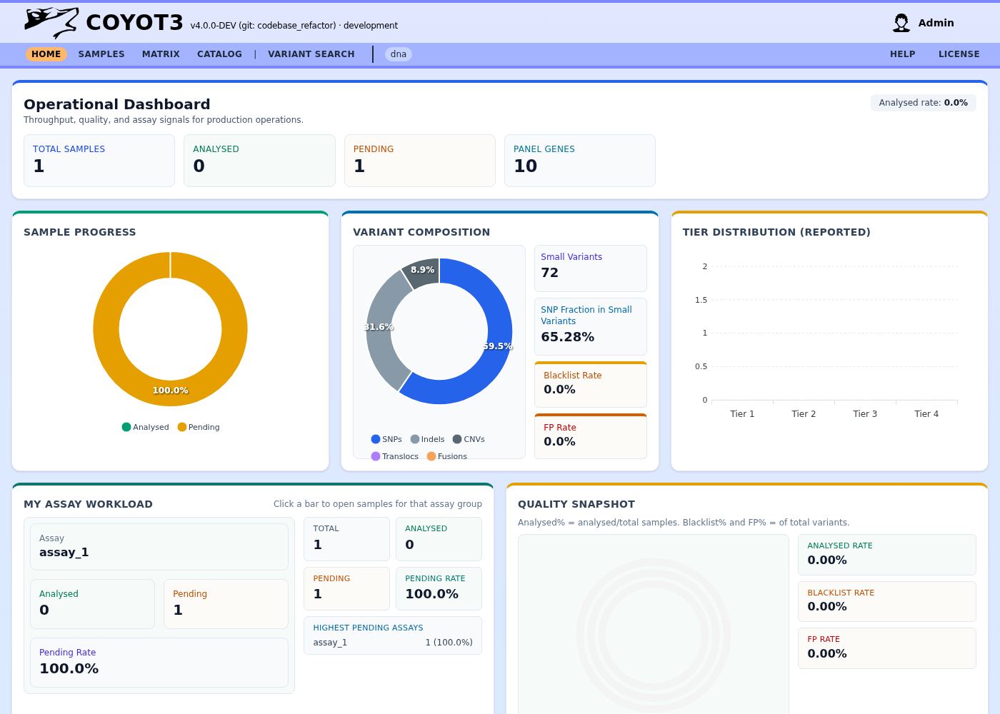

# User Guide: Operational Dashboard

The Operational Dashboard is the primary landing page for Coyote3, providing a high-level overview of laboratory throughput, clinical quality signals, and active workloads. It is accessible at the `/dashboard` route.

## Operational Overview

At the top of the dashboard, you will find real-time statistics summarizing the current state of the laboratory:

*   **Total Samples**: The cumulative count of all clinical samples ingested into the platform.
*   **Analysed Samples**: Samples that have been reviewed and finalized by a clinician.
*   **Pending Samples**: The current active backlog requiring clinical attention.
*   **Analysed Rate**: A percentage indicating the laboratory's efficiency in clearing the sample queue.

## Analytical Charts

The dashboard uses interactive visualizations to help you identify trends and potential issues:

### 1. Sample Progress
A donut chart visualizing the ratio of Analysed vs. Pending samples. This allows at-a-glance monitoring of the current workload status.

### 2. Variant Composition
Displays the distribution of findings across different omics layers, including SNPs, Indels, Copy Number Variants (CNVs), Translocations, and RNA Fusions. This helps clinicians understand the complexity of the current batch of samples.

### 3. Tier Distribution
A bar chart showing the categorization of variants that have been included in clinical reports (Tiers I through IV). This provides a snapshot of the clinical significance of findings across the platform.

### 4. Quality Snapshot
A radial chart monitoring three critical quality markers:
*   **Analysed Rate**: Progress toward completion.
*   **Blacklist Rate**: Percentage of variants identified as known technical artifacts.
*   **False Positive (FP) Rate**: Percentage of findings manually flagged as false results by clinicians.

## My Assay Workload

This section is personalized to your assigned assays. It shows a breakdown of progress for each assay group (e.g., Solid Tumors, Myeloid, WGS).

*   **Actionable Navigation**: Clicking on any bar in this chart will take you directly to the filtered Sample List for that specific assay group, allowing for rapid transition from oversight to action.

## Platform Capacity and Metadata

For administrators and senior lead clinicians, additional "Capacity Rings" show the growth of the system's knowledgebase, including the number of active Assay Panels (ASP), configurations (ASPC), and gene lists (ISGL) currently powering the platform's logic.
