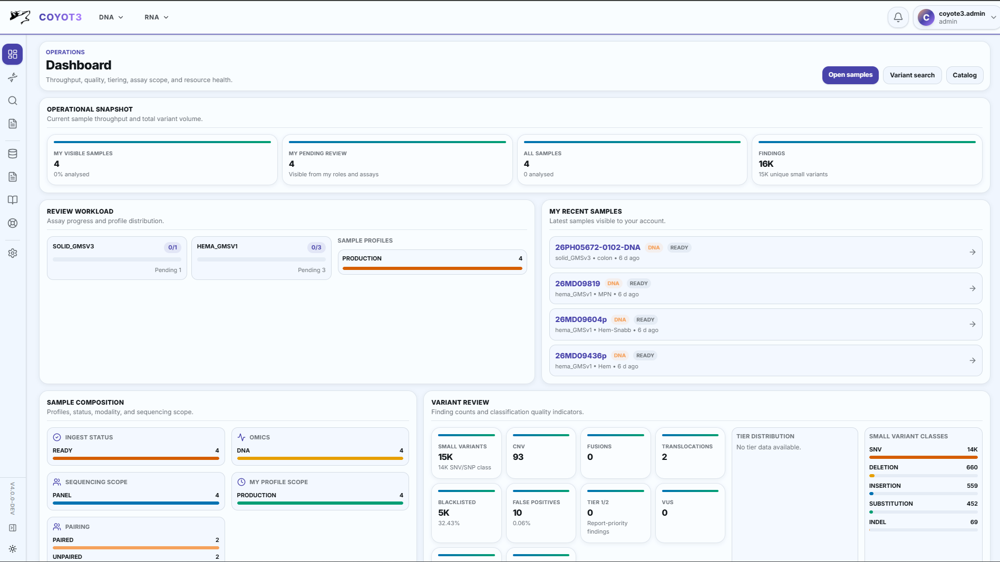
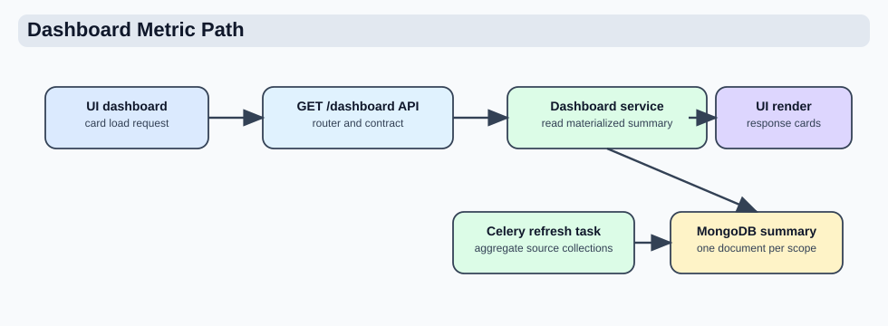

# Operational Dashboard

The dashboard summarizes the samples, findings, review workload, and clinical
configuration visible to the signed-in user. It uses aggregated API responses
instead of loading complete clinical collections into the browser.

!!! info
    Dashboard counts respect the user's role, assay, and environment scope.
    Two users can therefore see different totals from the same deployment.

## Operational Snapshot

The first section answers three immediate questions:

| Card | Meaning |
| --- | --- |
| Analysis progress | Analysed samples compared with all samples in the visible scope, including the number awaiting review. |
| My visible samples | Samples available through the user's assigned roles, assays, and environments. |
| Finding inventory | Persisted findings across the visible samples, with the unique small-variant count shown as supporting context. |

## Review Workload and Recent Samples

**Review Workload** groups sample progress by assay and shows the distribution
of sample environments. Each assay row reports analysed, total, and pending
samples.

**My Recent Samples** lists the latest samples visible to the account. Select a
row to open the sample workspace. Each row includes the sample name, omics
layer, ingest state, ASP, subpanel, and relative ingest time when available.

## Sample Composition

The composition section summarizes the visible sample population by:

- ingest status;
- omics layer;
- sequencing scope;
- environment; and
- paired or unpaired state.

These values describe workload composition. They do not replace sample-level
quality review.

## Variant Review

The variant review section provides persisted finding and curation totals:

- small variants, CNVs, fusions, and translocations;
- blacklisted and false-positive findings;
- Tier 1 or Tier 2 findings, Tier 4 findings, and VUS;
- findings saved in report snapshots;
- reported-tier distribution; and
- small-variant class distribution.

An unavailable tier chart means that the aggregate contains no reported tier
data. It is not rendered as a clinical zero unless the source aggregate
explicitly reports zero.

## Targeted-Panel Configuration

The panel sections include only active targeted-panel ASP and ASPC definitions;
WGS and WTS configurations are excluded.

### Panel Gene Coverage

The chart compares covered and germline gene assignments across active panels.
It summarizes panel design scope, not observed sample coverage.

### Panel Portfolio

The portfolio reports active panels, represented assay groups, accredited
panels, and covered or germline gene assignments.

### Panel Analysis Capability

For each analysis type, this chart compares:

- **Enabled:** active targeted-panel ASPCs that expose the analysis in
  `analysis_types`.
- **Reportable:** those configurations that also include the analysis in
  `reporting.report_sections`.

An enabled analysis does not have to be reportable. The difference represents
the configured review and reporting policy.

### Resource Capacity

The resource panel reports administrative inventory such as users, roles,
ASPs, ASPCs, and ISGLs when those values are available to the current user.

## Clinical Configuration

This section summarizes active gene-list and assay relationships, including
unique active genes, public and private ISGL counts, ad-hoc lists, and common
assay-to-ISGL associations. Use **Open catalog** for the complete public assay
and gene-list reference.

## Data Sources

| Dashboard value | Source | Meaning |
| --- | --- | --- |
| Sample workload and composition | `samples` aggregates | Ready, analysed, pending, profile, omics, scope, and pairing counts visible to the user. |
| Finding inventory | Finding collection aggregates | Persisted small variants, CNVs, fusions, and translocations. |
| Tier distribution | `reported_variants` aggregates | Findings stored in clinical report snapshots, grouped by tier. |
| False-positive and blacklist counts | Finding and blacklist aggregates | Persisted curation and technical-artifact identities. |
| Panel gene coverage and portfolio | Active targeted-panel ASP definitions | Covered and germline gene assignments and panel metadata. |
| Panel analysis capability | Active targeted-panel ASPC definitions | Enabled analyses compared with reportable sections. |
| Clinical configuration | Active ASP and ISGL aggregates | Gene-list visibility and assay relationships. |

## Caching and Refresh Behavior

Expensive aggregates use versioned, short-lived Redis cache entries and
persisted MongoDB metric snapshots. They are derived operational data, not
clinical source records. Sample ingest and relevant finding, blacklist, or
configuration mutations invalidate the affected metric families. The next
dashboard request then recomputes the changed values from the source
collections.

!!! note
    A displayed zero is a real count only when the corresponding aggregate was
    calculated successfully. Failed or unavailable aggregates are shown with an
    explanatory state instead of a blank chart or silent zero.
