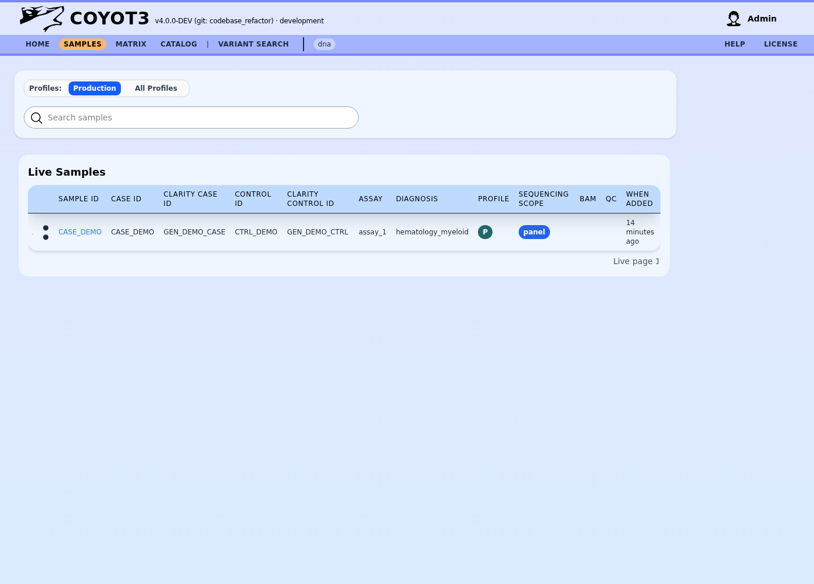

# User Guide: Sample Management and Navigation

The Sample List (accessible via the main navigation or assay-specific routes) is the central workspace for triaging incoming clinical cases. It is located at the `/samples/` route.

## Interface Overview

The sample management interface is designed to help you quickly locate and prioritize cases for review.

### 1. Global Filters and Search
At the top of the page, you can narrow down the sample list using:
*   **Profile Scope**: Toggle between "Production" (live clinical cases) and "All Profiles" (which includes validation and development samples).
*   **Search Bar**: Search by Sample ID, Case ID, or Patient identifiers. The search is real-time and filters both "Live" and "Reported" tables.

### 2. Live Samples Table
This table lists all samples that currently require interpretation.
*   **Status Indicators**: Small dots next to the ID indicate the "Priority" or "Urgency" of a sample.
*   **Case Details**: View associated Case IDs, Control IDs, and the specific Assay/Panel used for the test.
*   **Quick Actions**: If you have the necessary permissions, a **Gear icon** allows you to edit sample metadata or update clinical details (Clarity IDs, Diagnosis, etc.).

### 3. Reported Samples Table
Once a report is finalized, the sample moves to this section. It serves as an archive of completed work.
*   **Report History**: Click on the numbered badges (e.g., `1`, `2`) to download or view specific versions of the clinical report.
*   **Audit Trail**: The "Last Report" column shows exactly when the diagnostic event was closed.

## Data Integration Links

For each sample, Coyote3 provides direct links to the raw data and quality metrics:
*   **BAM/BAI**: Direct links to download visualization files for external IGV review.
*   **QC Metrics**: A percentage or read-count badge that link to a detailed Quality Control report, showing mapping stats and coverage per-base.

## Entering Interpretation

Clicking on a **Sample ID** will take you into the specialized interpretation environment for that data type:
*   **DNA Samples**: Opens the SNV/CNV interpretation view.
*   **RNA Samples**: Opens the Fusion and Expression analysis view.
